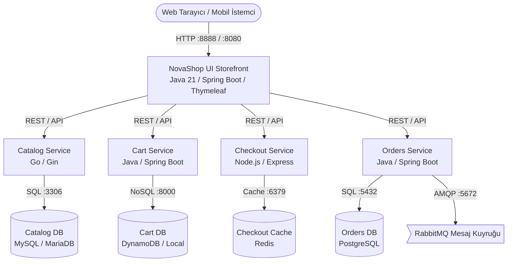

# NovaShop DevOps Store

> **From Code to Cloud** — DevOps Atölyesi Uygulamalı Eğitim Projesi

NovaShop DevOps Store, tek bir e-ticaret uygulamasının modern DevOps ve Cloud-Native teslim zinciri boyunca adım adım nasıl olgunlaştığını gösteren yaşayan eğitim platformudur:

`plan → code → review → test → quality → security → package → registry → deploy → verify → observe → respond → improve`

---

## 🏗️ Mimari ve Bileşenler

Uygulama, mikroservis mimarisine sahip çok dilli (polyglot) modern bir e-ticaret platformudur:



### Servis Envanteri

| Servis | Teknoloji / Dil | Port | Görev |
|---|---|---|---|
| **UI** | Java 21 / Spring Boot / Thymeleaf | 8080 (Host 8888) | Mağaza ön yüzü, ürün vitrini ve API aggregator |
| **Catalog** | Go / Gin | 8080 (Host 8081) | Ürün kataloğu ve kategori sorgulama API'si |
| **Cart** | Java 21 / Spring Boot | 8080 (Host 8082) | Kullanıcı sepeti ve ürün ekleme API'si |
| **Orders** | Java 21 / Spring Boot | 8080 (Host 8083) | Sipariş oluşturma ve asenkron kuyruk yönetimi |
| **Checkout** | Node.js / Express | 8080 (Host 8085) | Ödeme ve sipariş tamamlama orkestrasyonu |

---

## 🚀 Hızlı Başlangıç (Starter Profil)

NovaShop UI, arka plan servisleri hazır olmadığında otomatik olarak **in-memory mock** modunda çalışır. Böylece harici veritabanları kurmadan arayüzü hemen test edebilirsiniz.

### Ön Koşullar
- Docker yüklü bir sistem (Ubuntu 22.04+ önerilir)

### 1. Starter Container'ı Çalıştırın
```bash
docker run -d --name novashop-ui -p 8888:8080 public.ecr.aws/aws-containers/retail-store-sample-ui:1.6.2
```

### 2. Tarayıcıda Açın
Tarayıcınızdan şu adrese gidin:
```text
http://localhost:8888
```

### 3. Durdurun ve Temizleyin
```bash
docker stop novashop-ui && docker rm novashop-ui
```

---

## 📚 Eğitim Yol Haritası ve Laboratuvarlar

1. [LAB-01: Git Temelleri, Feature Branch ve Merge Conflict Çözümü](docs/labs/LAB-01-GIT-GITHUB.md)
2. **LAB-02:** AWS Temelleri: VPC, Public/Private Subnet, EC2, RDS ve Nginx
3. **LAB-03:** Dockerfile Optimizasyonu ve Docker Compose ile Çoklu Servis
4. **LAB-04:** AWS 3-Tier Dağıtım (EC2 + Private RDS + Let's Encrypt TLS)
5. **LAB-05:** GitHub Actions ile CI/CD Pipeline (ECR + Otomatik Rollback)
6. **LAB-06:** Kubernetes Temelleri, Kind Cluster ve Helm Paketleme
7. **LAB-07:** Kurumsal CI Platformu (GitLab CE, Jenkins Pipeline ve Harbor Registry)
8. **LAB-08:** DevSecOps Güvenlik ve Kalite Kapıları (SonarQube, Trivy ve SBOM)
9. **LAB-09:** Argo CD ile Deklaratif GitOps Dağıtımı
10. **LAB-10:** Gözlemlenebilirlik (Prometheus, Grafana, Alertmanager, OpenTelemetry, Jaeger)
11. **LAB-11:** Merkezi Loglama (Fluent Bit → Elasticsearch → Kibana)
12. **LAB-12:** Altyapı Otomasyonu (Terraform ile AWS + Ansible ile Konfigürasyon)
13. **LAB-13 (Bonus):** AWS EKS Kurumsal Platform Dağıtımı

---

## 📜 Lisans ve Kaynak Atfı

- NovaShop DevOps Store, AWS Containers Retail Store Sample App (`https://github.com/aws-containers/retail-store-sample-app`) projesinden eğitim amacıyla uyarlanmıştır.
- Orijinal kodlar Amazon.com, Inc. or its affiliates mülkiyetinde olup **MIT-0** ([LICENSE](LICENSE)) lisansı altındadır.
- Detaylı bağımlılık ve kaynak atıf bilgileri için [UPSTREAM.md](UPSTREAM.md) dosyasını inceleyebilirsiniz.
