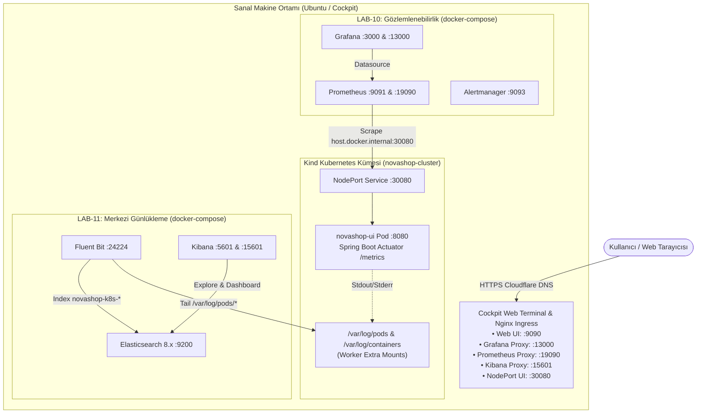

# UYGULAMA PLANI: LAB-10 ve LAB-11 (Cockpit & Kind Entegrasyonu)

Bu plan; **NovaShop** projesindeki **LAB-10 (Observability — Prometheus & Grafana)** ve **LAB-11 (Centralized Logging — ELK Stack)** laboratuvarlarının, **Cockpit Azure Lab** ortamı ve **Kind Kubernetes** kümesi ile sıfır dış bağımlılıkla (önceki lablar çalıştırılmamış olsa dahi) uçtan uca çalıştırılmasını sağlamak amacıyla hazırlanmıştır.

---

## 1. Mimari ve Entegrasyon Özeti

---

## 2. Faz ve Adım Detayları

### Faz 1: Kind ve NovaShop Bağımsız Başlatıcı Sağlamlaştırma
* **Hedef:** Önceki hiçbir lab yapılmamış olsa dahi, tek bir komutla Kind kümesini ayağa kaldırmak ve NovaShop UI podunun `ImagePullBackOff` hatası almadan `Running` durumuna gelmesini sağlamak.
* **Etkilenecek Dosyalar:**
  - `scripts/setup-kind-cluster.sh`
  - `charts/novashop/values.yaml`
* **Yapılacak İşlemler:**
  1. `setup-kind-cluster.sh` betiğinde `/var/log/containers` ve `/var/log/pods` dizinlerinin hostta oluşturulup (`mkdir -p`) izinlerinin (`chmod 777`) ayarlanmasını garantiye alma (LAB-11 Fluent Bit için zorunlu).
  2. Eğer yerel `novashop-ui:v0.1.0` imajı makinede yoksa, podların çökmesini engellemek için genel erişilebilir `public.ecr.aws/aws-containers/retail-store-sample-ui:1.6.2` imajının Helm parametresi olarak kullanılmasını sağlama.
  3. Kind kümesinin `30080` portundan `http://localhost:30080/actuator/prometheus` yanıtı verdiğini doğrulayan sağlık kontrolü ekleme.

---

### Faz 2: LAB-10 (Observability) Stack İzolasyonu ve Cockpit Uyumu
* **Hedef:** LAB-10'un LAB-03 Docker Compose ağına bağımlılığını tamamen kaldırmak; Prometheus'un Kind'daki NovaShop'u dinlemesini sağlamak ve Cockpit proxy portlarını açmak.
* **Etkilenecek Dosyalar:**
  - `deploy/observability/docker-compose.observability.yml`
  - `deploy/observability/prometheus.yml`
* **Yapılacak İşlemler:**
  1. `docker-compose.observability.yml` dosyasından `novashop-starter-net (external: true)` tanımını kaldırmak. Stack'in tamamen bağımsız `novashop-observability-net` köprüsüyle ayağa kalkmasını sağlamak.
  2. Konteynerlara `extra_hosts: ["host.docker.internal:host-gateway"]` eklemek.
  3. Port eşlemelerini hem standart hem Cockpit uyumlu yapmak:
     - **Grafana:** `"3000:3000"` ve `"13000:3000"`
     - **Prometheus:** `"9091:9090"` ve `"19090:9090"`
  4. `prometheus.yml` içine `host.docker.internal:30080` hedefini (`/actuator/prometheus`) birincil Kind scrape target olarak eklemek (`ui:8080` hedefini opsiyonel tutmak).

---

### Faz 3: LAB-11 (Centralized Logging) Stack ve Kind Logları Entegrasyonu
* **Hedef:** LAB-11'in Kind pod loglarını (`novashop-k8s-*`) sorunsuz toplaması ve Cockpit Kibana portunun çalışması.
* **Etkilenecek Dosyalar:**
  - `deploy/logging/docker-compose.logging.yml`
  - `deploy/logging/fluent-bit.conf`
* **Yapılacak İşlemler:**
  1. `docker-compose.logging.yml` içinde Kibana port eşlemesine Cockpit portunu eklemek:
     - **Kibana:** `"5601:5601"` ve `"15601:5601"`
  2. Fluent Bit'in `/var/log/pods` ve `/var/log/containers` yollarını okuduğundan ve Elasticsearch'e `novashop-k8s-*` indeksi altında `kubernetes_pod` kaynağıyla bastığından emin olmak.
  3. `scripts/setup-kibana-dataviews.sh` betiğinde `novashop-k8s-*` veri görünümünün hazır gelmesini teyit etmek.

---

### Faz 4: Yardımcı Araçlar ve Doğrulama Betikleri
* **Hedef:** Trafik simülatörü ve doğrulama betiklerinin Kind NodePort'u (`30080`) otomatik tanıması.
* **Etkilenecek Dosyalar:**
  - `scripts/simulate-traffic.py`
  - `scripts/verify/verify-lab-10.sh`
  - `scripts/verify/verify-lab-11.sh`
* **Yapılacak İşlemler:**
  1. `simulate-traffic.py` betiğinde UI hedef URL'ini dinamik algılama: Port 30080 yanıt veriyorsa 30080 (Kind), vermiyorsa 8888 (Docker) kullanma.
  2. `verify-lab-10.sh` betiğine `--config-only` haricinde canlı kontrolde de port 30080/8888 algılama yeteneği ekleme.
  3. `verify-lab-11.sh` betiğine `novashop-k8s-*` indeks kontrolü ekleme.

---

### Faz 5: Laboratuvar Kılavuzlarının (README.md) Yalınlaştırılması
* **Hedef:** Rol ve kişi sıfatları (öğrenci, eğitmen vb.) içermeyen, doğrudan uygulama odaklı, Cockpit ve Kind ile uyumlu rehberler sunmak.
* **Etkilenecek Dosyalar:**
  - `labs/LAB-10/README.md`
  - `labs/LAB-11/README.md`
* **Yapılacak İşlemler:**
  1. **En Başa "Hızlı Hazırlık: NovaShop'u Kind Üzerinde Başlatma" Adımı:**
     - Eğer Kind kümesi henüz kurulmadıysa `bash scripts/setup-kind-cluster.sh` komutunu tek adım olarak sunmak.
     - Doğrulama komutu: `kubectl get pods -n novashop`
  2. **Erişim Tablosu (Cockpit ve Doğrudan IP:Port):**
     - Hem alan adı URL'leri (`https://studentXX-grafana.<domain>`, `https://studentXX-kibana.<domain>`) hem de doğrudan portlar net bir şekilde gösterilecek.
  3. **Adım Adım Komutlar ve Doğal Doğrulama:**
     - `curl` ile metrik ve log teyitleri.
     - KQL arama örnekleri (Kind pod logları filtreleme).
     - PromQL RED/USE sorguları.

---

## 3. Doğrulama ve Kabul Kriterleri

| Kriter | Doğrulama Yöntemi | Beklenen Sonuç |
|---|---|---|
| **Kind Cluster & NovaShop** | `kubectl get pods -n novashop` | `novashop-ui` podları `2/2 Running` olmalı. |
| **NodePort Metrikleri** | `curl -s http://localhost:30080/actuator/prometheus` | JVM ve HTTP metrikleri dönmeli. |
| **LAB-10 Stack Başlatma** | `docker compose ... up -d` (LAB-03 kapalıyken) | Hata vermeden tüm konteynerler ayağa kalkmalı. |
| **Prometheus Hedefleri** | `curl -s http://localhost:9091/api/v1/targets` | `novashop-ui` (host:30080) hedefi `UP` olmalı. |
| **Cockpit Grafana Erişimi** | `curl -s http://localhost:13000/api/health` | HTTP 200 OK |
| **LAB-11 Stack Başlatma** | `docker compose ... up -d` | ES, Kibana ve Fluent Bit `Up` olmalı. |
| **Kind Pod Loglarının ES'e Akışı**| `curl -s http://localhost:9200/_cat/indices?v` | `novashop-k8s-*` indeksi oluşmalı ve doc count > 0 olmalı. |
| **Cockpit Kibana Erişimi** | `curl -s http://localhost:15601/api/status` | HTTP 200 OK |
| **Otomasyon Testleri** | `bash scripts/verify/verify-all-labs.sh` | 11/11 Test PASS |
