# NovaShop DevOps Store — Ağ Topolojisi ve Port Haritası (Networking Architecture)

Bu doküman; NovaShop platformunun yerel geliştirme (Local Docker), bulut (AWS VPC) ve konteyner orkestrasyonu (Kubernetes/EKS) ortamlarındaki ağ mimarisini, port haritasını ve güvenlik duvarı (Security Group / Network Policy) kurallarını detaylandırır.

---

## 1. Genel Ağ Katmanları ve Evrimi

NovaShop eğitimi boyunca ağ mimarisi 4 aşamada olgunlaşır:

```mermaid
graph TD
    subgraph 1. Aşama: Yerel Köprü Ağı Local Bridge
        L1[Host Port :8888] -->|Docker Bridge novashop-net| L2[UI :8080]
        L2 -->|Dahili DNS http://catalog:8080| L3[Catalog :8080]
        L3 -->|Dahili TCP :3306| L4[(Catalog DB MySQL)]
    end

    subgraph 2. Aşama: AWS 3-Katmanlı VPC
        W1[İnternet] -->|HTTP:80 / HTTPS:443| W2[EC2 Nginx Reverse Proxy Public Subnet]
        W2 -->|Local Loopback :8888| W3[Docker UI Container]
        W3 -->|Docker Bridge| W4[Docker Catalog Container]
        W4 -->|TCP :3306 Sadece EC2 SG'den| W5[(RDS MySQL Private Subnet)]
    end

    subgraph 3. Aşama: Kubernetes Küme Ağı Kind & EKS
        K1[Kullanıcı] -->|Ingress / NodePort :30080| K2[Ingress-NGINX / AWS ALB]
        K2 -->|ClusterIP Service :8080| K3[Pod: novashop-ui]
        K3 -->|CoreDNS: catalog.novashop.svc| K4[Pod: novashop-catalog]
        K4 -->|Egress| K5[(RDS / StatefulSet DB)]
    end
```



---

## 2. Kapsamlı Port ve Servis Haritası

| Katman | Servis / Bileşen | Dahili Port (Container) | Harici Port (Host / LB) | Protokol | İletişim Yönü ve İzin Verilen Kaynak |
|---|---|---|---|---|---|
| **Web Edge** | Nginx Reverse Proxy / Ingress | 80, 443 | 80, 443 | HTTP, HTTPS | Dış Dünya (`0.0.0.0/0`) |
| **Yönetim** | SSH (EC2 Sunucu Erişimi) | 22 | 22 | TCP | Yalnızca Öğrencinin IP'si (`<MY_IP>/32`) |
| **Frontend** | NovaShop UI (Spring Boot) | 8080 | 8888 (Local/Dev) | HTTP | Nginx veya ClusterIP Service |
| **Microservice** | Catalog Service (Go Gin) | 8080 | 8081 (Dev) | HTTP/REST | Yalnızca UI servisinden erişilebilir |
| **Microservice** | Cart Service (Java Spring) | 8080 | 8082 (Dev) | HTTP/REST | Yalnızca UI servisinden erişilebilir |
| **Microservice** | Orders Service (Java Spring) | 8080 | 8083 (Dev) | HTTP/REST | Yalnızca UI servisinden erişilebilir |
| **Microservice** | Checkout Service (Node.js) | 8080 | 8085 (Dev) | HTTP/REST | Yalnızca UI servisinden erişilebilir |
| **Veritabanı** | Catalog DB (MySQL / RDS) | 3306 | - (Açılmaz) | TCP (TLS Zorunlu) | Yalnızca Web SG veya Catalog Pod (`0.0.0.0/0` KESİNLİKLE YASAKTIR) |
| **Veritabanı** | Orders DB (PostgreSQL) | 5432 | - (Açılmaz) | TCP | Yalnızca Orders Pod / Servis |
| **Önbellek** | Checkout Cache (Redis) | 6379 | - (Açılmaz) | TCP | Yalnızca Checkout Pod / Servis |
| **Kuyruk** | Message Broker (RabbitMQ) | 5672, 15672 | 15672 (Yönetim) | AMQP, HTTP | Orders Pod ve yetkili admin |
| **İzleme** | Prometheus Server | 9090 | 9090 (Dev/Admin) | HTTP | Dahili ağ veya admin IP |
| **Görselleştirme**| Grafana UI | 3000 | 3000 | HTTP | Öğrenci web tarayıcısı |
| **Tracing** | OpenTelemetry Collector | 4317, 4318 | - | gRPC, HTTP | Tüm mikroservisler |
| **Tracing UI** | Jaeger UI | 16686 | 16686 | HTTP | Öğrenci web tarayıcısı |
| **Log Arama** | Elasticsearch | 9200 | - (Açılmaz) | HTTP | Fluent Bit ve Kibana |
| **Log UI** | Kibana Web UI | 5601 | 5601 | HTTP | Öğrenci web tarayıcısı |
| **GitOps** | Argo CD Server | 8080, 443 | 8080 (Port-Forward) | HTTPS | Öğrenci web tarayıcısı |

---

## 3. AWS VPC Ağ Bölümlendirmesi (CIDR Planı)

AWS üzerinde izole bir ağ kurarken kullanılan standart adresleme planı:

- **VPC Ana Blok:** `10.0.0.0/16` (65,536 IP kapasitesi)
  - **Public Subnet 1 (AZ: a):** `10.0.1.0/24` (256 IP) — EC2 Web Sunucusu, NAT Gateway, Public Load Balancer.
  - **Public Subnet 2 (AZ: b):** `10.0.2.0/24` (256 IP) — Yüksek erişilebilirlik (HA) için ikinci public alan.
  - **Private Subnet 1 (AZ: a):** `10.0.10.0/24` (256 IP) — RDS MySQL Birincil Veritabanı, Backend Podlar.
  - **Private Subnet 2 (AZ: b):** `10.0.11.0/24` (256 IP) — RDS Subnet Group rezerve alanı.

### Yönlendirme Tablosu (Route Table) Kuralları:
1. **Public Route Table:** `0.0.0.0/0` -> Internet Gateway (`igw-xxxx`).
2. **Private Route Table:** `0.0.0.0/0` -> Doğrudan internet çıkışı yoktur; gerekiyorsa NAT Gateway üzerinden dışarıya sadece giden (outbound) trafik açılır.

---

## 4. Kubernetes İçi Ağ İletişimi ve DNS Çözümleme

Kubernetes kümesinde (Kind / EKS) CoreDNS servisi mikroservislerin birbirini IP yerine standart etki alanı adıyla bulmasını sağlar:

```text
<SERVİS_ADI>.<NAMESPACE>.svc.cluster.local
```

### Örnekler:
- UI'dan Catalog servisine istek: `http://novashop-catalog-service.novashop.svc.cluster.local:8080`
- Kısaltılmış aynı namespace içi istek: `http://novashop-catalog-service:8080`
- Spring Boot konfigürasyonunda ortam değişkeni eşlemesi:
  ```yaml
  ENDPOINTS_CATALOG: "http://novashop-catalog-service:8080"
  ```

---

## 5. Güvenlik Prensipleri ve Ağ İzolasyonu

1. **Katmanlar Arası İzolasyon:**
   - Ön yüz (UI) dış dünyaya hizmet verirken, katalog ve sipariş veritabanlarına dış dünyadan doğrudan paket gönderilemez.
2. **Güvenlik Grupları (Security Groups) Zincirlemesi:**
   - RDS Güvenlik Grubu kaynak olarak IP adresi yerine **EC2 Web Güvenlik Grubu Kimliğini (`sg-xxxx`)** kabul eder. Bu sayede EC2'nin IP'si değişse bile güvenlik ilişkisi bozulmaz.
3. **Egress (Dışa Giden) Kısıtlamaları:**
   - Veritabanı ve önbellek sistemlerinin dış internete doğrudan erişimi (Egress) engellenir.
