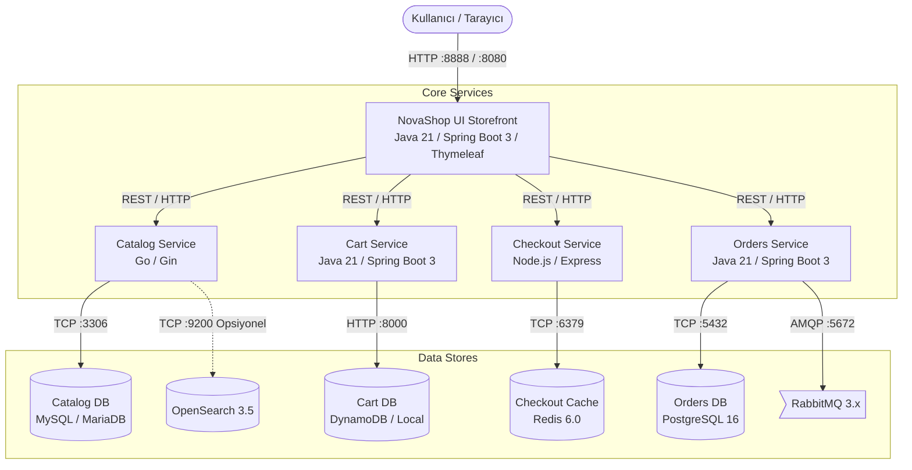

# NovaShop DevOps Store — Mimari Genel Bakış

Bu doküman, NovaShop DevOps Store uygulamasının bileşenlerini, veri akışını, ağ topolojisini ve veritabanı haritasını öğrencilerin eğitimi boyunca başvurabileceği kapsamlı bir rehber olarak açıklar.

---

## 1. Mimari Vizyon: "From Code to Cloud"

NovaShop, tek bir monolitik uygulama yerine gerçek kurumsal mikroservis pratiklerini yansıtmak üzere tasarlanmış **çok dilli (polyglot)** ve **gevşek bağlı (loosely coupled)** bir e-ticaret platformudur.

---

## 2. Servis Envanteri ve Sorumluluk Dağılımı

| Bileşen | Dil & Framework | Container Portu | Host Portu (Compose) | Veri Deposu | Görev Tanımı |
|---|---|---|---|---|---|
| **UI** | Java 21 / Spring Boot 3 / Thymeleaf | 8080 | 8888 | In-Memory (Mock) | Kullanıcı web arayüzü, sepet/katalog birleştirici (aggregator) ve oturum yönetimi |
| **Catalog** | Go (Gin) | 8080 | 8081 | MySQL / MariaDB (`catalogdb:3306`) | Ürün kataloğu, etiketleme ve arama API'si |
| **Cart** | Java 21 / Spring Boot 3 | 8080 | 8082 | DynamoDB (`carts-db:8000`) | Müşteri alışveriş sepetleri ve ürün miktarı yönetimi |
| **Checkout** | Node.js / Express | 8080 | 8085 | Redis (`checkout-redis:6379`) | Ödeme yöntemleri, teslimat seçenekleri ve sipariş öncesi doğrulama |
| **Orders** | Java 21 / Spring Boot 3 | 8080 | 8083 | PostgreSQL (`orders-db:5432`) + RabbitMQ (`rabbitmq:5672`) | Kesinleşen siparişlerin saklanması ve asenkron olay (event) üretimi |

---

## 3. Kullanıcı İstek ve Veri Akışı Yaşam Döngüsü

### 1. Ürün İnceleme (Catalog Flow)
1. Kullanıcı tarayıcıdan ana sayfaya (`/`) veya katalog sayfasına (`/catalog`) erişir.
2. `UI` servisi, arka planda yapılandırılmışsa `http://catalog:8080/products` endpoint'ine HTTP GET isteği atar.
3. `Catalog` servisi MySQL/MariaDB üzerindeki `products` tablosundan ürün listesini çeker ve JSON formatında döner.
4. `UI` servisi bu veriyi Thymeleaf şablonuyla HTML sayfasına dönüştürerek tarayıcıya sunar.
*(Not: Arka uç servisleri kapalıysa UI yerel `data/products.json` mock verisini kullanır).*

### 2. Sepete Ekleme (Cart Flow)
1. Kullanıcı bir ürünü sepete eklediğinde (`POST /cart`), tarayıcı `UI` servisine istek gönderir.
2. `UI` kullanıcının oturum UUID'si ile `Cart` servisine (`http://cart:8080/carts/{sessionId}/items`) istek yapar.
3. `Cart` servisi öğeyi DynamoDB tablosunda saklar ve güncel sepet toplamını döner.

### 3. Satın Alma ve Sipariş Oluşturma (Checkout & Order Flow)
1. Kullanıcı sepetten ödeme adımına geçtiğinde `Checkout` servisi çağrılır.
2. Teslimat adresi ve ödeme simülasyonu Redis üzerinde geçici oturum durumunda (cache) tutulur.
3. Kullanıcı "Siparişi Tamamla" butonuna bastığında:
   - `Checkout` servisi sipariş ayrıntılarını paketler ve `Orders` servisine (`http://orders:8080/orders`) gönderir.
   - `Orders` servisi siparişi PostgreSQL veritabanına kalıcı olarak yazar.
   - `Orders` servisi aynı zamanda RabbitMQ üzerine `order.created` olayı yayınlar (asenkron bildirim/fatura simülasyonu).
   - `Cart` servisine sepetin boşaltılması çağrısı yapılır.

---

## 4. Ağ ve İletişim Güvenliği Standartları

1. **Port İzolasyonu:**
   - Dış dünyaya yalnızca HTTP (80/8888) ve HTTPS (443) açık tutulur.
   - Veritabanı portları (3306, 5432, 6379, 8000, 5672) kesinlikle dış dünyaya (`0.0.0.0/0`) açılmaz; yalnızca container iç ağı veya AWS private subnet ile sınırlandırılır.
2. **Sağlık Kontrolleri (Health Checks):**
   - Spring Boot servislerinde: `/actuator/health` (Liveness & Readiness probe desteği).
   - Go ve Node.js servislerinde: `/health`.
3. **Metrikler ve İzlenebilirlik (Observability Readiness):**
   - Tüm servisler varsayılan olarak `/actuator/prometheus` veya `/metrics` endpoint'i sunar.
   - Tracing katmanı OTLP (OpenTelemetry Protocol) standartlarını destekler.
