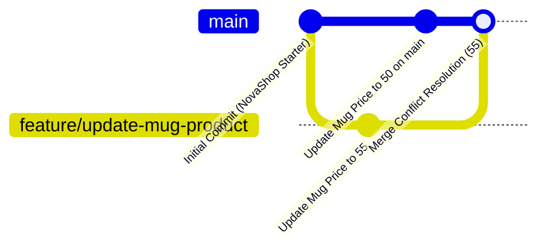

# LAB-GIT-01 — Git Temelleri, GitHub ve Kontrollü Merge Conflict Çözümü

> 💡 **Eğitmen & Canlı Demo İpucu:** Sınıfta anlatırken sol ekranda Terminal, sağ ekranda GitHub web arayüzünü açarak adım adım gitmek isterseniz [LAB-01 Web Arayüzü ve PR Canlı Demo Rehberi](./LAB-01-WEB-UI-VE-PR-DEMO-REHBERI.md) dosyasını takip edebilirsiniz.


## Amaç

Ubuntu sunucu ortamında Git sürüm kontrol sistemini sıfırdan başlatmak, GitHub üzerinde kişisel bir uzak depo oluşturup projeyi göndermek, bir özellik dalı (feature branch) açıp değişiklik yapmak ve `products.json` üzerinde kasıtlı oluşturulmuş bir merge conflict'i (çakışmayı) komut satırında teşhis edip başarıyla çözmek.

---

## Kazanımlar

1. Linux komut satırında `git init`, `.gitignore`, `git status`, `git add` ve anlamlı commit pratiklerini kazanmak.
2. GitHub üzerinde Personal Access Token (PAT) oluşturup Ubuntu sunucusundan uzak depoya güvenli ilk aktarımı yapmak.
3. Feature branch yaşam döngüsünü (`git checkout -b`, değişiklik, push) uygulamak.
4. İki farklı dalda aynı satır değiştirildiğinde ortaya çıkan merge conflict yapısını (`<<<<<<<`, `=======`, `>>>>>>>`) okumak, düzenlemek ve birleştirmeyi tamamlamak.
5. `git log --graph --oneline` ile dal geçmişini terminalde görselleştirmek.

---

## 🛠️ Ön Koşullar

Laboratuvara başlamadan önce aşağıdaki adımları tamamlayın:

### 1. GitHub Hesabı ve Boş Depo (Repository) Oluşturma
1. [GitHub](https://github.com)'a giriş yapın (hesabınız yoksa ücretsiz oluşturun).
2. Sağ üstteki **`+`** butonuna tıklayıp **New repository** seçin.
3. Repository name: **`novashop`** yazın.
4. Görünürlük: **Public** (veya isteğe bağlı Private) seçin.
5. ⚠️ **ÖNEMLİ:** *"Add a README file"*, *"Add .gitignore"* veya *"Choose a license"* seçeneklerinin **HİÇBİRİNİ İŞARETLEMEYİN** (Depo tamamen boş olmalıdır).
6. **Create repository** butonuna tıklayın.

### 2. GitHub Personal Access Token (PAT) Oluşturma
GitHub, komut satırından şifre ile erişimi güvenlik nedeniyle engellemiştir; bunun yerine bir **Personal Access Token (PAT)** kullanmanız gerekir:
1. GitHub'da sağ üstteki profil resminize tıklayın -> **Settings** seçin.
2. Sol menünün en altına inip **Developer Settings** -> **Personal access tokens** -> **Tokens (classic)** seçeneğine tıklayın.
3. **Generate new token** -> **Generate new token (classic)** butonuna tıklayın.
4. **Note:** `novashop-lab` yazın.
5. **Expiration:** `30 days` seçin.
6. **Scopes:** En üstteki **`repo`** kutucuğunu işaretleyin (Tüm repository yönetim izinlerini verir).
7. Sayfanın altındaki yeşil **Generate token** butonuna tıklayın.
8. ⚠️ **DİKKAT:** Ekranda beliren `ghp_xxxxxxxxxxxxxxxxxxxx` biçimindeki token'ı bir yere kopyalayın. Sayfayı kapattığınızda bir daha göremezsiniz!

### 3. Ubuntu Sunucu Ortamı
- Ubuntu 22.04+ işletim sistemi (Cockpit web terminali veya SSH erişimi).
- Git kurulu olmalıdır (`git --version` >= 2.30).

---

## Mimari ve Dal Akışı



---

## Kullanılan Placeholder'lar

| Placeholder | Anlamı | Örnek Biçim |
|---|---|---|
| `<GITHUB_USERNAME>` | GitHub kullanıcı adınız | `johndoe` |
| `<STUDENT_NAME>` | Git commit'lerinde görünecek adınız soyadınız | `Ahmet Yilmaz` |
| `<STUDENT_EMAIL>` | Git commit'lerinde görünecek e-posta adresiniz | `ahmet@example.com` |
| `<GITHUB_PAT_TOKEN>` | GitHub'dan aldığınız erişim token'ı | `ghp_1234567890abcdef...` |

---

## Adımlar

### Bölüm 1: Yerel Depoyu Başlatma ve İlk Commit

Bu bölümde, NovaShop proje şablonunu sunucuya indirecek, mevcut Git geçmişini temizleyip kendi adınıza sıfırdan bir Git deposu başlatacaksınız.

#### 1.1 Projeyi İndirin ve Yeni Git Deposu Başlatın
```bash
cd ~
# Eğer daha önce novashop klasörü varsa temiz bir başlangıç için yedekleyin veya silin
git clone https://github.com/devopsatolyesi-labs/novashop.git
cd novashop/
rm -rf .git
git init -b main
```
> **Neden `rm -rf .git` yapıyoruz?**  
> Projeyi ilk indirdiğimizde orijinal depoya ait geçmiş ve commit referansları bulunur. Bu laboratuvarda deponun ilk mimarı siz olacaksınız; `.git` dizinini silip `git init -b main` çalıştırarak temiz, sıfır bir geçmişle kendi deponuzu başlatmış olursunuz.

*Beklenen Çıktı:*
```text
Initialized empty Git repository in /home/.../novashop/.git/
```

#### 1.2 Depoya Özel (Local) Git Kimlik Bilgilerini Yapılandırın
Sunucudaki genel Git ayarlarını etkilememek için kimlik bilgilerinizi yalnızca bu depoya özel (`--local`) olarak tanımlayın:
```bash
git config --local user.name "<STUDENT_NAME>"
git config --local user.email "<STUDENT_EMAIL>"
```

*Doğrulama:*
```bash
git config --local --get user.name
git config --local --get user.email
```

#### 1.3 .gitignore Dosyasını İnceleyin
Depoda gizli anahtarların (`.env`), geçici ve derleme artıklarının izlenmesini engellemek için `.gitignore` dosyasının ilk satırlarına göz atın:
```bash
head -n 20 .gitignore
```

#### 1.4 Dosyaları Sahneleyin (Stage) ve İlk Commit'i Atın
```bash
git add .
git commit -m "feat: initial novashop starter repository with branding"
```

*Beklenen Çıktı:*
```text
[main (root-commit) 8a1b2c3] feat: initial novashop starter repository with branding
 ... files changed, ... insertions(+)
```

#### 1.5 GitHub Uzak Deposunu Ekleyin ve Gönderin
Kendi GitHub kullanıcı adınızı yazarak uzak depoyu bağlayın ve `main` dalını gönderin:
```bash
git remote add origin https://github.com/<GITHUB_USERNAME>/novashop.git
git push -u origin main
```
> **Kimlik Doğrulama:**  
> - **Username:** `<GITHUB_USERNAME>`  
> - **Password:** Yukarıda oluşturduğunuz `<GITHUB_PAT_TOKEN>` değerini yapıştırın (Terminalde yazarken karakterler görünmez, yapıştırıp Enter'a basın).  
> *(İpucu: Şifre sormasın isterseniz doğrudan `git remote set-url origin https://<GITHUB_USERNAME>:<GITHUB_PAT_TOKEN>@github.com/<GITHUB_USERNAME>/novashop.git` komutunu da kullanabilirsiniz).*

---

### Bölüm 2: Feature Branch Açma ve Değişiklik Yapma

Bu bölümde, ana dalı (`main`) riske atmadan yeni bir özellik dalı açacak ve ilk ürünün fiyatını güncelleyeceksiniz.

#### 2.1 Yeni Bir Özellik Dalı (Branch) Oluşturun
```bash
git checkout -b feature/update-mug-product
```
*Açıklama:* `main` dalından ayrılarak izole bir geliştirme dalına geçer.

*Beklenen Çıktı:*
```text
Switched to a new branch 'feature/update-mug-product'
```

#### 2.2 Ürün Fiyatını Güncelleyin
`src/ui/src/main/resources/data/products.json` dosyasındaki ilk ürünün (`Kubernetes Cluster Mug`) fiyatını `45` yerine `55` yapın:
```bash
sed -i 's/"price": 45/"price": 55/' src/ui/src/main/resources/data/products.json
```
> **Linux / Ubuntu Notu (Neden `.bak` yok?):**  
> macOS BSD sed komutunda `-i` parametresi `.bak` uzantısı zorunlu kılar ve yedek dosya üretir. Ancak Ubuntu (GNU sed) üzerinde `sed -i` doğrudan dosya üzerinde işlem yapar, fazladan `.bak` dosyası üretmez. İsterseniz bu değişikliği `nano` editörüyle dosyayı açıp elle de yapabilirsiniz.

#### 2.3 Değişikliği İnceleyin, Commit Edin ve GitHub'a Gönderin
```bash
git diff src/ui/src/main/resources/data/products.json
git add src/ui/src/main/resources/data/products.json
git commit -m "feat(catalog): update kubernetes mug price to 55"
git push -u origin feature/update-mug-product
```
*Açıklama:* Değişikliği feature branch'e kaydettiniz ve GitHub'a gönderdiniz. Bu branch şu an `main` dalıyla birleştirilmedi, uzakta izole bir dal olarak duruyor.

---

### Bölüm 3: Kontrollü Merge Conflict (Çakışma) Simülasyonu ve Çözümü

#### 💡 Senaryonun Mantığı:
Gerçek hayatta siz bir özellik dalında çalışırken (`feature/update-mug-product`), başka bir ekip arkadaşınız `main` dalında aynı ürünün fiyatını acil bir düzeltmeyle `50` yapmış olsun.  
Siz kendi dalınızı `main` ile birleştirmek istediğinizde, Git aynı satırda iki farklı değer (`50` ve `55`) görecek ve hangi bilginin doğru olduğuna makine karar veremeyeceği için **Merge Conflict** üretecektir.

#### 3.1 Ana Dala Geri Dönün ve Farklı Bir Fiyat Değişikliği Commit Edin
```bash
git checkout main
sed -i 's/"price": 45/"price": 50/' src/ui/src/main/resources/data/products.json
git commit -am "fix(pricing): adjust kubernetes mug price to 50 on main"
```
*Açıklama:* Artık `main` dalında fiyat `50`, `feature/update-mug-product` dalında ise fiyat `55`tir. İki dal çatallanmış (diverged) durumdadır.

#### 3.2 Feature Branch'i `main` ile Birleştirmeyi Deneyin (Conflict Tetikleme)
```bash
git merge feature/update-mug-product
```

*Beklenen Çıktı:*
```text
Auto-merging src/ui/src/main/resources/data/products.json
CONFLICT (content): Merge conflict in src/ui/src/main/resources/data/products.json
Automatic merge failed; fix conflicts and then commit the result.
```

#### 3.3 Çakışmayı İnceleyin
```bash
git status
git diff src/ui/src/main/resources/data/products.json
```
Dosyayı açtığınızda Git'in eklediği şu conflict bloklarını görürsünüz:
```json
<<<<<<< HEAD
    "price": 50,
=======
    "price": 55,
>>>>>>> feature/update-mug-product
```
- `<<<<<<< HEAD`: Mevcut bulunduğunuz daldaki (`main`) değer: `50`.
- `=======`: Çakışan iki değişiklik arasındaki sınır çizgisi.
- `>>>>>>> feature/...`: Birleştirmeye çalıştığınız daldaki değer: `55`.

#### 3.4 Çakışmayı Çözün
Ekip içi karar gereği geçerli fiyatın **`55`** olması kararlaştırılmıştır.  
Dosyayı `nano` ile açarak veya komut satırından conflict işaretçilerini temizleyip tek satır haline getirin:

```bash
# nano ile açıp elle düzenlemek isterseniz:
nano src/ui/src/main/resources/data/products.json
# <<<<<<<, =======, >>>>>>> satırlarını silin ve sadece "price": 55, bırakın.
```
*VEYA tek komutla otomatik temizlemek isterseniz:*
```bash
sed -i '/<<<<<<< HEAD/d' src/ui/src/main/resources/data/products.json
sed -i '/"price": 50,/d' src/ui/src/main/resources/data/products.json
sed -i '/=======/d' src/ui/src/main/resources/data/products.json
sed -i '/>>>>>>> feature\/update-mug-product/d' src/ui/src/main/resources/data/products.json
```

**JSON Geçerliliğini Doğrulayın:**
```bash
jq . src/ui/src/main/resources/data/products.json > /dev/null && echo "✅ JSON GEÇERLİ"
```

#### 3.5 Çözümü Sahneye Alın ve Merge Commit'ini Tamamlayın
```bash
git add src/ui/src/main/resources/data/products.json
git commit -m "merge: resolve pricing conflict on kubernetes mug (set to 55)"
```

#### 3.6 Dal Geçmişini Terminalde Görselleştirin
İki dalın ayrılıp başarıyla birleştiğini terminalde gözlemleyin:
```bash
git log --graph --oneline --decorate -n 6
```
*Beklenen Çıktı Görünümü:*
```text
*   7f8a9b1 (HEAD -> main) merge: resolve pricing conflict on kubernetes mug (set to 55)
|\  
| * 3b2c1d0 (origin/feature/update-mug-product, feature/update-mug-product) feat(catalog): update kubernetes mug price to 55
* | 9e8f7a6 fix(pricing): adjust kubernetes mug price to 50 on main
|/  
* 8a1b2c3 (origin/main) feat: initial novashop starter repository with branding
```

#### 3.7 Çözülen `main` Dalını GitHub'a Gönderin
```bash
git push origin main
```

---

### Bölüm 4: Otomatik Doğrulama Betiğini Çalıştırma

Laboratuvar adımlarını başarıyla tamamladığınızı doğrulamak için hazır doğrulama betiğini çalıştırın:

```bash
bash scripts/verify/verify-lab-01.sh
```

*Beklenen Çıktı:*
```text
=== [LAB-01] Doğrulama Başlatılıyor ===
✅ Git deposu mevcut.
✅ Local Git yapılandırması: <STUDENT_NAME> <<STUDENT_EMAIL>>
✅ Toplam commit sayısı: 4
✅ Çalışma ağacı temiz (clean working tree).
=== [LAB-01] Doğrulama Başarıyla Tamamlandı! ===
```

---

## 🧹 Temizlik (Cleanup)

Egzersiz sonrasında yereldeki geçici özellik dalını güvenle silebilirsiniz:
```bash
git branch -d feature/update-mug-product
```

---

## 🚨 Troubleshooting (Sık Karşılaşılan Sorunlar)

### 1. `Support for password authentication was removed`
- **Belirti:** `git push` sırasında şifrenizi girdiğinizde kimlik doğrulama reddedilir.
- **Çözüm:** GitHub normal hesap şifresini komut satırında kabul etmez. **Ön Koşullar** bölümündeki adımları takip ederek `repo` yetkisine sahip bir **Personal Access Token (PAT)** oluşturun ve şifre sorulduğunda o token'ı yapıştırın.

### 2. `fatal: refusing to merge unrelated histories`
- **Belirti:** Uzak repodan çekerken veya birleştirirken hata verir.
- **Neden:** GitHub'da repo açarken "Add README" veya ".gitignore" işaretlendiği için uzakta ilgisiz bir başlangıç commit'i oluşmuştur.
- **Çözüm:** Depoyu GitHub'da tamamen boş olarak oluşturun veya:
  ```bash
  git pull origin main --allow-unrelated-histories
  ```
