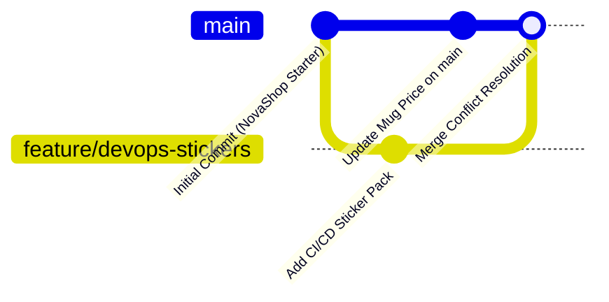

# LAB-GIT-01 — Git Temelleri, GitHub ve Kontrollü Merge Conflict Çözümü

## Amaç

NovaShop kod tabanında Git sürüm kontrol sistemini başlatmak, GitHub uzak reposuna güvenli ilk aktarımı yapmak, bir özellik branch'i üzerinden Pull Request açmak ve `products.json` üzerinde kasıtlı oluşturulmuş bir merge conflict'i (çakışmayı) komut satırında teşhis edip başarıyla çözmek.

---

## Kazanımlar

1. `git init`, `.gitignore`, `git status`, `git add` ve anlamlı commit mesajı yazma pratiklerini kazanmak.
2. Yerel Git deposunu GitHub uzak deposuna bağlamak ve `main` dalına ilk aktarımı yapmak.
3. Feature branch yaşam döngüsünü (`git checkout -b`, değişiklik, push, Pull Request) uygulamak.
4. İki farklı daldan aynı satır değiştirildiğinde ortaya çıkan merge conflict yapısını (`<<<<<<<`, `=======`, `>>>>>>>`) okumak, düzenlemek ve birleştirmeyi tamamlamak.
5. `git log --graph --oneline` ile dal geçmişini terminalde görselleştirmek.

---

## Ön Koşullar

- Ubuntu 22.04+ (Cockpit web terminali veya SSH erişimi)
- Git kurulu ve yapılandırılmış (`git --version` >= 2.30)
- GitHub hesabı ve GitHub Personal Access Token (veya SSH anahtarı)
- Boş GitHub reposu: `devopsatolyesi-labs/novashop` (veya öğrencinin kendi repo URL'i)

---

## Mimari ve Dal Akışı



---

## Kullanılan Placeholder'lar

| Placeholder | Anlamı | Örnek Biçim |
|---|---|---|
| `<GITHUB_USERNAME>` | GitHub kullanıcı adınız veya organizasyon adı | `devopsatolyesi-labs` |
| `<REPO_URL>` | GitHub repository klonlama URL'i | `https://github.com/devopsatolyesi-labs/novashop.git` |
| `<STUDENT_EMAIL>` | Git commit'lerinde görünecek e-posta adresiniz | `ogrenci@devopsatolyesi.com` |
| `<STUDENT_NAME>` | Git commit'lerinde görünecek adınız soyadınız | `Hakan Yilmaz` |

---

## Adımlar

### Bölüm 1: Yerel Depoyu Başlatma ve İlk Commit

#### 1.1 Depoyu Başlatın ve Dizin Konumuna Geçin
```bash
cd /Users/hakan/novashop-workspace/novashop
git init -b main
```
*Açıklama:* `novashop/` klasöründe varsayılan dalı `main` olan yerel bir Git deposu başlatır.

*Beklenen Çıktı:*
```text
Initialized empty Git repository in .../novashop/.git/
```

#### 1.2 Depoya Özel (Local) Git Kimlik Bilgilerini Yapılandırın
Paylaşılan veya kişisel ortamdaki global Git ayarlarını bozmamak için kimlik ayarları yalnızca bu depoya özel (`--local`) olarak tanımlanır:
```bash
git config --local user.name "<STUDENT_NAME>"
git config --local user.email "<STUDENT_EMAIL>"
```
*Açıklama:* Git commit'lerinin yazar bilgilerini yalnızca bu depo sınırlarında yapılandırır.

*Doğrulama:*
```bash
git config --local --get user.name
git config --local --get user.email
```

#### 1.3 .gitignore Dosyasını Doğrulayın
Depo içinde gizli anahtarların (`.env`, `.key`), derleme artıklarının (`target/`, `node_modules/`) izlenmesini engellemek için `.gitignore` dosyasını kontrol edin:
```bash
head -n 20 .gitignore
```

#### 1.4 Dosyaları Sahneleyin (Stage) ve İlk Commit'i Atın
```bash
git add .
git commit -m "feat: initial novashop starter repository with branding"
```
*Açıklama:* Tüm proje dosyalarını sahneye alır ve ilk resmi commit'i oluşturur.

*Beklenen Çıktı:*
```text
[main (root-commit) 8a1b2c3] feat: initial novashop starter repository with branding
 ... files changed, ... insertions(+)
```

#### 1.5 GitHub Uzak Deposunu Ekleyin ve Gönderin
```bash
git remote add origin https://github.com/<GITHUB_USERNAME>/novashop.git
git push -u origin main
```
*Açıklama:* Yerel repoyu GitHub'daki boş uzak depoya bağlar ve `main` branch'ini gönderir.

---

### Bölüm 2: Feature Branch Açma ve Pull Request Süreci

#### 2.1 Yeni Bir Özellik Dalı (Branch) Oluşturun
```bash
git checkout -b feature/update-mug-product
```
*Açıklama:* `main` dalından ayrılarak izole bir geliştirme dalına geçer.

*Beklenen Çıktı:*
```text
Switched to a new branch 'feature/update-mug-product'
```

#### 2.2 Ürün Bilgisini Güncelleyin
`src/ui/src/main/resources/data/products.json` dosyasındaki ilk ürünün (`Kubernetes Cluster Mug`) fiyatını `45` yerine `55` yapın ve açıklamasını güncelleyin:
```bash
sed -i.bak 's/"price": 45/"price": 55/' src/ui/src/main/resources/data/products.json
rm src/ui/src/main/resources/data/products.json.bak
```

#### 2.3 Değişikliği İnceleyin, Commit Edin ve Push Edin
```bash
git diff src/ui/src/main/resources/data/products.json
git add src/ui/src/main/resources/data/products.json
git commit -m "feat(catalog): update kubernetes mug price to 55"
git push -u origin feature/update-mug-product
```

---

### Bölüm 3: Kontrollü Merge Conflict (Çakışma) Simülasyonu ve Çözümü

Bu bölümde, ekip arkadaşınızın `main` dalında aynı satırı farklı bir fiyatla güncellediği gerçekçi bir senaryo canlandıracağız.

#### 3.1 Ana Dala Geri Dönün ve Farklı Bir Değişiklik Yapın
```bash
git checkout main
sed -i.bak 's/"price": 45/"price": 50/' src/ui/src/main/resources/data/products.json
rm src/ui/src/main/resources/data/products.json.bak
git commit -am "fix(pricing): adjust kubernetes mug price to 50 on main"
```

#### 3.2 Feature Branch'i `main` ile Birleştirmeyi Deneyin (Conflict Tetikleme)
```bash
git merge feature/update-mug-product
```
*Açıklama:* İki dalda da aynı satır (`"price"`) farklı değerlerle değiştirildiği için Git birleştirmeyi durdurur ve conflict üretir.

*Beklenen Çıktı:*
```text
Auto-merging src/ui/src/main/resources/data/products.json
CONFLICT (content): Merge conflict in src/ui/src/main/resources/data/products.json
Automatic merge failed; fix conflicts and then commit the result.
```

#### 3.3 Çakışmayı İnceleyin
```bash
git status
git diff src/ui/src/main/resources/data/products.json
```
Dosyayı açtığınızda şu conflict işaretçilerini görürsünüz:
```json
<<<<<<< HEAD
    "price": 50,
=======
    "price": 55,
>>>>>>> feature/update-mug-product
```
- `<<<<<<< HEAD`: Mevcut dalınızdaki (`main`) değişiklik.
- `=======`: İki değişiklik arasındaki ayırıcı çizgi.
- `>>>>>>> feature/...`: Birleştirmeye çalıştığınız daldaki değişiklik.

#### 3.4 Çakışmayı Çözün
Ekip kararı gereği doğru fiyatın `55` olduğuna karar verildiğini varsayalım. İşaretçileri silerek dosyayı tek bir geçerli JSON haline getirin:
```json
    "price": 55,
```

JSON doğruluğunu kontrol edin:
```bash
jq . src/ui/src/main/resources/data/products.json > /dev/null && echo "JSON GEÇERLİ"
```

#### 3.5 Çözümü Sahneye Alın ve Birleştirmeyi Tamamlayın
```bash
git add src/ui/src/main/resources/data/products.json
git commit -m "merge: resolve pricing conflict on kubernetes mug (set to 55)"
```

#### 3.6 Dal Geçmişini Görselleştirin
```bash
git log --graph --oneline --decorate -n 5
```

---

## Troubleshooting (Sorun Giderme)

### 1. `fatal: refusing to merge unrelated histories`
- **Belirti:** Uzak repodaki mevcut bir commit ile yerel commit birleştirilemiyor.
- **Muhtemel Neden:** GitHub'da repo oluşturulurken otomatik README veya LICENSE eklenmiş olması.
- **Teşhis:** `git log origin/main` komutunda yerel geçmişle uyuşmayan bir commit görülür.
- **Güvenli Çözüm:**
  ```bash
  git pull origin main --allow-unrelated-histories
  ```

### 2. `error: failed to push some refs to ...` (Rejected - Non-fast-forward)
- **Belirti:** `git push` reddedilir.
- **Muhtemel Neden:** Uzak repoda yerelde bulunmayan yeni commit'ler vardır.
- **Teşhis:** `git fetch origin && git status` çalıştırıldığında "Your branch is behind" uyarısı görünür.
- **Güvenli Çözüm:**
  ```bash
  git pull --rebase origin main
  git push origin main
  ```
  *(Asla `--force` kullanmayın).*

---

## Güvenlik Notu

1. `.env`, AWS kimlik anahtarları (`access_key`), özel SSH anahtarları (`*.pem`, `id_rsa`) asla `git add` ile repoya eklenmemelidir.
2. `git status` komutunda sahnelenecek dosyaları her commit öncesi dikkatlice gözden geçirin.
3. Gizli bir veri yanlışlıkla commit edilirse yalnızca dosyayı silip yeni commit atmak geçmişi temizlemez; commit geçmişinin yeniden yazılması ve anahtarın rotate edilmesi gerekir.

---

## Temizlik (Cleanup)

Egzersiz sonrasında yerel geçici dalları temizlemek için:
```bash
git branch -d feature/update-mug-product
```

---

## Öğrenci Görevi

1. `feature/add-devops-sticker` adında yeni bir branch açın.
2. `src/ui/src/main/resources/data/products.json` dosyasına 13. ürün olarak `Docker & K8s Sticker Pack` (fiyat: 10) ekleyin.
3. `jq .` ile JSON syntax'ını doğrulayın.
4. Değişikliği commit edip GitHub'a push edin ve web arayüzünden bir Pull Request açın.

---

## Eğitmen Kontrol Listesi

- [ ] `git status` temiz durumda ve çalışma dizininde çözülmemiş conflict yok.
- [ ] `git log --graph --oneline` çıktısında birleştirme (merge commit) açıkça görünüyor.
- [ ] `products.json` dosyası `jq` kontrolünden başarıyla geçiyor.
- [ ] Hiçbir gizli anahtar veya geçici dosya commit geçmişine sızmamış.
