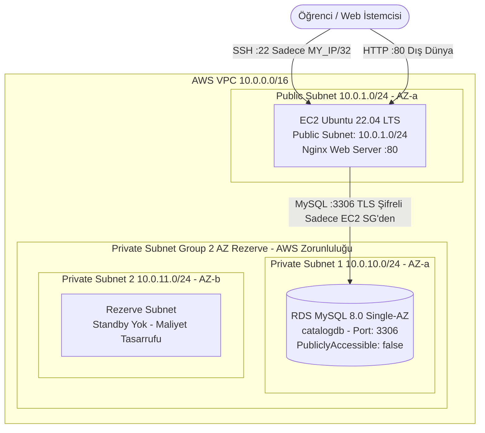

# LAB-02-AWS-BASICS — AWS Temel Altyapı ve Manuel Kurulum

---

### Amaç

AWS üzerinde izole bir VPC içerisinde; public subnet'te bağımsız statik test sayfası ve sağlık kontrolü sunan bir Nginx web sunucusu (EC2) ile private subnet'te dış dünyaya kapalı, TLS şifrelemeli bir RDS MySQL veritabanı kurarak temel bulut ağ topolojisini ve katmanlar arası güvenli erişimi doğrulamak.

---

### Kazanımlar

- AWS VPC, Public Subnet, Private Subnet Group, Internet Gateway (IGW) ve Route Table bileşenlerini kurup yapılandırmak.
- Güvenlik Grupları (Security Groups) ile "En Az Ayrıcalık" (Least Privilege) ilkesine göre ağ kurallarını sınırlandırmak.
- Dış dünyaya kapalı (`PubliclyAccessible: false`, Single-AZ) bir RDS MySQL veritabanını yalnızca web katmanı güvenlik grubundan erişilecek şekilde konumlandırmak.
- EC2 Ubuntu üzerinde Nginx web sunucusu yapılandırarak çalışan bir karşılama sayfası ve `/healthz` sağlık kontrolü endpoint'i (HTTP 200) sunmak.
- EC2 üzerinden private RDS veritabanına Amazon Trust Store CA sertifikası (`rds-ca-bundle.pem`) ile doğrulanmış şifreli TLS bağlantısı kurmak ve tablo oluşturup doğrulamak.
- Komut satırında düz metin parola kullanmadan güvenli kimlik doğrulama ve kontrollü kaynak temizliği (cleanup) uygulamak.

---

### Ön koşullar

- **Önceki Lab:** [LAB-01-GIT-GITHUB.md](file:///Users/hakan/novashop-workspace/novashop/docs/labs/LAB-01-GIT-GITHUB.md) tamamlanmış olmalıdır.
- **AWS Hesabı:** Geçerli bir AWS hesabı ve IAM kullanıcısı/rolü (VPC, EC2, RDS oluşturma yetkileri).
- **Maliyet Farkındalığı:** `db.t3.micro` ve `t3.micro` kaynakları yeni hesaplarda AWS Free Tier kapsamında olabilir; ancak hesabınızın Free Tier süresi dolmuşsa veya bölgeye bağlı olarak düşük miktarda ücret yansıyabilir. Lab sonunda temizlik adımlarını uygulamak zorunludur.
- **Yerel Araçlar:** AWS CLI v2 (`aws --version`), OpenSSH istemcisi (`ssh`).
- **SSH Anahtar Çifti:** AWS konsolundan veya CLI ile üretilmiş `.pem` formatında bir Key Pair (`novashop-key.pem`).

---

### Mimari



> [!NOTE]
> AWS RDS, DB Subnet Group oluştururken yüksek erişilebilirlik gereksinimi nedeniyle en az iki farklı Availability Zone (AZ) içinde subnet bulunmasını zorunlu kılar. Ancak gereksiz kaynak maliyetini önlemek amacıyla RDS veritabanı örneği **Single-AZ** (`--no-multi-az`) olarak başlatılır; ikinci subnet yalnızca rezerve alan olarak kalır.

---

### Kullanılan placeholder'lar

Aşağıdaki komutları çalıştırırken `<...>` ile belirtilen alanları kendi ortamınıza göre doldurunuz:

| Placeholder | Anlamı | Örnek Biçim |
|---|---|---|
| `<AWS_REGION>` | Çalışılan AWS bölgesi | `eu-central-1` |
| `<MY_IP>` | Öğrencinin genel internet IP adresi | `85.105.x.x` |
| `<KEY_PAIR_NAME>` | AWS EC2 Key Pair adı | `novashop-key` |
| `<KEY_PATH>` | Yerel SSH özel anahtarının yolu | `~/.ssh/novashop-key.pem` |
| `<VPC_ID>` | Oluşturulan VPC kimliği | `vpc-0123456789abcdef0` |
| `<EC2_PUBLIC_IP>` | EC2 sunucusunun genel IP adresi | `3.120.45.67` |
| `<RDS_ENDPOINT>` | RDS MySQL bağlantı adresi | `novashop-catalog-db.cxxxx.eu-central-1.rds.amazonaws.com` |

---

### Adımlar

#### 1. Öğrenci İstemci IP Adresini Öğrenme

SSH erişimini yalnızca kendi IP adresinizle sınırlandırmak en temel güvenlik gereksinimidir.

```bash
curl -s https://checkip.amazonaws.com
```
*Açıklama:* Dışarıya çıkan genel IP adresinizi döner.  
*Beklenen çıktı:* `85.105.42.18` gibi bir IP adresi.

---

#### 2. VPC, Subnet ve İnternet Ağ Geçidi Yapılandırması

İzole bir sanal ağ oluşturulur: 1 adet VPC, 1 adet Public Subnet (EC2 için), 2 adet Private Subnet (RDS Subnet Group gereksinimi için).

**VPC Oluşturma:**
```bash
VPC_ID=$(aws ec2 create-vpc \
  --cidr-block 10.0.0.0/16 \
  --tag-specifications 'ResourceType=vpc,Tags=[{Key=Name,Value=novashop-vpc}]' \
  --region <AWS_REGION> \
  --output text --query 'Vpc.VpcId')

echo "Oluşturulan VPC: $VPC_ID"
```

**DNS Desteğini Etkinleştirme:**
```bash
aws ec2 modify-vpc-attribute --vpc-id $VPC_ID --enable-dns-support "{\"Value\":true}" --region <AWS_REGION>
aws ec2 modify-vpc-attribute --vpc-id $VPC_ID --enable-dns-hostnames "{\"Value\":true}" --region <AWS_REGION>
```

**İnternet Ağ Geçidi (IGW) Ekleme:**
```bash
IGW_ID=$(aws ec2 create-internet-gateway \
  --tag-specifications 'ResourceType=internet-gateway,Tags=[{Key=Name,Value=novashop-igw}]' \
  --region <AWS_REGION> --output text --query 'InternetGateway.InternetGatewayId')

aws ec2 attach-internet-gateway --vpc-id $VPC_ID --internet-gateway-id $IGW_ID --region <AWS_REGION>
```

**Subnet'leri Oluşturma:**
```bash
# Public Subnet (Web / EC2 için - AZ: a)
PUB_SUB=$(aws ec2 create-subnet --vpc-id $VPC_ID --cidr-block 10.0.1.0/24 \
  --availability-zone <AWS_REGION>a \
  --tag-specifications 'ResourceType=subnet,Tags=[{Key=Name,Value=novashop-public-1a}]' \
  --region <AWS_REGION> --output text --query 'Subnet.SubnetId')

# Private Subnet 1 (RDS için - AZ: a)
PRIV_SUB_1=$(aws ec2 create-subnet --vpc-id $VPC_ID --cidr-block 10.0.10.0/24 \
  --availability-zone <AWS_REGION>a \
  --tag-specifications 'ResourceType=subnet,Tags=[{Key=Name,Value=novashop-private-1a}]' \
  --region <AWS_REGION> --output text --query 'Subnet.SubnetId')

# Private Subnet 2 (RDS Subnet Group gereksinimi - AZ: b)
PRIV_SUB_2=$(aws ec2 create-subnet --vpc-id $VPC_ID --cidr-block 10.0.11.0/24 \
  --availability-zone <AWS_REGION>b \
  --tag-specifications 'ResourceType=subnet,Tags=[{Key=Name,Value=novashop-private-1b}]' \
  --region <AWS_REGION> --output text --query 'Subnet.SubnetId')

# Public Subnet için otomatik IP atamayı etkinleştir
aws ec2 modify-subnet-attribute --subnet-id $PUB_SUB --map-public-ip-on-launch --region <AWS_REGION>
```

**Public Route Table ve IGW Rotası Tanımlama:**
```bash
RT_ID=$(aws ec2 create-route-table --vpc-id $VPC_ID \
  --tag-specifications 'ResourceType=route-table,Tags=[{Key=Name,Value=novashop-public-rt}]' \
  --region <AWS_REGION> --output text --query 'RouteTable.RouteTableId')

aws ec2 create-route --route-table-id $RT_ID --destination-cidr-block 0.0.0.0/0 --gateway-id $IGW_ID --region <AWS_REGION>
aws ec2 associate-route-table --subnet-id $PUB_SUB --route-table-id $RT_ID --region <AWS_REGION>
```

---

#### 3. Güvenlik Grupları (Security Groups) Tanımlama

En az ayrıcalık kuralı uygulanır:
1. `novashop-web-sg`: Dış dünyadan HTTP (port 80), sadece sizin IP adresinizden SSH (port 22).
2. `novashop-rds-sg`: SADECE `novashop-web-sg` grubundan MySQL (port 3306). Dış dünyaya (`0.0.0.0/0`) kesinlikle kapalı.

**Web Güvenlik Grubu:**
```bash
WEB_SG=$(aws ec2 create-security-group \
  --group-name novashop-web-sg \
  --description "NovaShop Web Layer Security Group" \
  --vpc-id $VPC_ID --region <AWS_REGION> --output text --query 'GroupId')

# SSH (Yalnızca öğrenci IP'si)
aws ec2 authorize-security-group-ingress --group-id $WEB_SG --protocol tcp --port 22 --cidr <MY_IP>/32 --region <AWS_REGION>

# HTTP (Dış Dünya)
aws ec2 authorize-security-group-ingress --group-id $WEB_SG --protocol tcp --port 80 --cidr 0.0.0.0/0 --region <AWS_REGION>
```

**RDS Güvenlik Grubu:**
```bash
RDS_SG=$(aws ec2 create-security-group \
  --group-name novashop-rds-sg \
  --description "NovaShop Database Layer Security Group" \
  --vpc-id $VPC_ID --region <AWS_REGION> --output text --query 'GroupId')

# MySQL port 3306 SADECE WEB_SG kaynaklı izin verilir (0.0.0.0/0 KESİNLİKLE YASAKTIR)
aws ec2 authorize-security-group-ingress --group-id $RDS_SG --protocol tcp --port 3306 --source-group $WEB_SG --region <AWS_REGION>
```

---

#### 4. RDS MySQL Veritabanı Örneği Oluşturma

**Bölgesel MySQL Sürümünü Doğrulama:**
```bash
aws rds describe-orderable-db-instance-options \
  --engine mysql \
  --instance-class db.t3.micro \
  --region <AWS_REGION> \
  --query 'OrderableDBInstanceOptions[0].EngineVersion' \
  --output text
```
*Beklenen çıktı:* `8.0.36` veya benzeri desteklenen bir MySQL 8.0 alt sürümü.

**DB Subnet Group Oluşturma:**
```bash
aws rds create-db-subnet-group \
  --db-subnet-group-name novashop-rds-subnet-group \
  --db-subnet-group-description "Private Subnets for NovaShop DB" \
  --subnet-ids "$PRIV_SUB_1" "$PRIV_SUB_2" \
  --region <AWS_REGION>
```

**Güvenli Kimlik Yönetimi ve RDS Instance Başlatma:**
> [!IMPORTANT]
> Parolanın shell geçmişinde (`history`) veya işletim sistemi süreç tablosunda (`ps aux`) komut satırı argümanı olarak sızmasını önlemek için AWS yerleşik parola yönetimi (`--manage-master-user-password`) kullanılır. Bu parametre ile parola doğrudan AWS Secrets Manager tarafından şifrelenerek yönetilir.
> *(Alternatif GUI Yöntemi: AWS Management Console > RDS > Create Database adımında "Credentials Settings" altında maskeli parola alanı kullanılabilir).*

```bash
aws rds create-db-instance \
  --db-instance-identifier novashop-catalog-db \
  --db-instance-class db.t3.micro \
  --engine mysql \
  --allocated-storage 20 \
  --master-username novashop \
  --manage-master-user-password \
  --db-name catalogdb \
  --db-subnet-group-name novashop-rds-subnet-group \
  --vpc-security-group-ids $RDS_SG \
  --no-publicly-accessible \
  --no-multi-az \
  --backup-retention-period 0 \
  --region <AWS_REGION>
```
*Açıklama:* Single-AZ (`--no-multi-az`), 20 GB depolama, dışarıya kapalı (`--no-publicly-accessible`) ve AWS Secrets Manager tarafından yönetilen ana parolaya sahip bir MySQL instance başlatır.  
*Not:* Veritabanının hazır (`available`) duruma geçmesi yaklaşık 5–7 dakika sürebilir.

**Oluşturulan Parolayı AWS Secrets Manager'dan Güvenle Öğrenme:**
```bash
# Otomatik oluşturulan Secret ARN kimliğini al
SECRET_ARN=$(aws rds describe-db-instances \
  --db-instance-identifier novashop-catalog-db \
  --region <AWS_REGION> \
  --query 'DBInstances[0].MasterUserSecret.SecretArn' --output text)

# Parola değerini JSON olarak görüntüle (yalnızca terminal ekranında kalır)
aws secretsmanager get-secret-value --secret-id "$SECRET_ARN" --region <AWS_REGION> --query 'SecretString' --output text
```

**Durumu ve Endpoint'i Takip Etme:**
```bash
aws rds describe-db-instances \
  --db-instance-identifier novashop-catalog-db \
  --region <AWS_REGION> \
  --query 'DBInstances[0].[DBInstanceStatus,Endpoint.Address,MultiAZ]' \
  --output text
```
*Beklenen çıktı (hazır olduğunda):*
```text
available    novashop-catalog-db.cxxxx.eu-central-1.rds.amazonaws.com    False
```
`False` değeri veritabanının planlandığı gibi Single-AZ çalıştığını doğrular. Endpoint adresini not ediniz (`<RDS_ENDPOINT>`).

---

#### 5. EC2 Ubuntu Sanal Sunucusunu Başlatma

Public Subnet içinde Ubuntu 22.04 LTS instance'ı başlatılır:

```bash
# Ubuntu 22.04 LTS en güncel AMI kimliğini bul
AMI_ID=$(aws ec2 describe-images --owners 099720109477 \
  --filters "Name=name,Values=ubuntu/images/hvm-ssd/ubuntu-jammy-22.04-amd64-server-*" \
  --query 'sort_by(Images, &CreationDate)[-1].ImageId' --output text --region <AWS_REGION>)

# EC2 Başlat
EC2_INSTANCE_ID=$(aws ec2 run-instances \
  --image-id $AMI_ID \
  --count 1 \
  --instance-type t3.micro \
  --key-name <KEY_PAIR_NAME> \
  --security-group-ids $WEB_SG \
  --subnet-id $PUB_SUB \
  --tag-specifications 'ResourceType=instance,Tags=[{Key=Name,Value=novashop-web-server}]' \
  --region <AWS_REGION> \
  --output text --query 'Instances[0].InstanceId')

# Instance çalışana kadar bekle
aws ec2 wait instance-running --instance-ids $EC2_INSTANCE_ID --region <AWS_REGION>

EC2_PUBLIC_IP=$(aws ec2 describe-instances --instance-ids $EC2_INSTANCE_ID \
  --region <AWS_REGION> \
  --query 'Reservations[0].Instances[0].PublicIpAddress' --output text)

echo "EC2 Public IP: $EC2_PUBLIC_IP"
```

---

#### 6. EC2 Sunucusuna SSH ile Bağlanma ve Nginx Web Sunucusu Kurulumu

Yerel terminalinizden EC2 sunucusuna bağlanın:

```bash
chmod 400 <KEY_PATH>
ssh -i <KEY_PATH> ubuntu@<EC2_PUBLIC_IP>
```

**Paketleri Güncelleme ve Nginx ile MySQL İstemcisini Kurma:**
```bash
sudo apt-get update -y
sudo apt-get install -y nginx mysql-client curl
```

**NovaShop Statik Karşılama Sayfası ve Sağlık Kontrolü Yapılandırması:**
Bu temel laboratuvarda, Nginx doğrudan çalışan bir statik test sayfası ve `/healthz` endpoint'i (HTTP 200) sunar:

```bash
sudo tee /etc/nginx/conf.d/novashop.conf > /dev/null << 'EOF'
server {
    listen 80 default_server;
    listen [::]:80 default_server;
    server_name _;

    # Güvenlik Başlıkları
    add_header X-Frame-Options "SAMEORIGIN" always;
    add_header X-Content-Type-Options "nosniff" always;
    add_header X-XSS-Protection "1; mode=block" always;
    server_tokens off;

    # 1. Sağlık Kontrolü Endpoint'i (HTTP 200)
    location = /healthz {
        access_log off;
        default_type application/json;
        return 200 '{"status":"UP","layer":"web","host":"$hostname"}\n';
    }

    # 2. Ana Sayfa: NovaShop Web Katmanı Test Sayfası (HTTP 200)
    location / {
        default_type text/html;
        return 200 '<!DOCTYPE html><html><head><meta charset="utf-8"><title>NovaShop DevOps Store - Web Layer</title><style>body{background:#0f172a;color:#f8fafc;font-family:sans-serif;display:flex;align-items:center;justify-content:center;height:100vh;margin:0;}div{background:#1e293b;padding:2.5rem;border-radius:10px;border:1px solid #334155;text-align:center;box-shadow:0 10px 25px rgba(0,0,0,0.5);}h1{color:#38bdf8;margin-bottom:0.5rem;}p{color:#94a3b8;font-size:1.1rem;}span{color:#a5f3fc;font-weight:bold;}</style></head><body><div><h1>NovaShop DevOps Store</h1><p>AWS EC2 Web Katmanı Aktif ve Çalışıyor.</p><p>Durum: <span>ONLINE (HTTP 200)</span> | Sağlık Kontrolü: <code>/healthz</code></p></div></body></html>\n';
    }
}
EOF
```

**Varsayılan Siteyi Kaldırıp Nginx'i Başlatma:**
```bash
sudo rm -f /etc/nginx/sites-enabled/default
sudo nginx -t
sudo systemctl restart nginx
sudo systemctl enable nginx
```
*Beklenen çıktı (`nginx -t`):*
```text
nginx: the configuration file /etc/nginx/nginx.conf syntax is ok
nginx: configuration file /etc/nginx/nginx.conf test is successful
```

---

#### 7. EC2'den Private RDS'e TLS Doğrulamalı Güvenli Bağlantı

EC2 konsolunda iken veritabanı portuna ağ düzeyinde erişimi teyit edin:

```bash
nc -zv -w 5 <RDS_ENDPOINT> 3306
```
*Beklenen çıktı:*
```text
Connection to <RDS_ENDPOINT> 3306 port [tcp/mysql] succeeded!
```

**Amazon RDS Global CA Sertifika Paketini İndirme:**
Veritabanı bağlantısının şifrelendiğini ve sunucu kimliğinin doğrulandığını garanti etmek için AWS resmi CA sertifika paketi yüklenir:

```bash
sudo curl -s https://truststore.pki.rds.amazonaws.com/global/global-bundle.pem -o /etc/ssl/certs/rds-ca-bundle.pem
ls -lh /etc/ssl/certs/rds-ca-bundle.pem
```

**Kimlik Doğrulamalı TLS (VERIFY_IDENTITY) ve Etkileşimli Parola ile MySQL Bağlantısı:**
> [!TIP]
> `-p` parametresinin yanına şifre yazılmaz; MySQL istemcisi şifreyi gizli olarak sorar. `--ssl-mode=VERIFY_IDENTITY` parametresi ile hem Amazon CA zinciri doğrulanır hem de sunucu alan adının (RDS endpoint) sertifikadaki CN/SAN bilgisiyle birebir eşleştiği teyit edilerek Man-in-the-Middle (MitM) saldırılarına karşı tam koruma sağlanır:

```bash
mysql -h <RDS_ENDPOINT> -u novashop -p \
  --ssl-ca=/etc/ssl/certs/rds-ca-bundle.pem \
  --ssl-mode=VERIFY_IDENTITY \
  -e "STATUS;" | grep -E "(SSL|Cipher)"
```
*İstenecek parola:* `Enter password:` (Secrets Manager'da görüntülenen parolayı girin).  
*Beklenen çıktı:*
```text
SSL:			Cipher in use is TLS_AES_256_GCM_SHA384
```
Bu çıktı, bağlantının düz metin yerine sunucu kimliği doğrulanmış yüksek güvenlikli TLS 1.3/AES-256 ile şifrelendiğini kanıtlar.

**Tablo Oluşturma ve Doğrulama Sorgusu:**
```bash
mysql -h <RDS_ENDPOINT> -u novashop -p \
  --ssl-ca=/etc/ssl/certs/rds-ca-bundle.pem \
  --ssl-mode=VERIFY_IDENTITY \
  catalogdb << 'EOF'
CREATE TABLE IF NOT EXISTS connectivity_check (
    id INT AUTO_INCREMENT PRIMARY KEY,
    checked_at TIMESTAMP DEFAULT CURRENT_TIMESTAMP,
    source_ip VARCHAR(64) NOT NULL
);

INSERT INTO connectivity_check (source_ip) VALUES ('ec2-web-layer');
SELECT * FROM connectivity_check;
EOF
```
*Beklenen çıktı:*
```text
+----+---------------------+---------------+
| id | checked_at          | source_ip     |
+----+---------------------+---------------+
|  1 | 2026-09-09 12:00:00 | ec2-web-layer |
+----+---------------------+---------------+
```

---

#### 8. Yerel Bilgisayardan Uçtan Uca Doğrulama

Yerel terminalinize dönün (`exit` ile EC2 oturumunu kapatın). Web sunucusunu dış dünyadan test edin:

```bash
# 1. Ana Sayfa Yanıtı (HTTP 200 OK)
curl -s -i http://<EC2_PUBLIC_IP>/ | head -n 12
```
*Beklenen çıktı:*
```text
HTTP/1.1 200 OK
Server: nginx
Content-Type: text/html
...
X-Frame-Options: SAMEORIGIN
X-Content-Type-Options: nosniff
X-XSS-Protection: 1; mode=block

<!DOCTYPE html><html><head><meta charset="utf-8"><title>NovaShop DevOps Store - Web Layer</title>
```

```bash
# 2. Sağlık Kontrolü Endpoint Testi (HTTP 200 OK JSON)
curl -s http://<EC2_PUBLIC_IP>/healthz
```
*Beklenen çıktı:*
```json
{"status":"UP","layer":"web","host":"ip-10-0-1-xxx"}
```

```bash
# 3. Otomatik Laboratuvar Doğrulama Betiğini Çalıştırma
bash scripts/verify/verify-lab-02.sh <EC2_PUBLIC_IP>
```
*Beklenen çıktı:*
```text
=== [LAB-02] Doğrulama Başlatılıyor: <EC2_PUBLIC_IP> ===
1. Ana sayfa (HTTP 200) kontrol ediliyor...
✅ Ana sayfa HTTP 200 OK döndü.
2. Sağlık kontrolü (/healthz) test ediliyor...
✅ Sağlık kontrolü başarılı: {"status":"UP","layer":"web","host":"ip-10-0-1-xxx"}
=== [LAB-02] Tüm Testler Başarılı! ===
```

---

### Troubleshooting

#### Senaryo 1: EC2'den RDS'e `Connection timed out` veya `nc` Bağlantı Kuramıyor
- **Belirti:** `nc -zv -w 5 <RDS_ENDPOINT> 3306` komutu yanıt vermiyor ve zaman aşımına uğruyor.
- **Muhtemel Neden:** 
  1. `novashop-rds-sg` güvenlik grubunda gelen kuralı (inbound rule) olarak `novashop-web-sg` Security Group kimliği yerine yanlış bir CIDR tanımlanmış olması.
  2. RDS'in public subnet'te veya VPC dışındaki yanlış subnet grubunda oluşturulması.
- **Teşhis Komutu:**
  ```bash
  aws ec2 describe-security-groups --group-ids $RDS_SG --query 'SecurityGroups[0].IpPermissions' --region <AWS_REGION>
  ```
- **Güvenli Çözüm:** RDS Security Group gelen kurallarında TCP 3306 portunun kaynak (source) değerini `novashop-web-sg` Security Group kimliği ile güncelleyin:
  ```bash
  aws ec2 authorize-security-group-ingress --group-id $RDS_SG --protocol tcp --port 3306 --source-group $WEB_SG --region <AWS_REGION>
  ```

#### Senaryo 2: Yerel Bilgisayardan EC2 SSH Bağlantısı Zaman Aşımına Uğruyor (`Operation timed out`)
- **Belirti:** `ssh -i ... ubuntu@<EC2_PUBLIC_IP>` komutu bekleyip `Operation timed out` hatası veriyor.
- **Muhtemel Neden:** İnternet servis sağlayıcınızın dinamik IP değiştirmesi sonucu `<MY_IP>` adresinizin değişmiş olması.
- **Teşhis Komutu:**
  ```bash
  curl -s https://checkip.amazonaws.com
  aws ec2 describe-security-groups --group-ids $WEB_SG --query 'SecurityGroups[0].IpPermissions' --region <AWS_REGION>
  ```
- **Güvenli Çözüm:** Güncel genel IP adresinizi alıp Security Group SSH kuralını güncelleyin:
  ```bash
  NEW_IP=$(curl -s https://checkip.amazonaws.com)
  aws ec2 authorize-security-group-ingress --group-id $WEB_SG --protocol tcp --port 22 --cidr ${NEW_IP}/32 --region <AWS_REGION>
  ```

#### Senaryo 3: MySQL Bağlantısında SSL / TLS Sertifika Hatası (`SSL connection error`)
- **Belirti:** `mysql` komutu çalıştırıldığında `ERROR 2026 (HY000): SSL connection error: certificate verify failed` hatası alınması.
- **Muhtemel Neden:** CA bundle dosyasının eksik indirilmesi veya yolunun hatalı girilmesi.
- **Teşhis Komutu:**
  ```bash
  openssl x509 -in /etc/ssl/certs/rds-ca-bundle.pem -text -noout | head -n 10
  ```
- **Güvenli Çözüm:** CA bundle dosyasını resmi kaynaktan tekrar indirin ve dosya boyutunun 0 byte olmadığını teyit edin:
  ```bash
  sudo curl -s https://truststore.pki.rds.amazonaws.com/global/global-bundle.pem -o /etc/ssl/certs/rds-ca-bundle.pem
  ```

---

### Güvenlik Notu

1. **Açık Portlar ve İzolasyon:**
   - EC2 üzerinde SSH (port 22) yalnızca öğrencinin IP'siyle (`<MY_IP>/32`) sınırlandırılmıştır. Dış dünyaya kesinlikle açılmamıştır.
   - HTTP (port 80) dış dünyaya açıktır; HTTPS (443) bir sonraki laboratuvarda (LAB-04) domain ve TLS ile devreye alınacaktır.
   - RDS MySQL (port 3306) dış dünyaya kesinlikle kapalıdır (`PubliclyAccessible: false`). Yalnızca EC2 Web Security Group üzerinden gelen bağlantıları kabul eder.
2. **Secret Güvenliği:**
   - Veritabanı ana parolası komut satırında düz metin olarak verilmemiştir; interaktif `read -s` ve `mysql -p` ile korunmuştur.
3. **Şifreli İletişim (TLS):**
   - Web katmanı ile veritabanı arasındaki tüm SQL sorguları RDS CA sertifikası ile TLS üzerinden şifrelenmiştir.
4. **Anti-Pattern Yasakları:**
   - Kolaylık olsun diye RDS için `0.0.0.0/0` kuralı eklemek, dosya izinlerini `chmod 777` yapmak veya TLS doğrulamasını kapatmak (`--skip-ssl`) **kesinlikle yasaktır**.

---

### Cleanup / Rollback

Gereksiz bulut maliyetlerini önlemek için oluşturulan kaynakları aşağıdaki kontrollü sırayla siliniz:

#### 1. EC2 Instance'ı Sonlandırın (Terminate)
```bash
aws ec2 terminate-instances --instance-ids <EC2_INSTANCE_ID> --region <AWS_REGION>
aws ec2 wait instance-terminated --instance-ids <EC2_INSTANCE_ID> --region <AWS_REGION>
```

#### 2. RDS Silme Korumasını (DeletionProtection) Kontrol Edin ve Kaldırın
```bash
# DeletionProtection mevcut durumunu oku
DP_STATUS=$(aws rds describe-db-instances \
  --db-instance-identifier novashop-catalog-db \
  --region <AWS_REGION> \
  --query 'DBInstances[0].DeletionProtection' --output text)

echo "Mevcut DeletionProtection: $DP_STATUS"

# Eğer açıksa kaldır ve veritabanı tekrar hazır (available) duruma gelene kadar bekle
if [ "$DP_STATUS" = "True" ]; then
    echo "Silme koruması kaldırılıyor..."
    aws rds modify-db-instance \
      --db-instance-identifier novashop-catalog-db \
      --no-deletion-protection \
      --apply-immediately \
      --region <AWS_REGION>

    echo "Veritabanının hazır (available) duruma geçmesi bekleniyor..."
    aws rds wait db-instance-available \
      --db-instance-identifier novashop-catalog-db \
      --region <AWS_REGION>
    echo "Veritabanı silmeye hazır."
fi
```

#### 3. RDS Instance'ı Silin (Bilinçli Snapshot Kararı)
> [!WARNING]
> Öğrenci lab ortamında veri saklama ihtiyacı yoksa ve ek snapshot saklama maliyetinden kaçınmak isteniyorsa **Seçenek A** uygulanır. Üretim veya veriyi saklamak istediğiniz senaryolarda ise **Seçenek B** tercih edilmelidir:

**Seçenek A (Eğitim Labı - Maliyetsiz Temizleme):**
```bash
aws rds delete-db-instance \
  --db-instance-identifier novashop-catalog-db \
  --skip-final-snapshot \
  --delete-automated-backups \
  --region <AWS_REGION>
```

**Seçenek B (Veriyi Saklama - Final Snapshot ile):**
```bash
# aws rds delete-db-instance \
#   --db-instance-identifier novashop-catalog-db \
#   --no-skip-final-snapshot \
#   --final-db-snapshot-identifier novashop-catalog-db-final-backup \
#   --region <AWS_REGION>
```

*RDS silinene kadar bekleyin (yaklaşık 4–6 dakika):*
```bash
aws rds wait db-instance-deleted --db-instance-identifier novashop-catalog-db --region <AWS_REGION>
```

#### 4. RDS Subnet Group ve Güvenlik Gruplarını Silin
```bash
aws rds delete-db-subnet-group --db-subnet-group-name novashop-rds-subnet-group --region <AWS_REGION>

aws ec2 delete-security-group --group-id <RDS_SG> --region <AWS_REGION>
aws ec2 delete-security-group --group-id <WEB_SG> --region <AWS_REGION>
```

#### 5. Route Table, Subnet'ler, Internet Gateway ve VPC'yi Silin
```bash
aws ec2 detach-internet-gateway --internet-gateway-id <IGW_ID> --vpc-id <VPC_ID> --region <AWS_REGION>
aws ec2 delete-internet-gateway --internet-gateway-id <IGW_ID> --region <AWS_REGION>

aws ec2 delete-subnet --subnet-id <PUB_SUB> --region <AWS_REGION>
aws ec2 delete-subnet --subnet-id <PRIV_SUB_1> --region <AWS_REGION>
aws ec2 delete-subnet --subnet-id <PRIV_SUB_2> --region <AWS_REGION>
aws ec2 delete-route-table --route-table-id <RT_ID> --region <AWS_REGION>

aws ec2 delete-vpc --vpc-id <VPC_ID> --region <AWS_REGION>
```

---

### Pratik Uygulama Görevi

1. EC2 üzerindeki Nginx konfigürasyonuna (`/etc/nginx/conf.d/novashop.conf`) `/info` adında yeni bir endpoint ekleyin.
2. Bu endpoint'in HTTP 200 ile aşağıdaki JSON içeriğini dönmesini sağlayın:
   ```json
   {"service": "novashop-web", "cloud": "aws", "tier": "presentation"}
   ```
3. `sudo nginx -t && sudo systemctl reload nginx` komutunu çalıştırıp yerel bilgisayarınızdan `curl -s http://<EC2_PUBLIC_IP>/info` ile doğrulayın.
