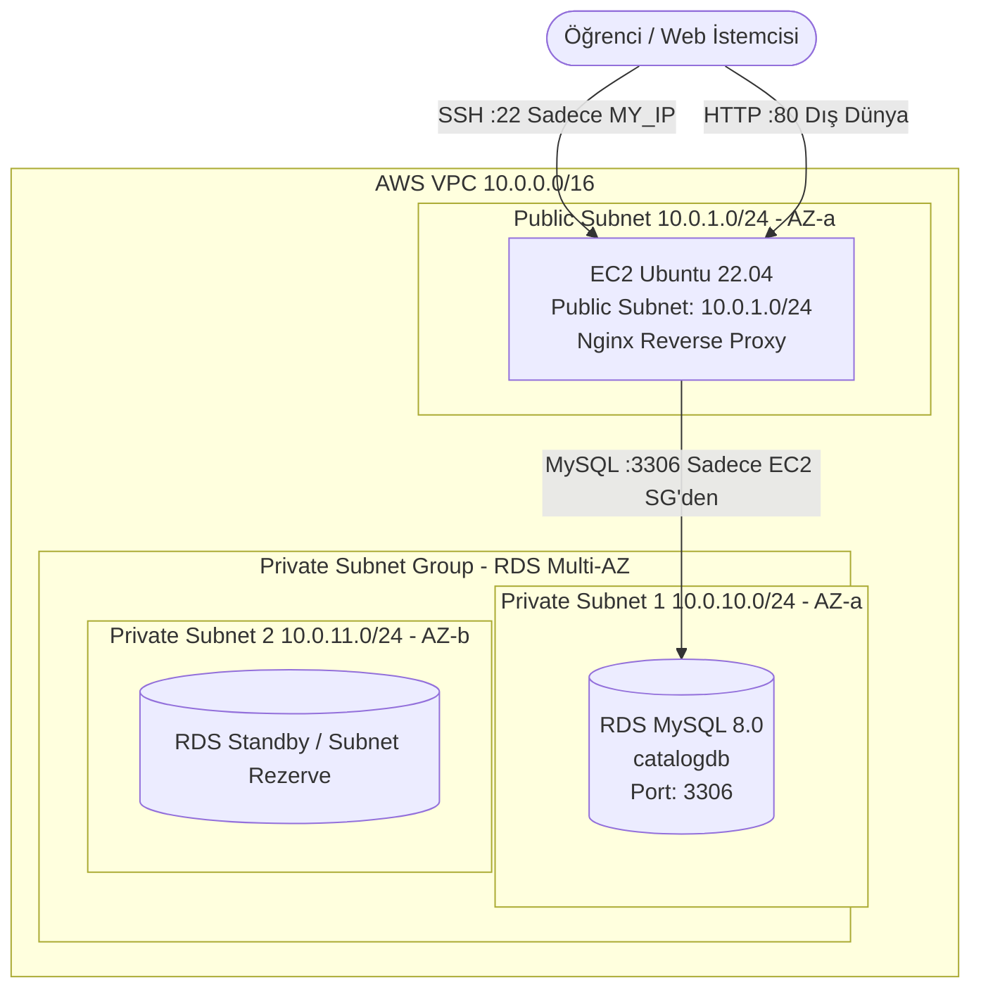

# LAB-02-AWS-BASICS — AWS Temel Altyapı ve Manuel Kurulum

---

### Amaç

AWS üzerinde izole bir VPC içerisinde; public subnet'te Nginx reverse proxy barındıran bir EC2 sanal sunucusu ile private subnet'te dış dünyaya kapalı bir RDS MySQL veritabanı kurarak 3-katmanlı ağ mimarisini ve katmanlar arası güvenli bağlantıyı doğrulamak.

---

### Kazanımlar

- AWS VPC, Public/Private Subnet, Internet Gateway (IGW) ve Route Table kavramlarını pratik olarak uygulamak.
- Güvenlik Grupları (Security Groups) ile "En Az Ayrıcalık" (Least Privilege) ilkesine göre ağ erişimini kısıtlamak.
- Dış dünyaya kapalı (`PubliclyAccessible: false`) bir RDS MySQL veritabanını yalnızca web katmanından erişilecek şekilde konumlandırmak.
- EC2 Ubuntu üzerinde Nginx web sunucusu ve `/healthz` sağlık kontrolü endpoint'ini yapılandırmak.
- EC2 üzerinden private RDS veritabanına bağlanıp NovaShop ürün kataloğu şemasını ve başlangıç verisini başarıyla yüklemek.

---

### Ön koşullar

- **Önceki Lab:** [LAB-01-GIT-GITHUB.md](file:///Users/hakan/novashop-workspace/novashop/docs/labs/LAB-01-GIT-GITHUB.md) tamamlanmış olmalıdır.
- **AWS Hesabı:** Geçerli bir AWS hesabı ve IAM kullanıcısı/rolü (VPC, EC2, RDS oluşturma yetkileri).
- **Yerel Araçlar:** AWS CLI v2 (`aws --version`), OpenSSH istemcisi (`ssh`), MySQL istemcisi (`mysql`).
- **SSH Anahtar Çifti:** AWS konsolundan veya CLI ile üretilmiş `.pem` formatında bir Key Pair (`novashop-key.pem`).

---

### Mimari



---

### Kullanılan placeholder'lar

Aşağıdaki komutları çalıştırırken `<...>` ile belirtilen alanları kendi ortamınıza göre doldurunuz:

| Placeholder | Anlamı | Örnek Biçim |
|---|---|---|
| `<AWS_REGION>` | Çalışılan AWS bölgesi | `eu-central-1` |
| `<MY_IP>` | Öğrencinin genel internet IP adresi | `85.105.x.x` |
| `<KEY_PAIR_NAME>` | AWS EC2 Key Pair adı | `novashop-key` |
| `<KEY_PATH>` | Yerel SSH özel anahtarının yolu | `~/.ssh/novashop-key.pem` |
| `<VPC_ID>` | Oluşturulan VPC kimliği | `vpc-0123456789abcdef0` |
| `<EC2_PUBLIC_IP>` | EC2 sunucusunun genel IP adresi | `3.120.45.67` |
| `<RDS_ENDPOINT>` | RDS MySQL bağlantı adresi | `novashop-catalog.cxxxx.eu-central-1.rds.amazonaws.com` |
| `<DB_PASSWORD>` | RDS veritabanı kullanıcısı şifresi | Güçlü parola (örn: `NovaShopCatalog2026!`) |

---

### Adımlar

#### 1. Öğrenci İstemci IP Adresini Öğrenme

SSH erişimini yalnızca kendi IP adresinizle sınırlandırmak güvenlik açısından zorunludur.

```bash
curl -s https://checkip.amazonaws.com
```
*Açıklama:* Dışarıya çıkan genel IP adresinizi döner.  
*Beklenen çıktı:* `85.105.42.18` gibi bir IP adresi.

---

#### 2. VPC, Subnet ve İnternet Ağ Geçidi Yapılandırması

İzole bir sanal ağ oluşturulur: 1 adet VPC, 1 adet Public Subnet (EC2 için), 2 adet Private Subnet (RDS Subnet Group gereksinimi için farklı AZ'lerde).

**VPC Oluşturma:**
```bash
aws ec2 create-vpc \
  --cidr-block 10.0.0.0/16 \
  --tag-specifications 'ResourceType=vpc,Tags=[{Key=Name,Value=novashop-vpc}]' \
  --region <AWS_REGION> \
  --output text --query 'Vpc.VpcId'
```
*Açıklama:* 10.0.0.0/16 CIDR bloğunda `novashop-vpc` adıyla yeni bir VPC oluşturur.  
*Beklenen çıktı:* `vpc-0a1b2c3d4e5f6g7h8`

**DNS Desteğini Etkinleştirme:**
```bash
aws ec2 modify-vpc-attribute --vpc-id <VPC_ID> --enable-dns-support "{\"Value\":true}"
aws ec2 modify-vpc-attribute --vpc-id <VPC_ID> --enable-dns-hostnames "{\"Value\":true}"
```

**İnternet Ağ Geçidi (IGW) Ekleme:**
```bash
IGW_ID=$(aws ec2 create-internet-gateway \
  --tag-specifications 'ResourceType=internet-gateway,Tags=[{Key=Name,Value=novashop-igw}]' \
  --region <AWS_REGION> --output text --query 'InternetGateway.InternetGatewayId')

aws ec2 attach-internet-gateway --vpc-id <VPC_ID> --internet-gateway-id $IGW_ID --region <AWS_REGION>
```

**Subnet'leri Oluşturma:**
```bash
# Public Subnet (Web / EC2 için - AZ: a)
PUB_SUB=$(aws ec2 create-subnet --vpc-id <VPC_ID> --cidr-block 10.0.1.0/24 \
  --availability-zone <AWS_REGION>a \
  --tag-specifications 'ResourceType=subnet,Tags=[{Key=Name,Value=novashop-public-1a}]' \
  --region <AWS_REGION> --output text --query 'Subnet.SubnetId')

# Private Subnet 1 (RDS için - AZ: a)
PRIV_SUB_1=$(aws ec2 create-subnet --vpc-id <VPC_ID> --cidr-block 10.0.10.0/24 \
  --availability-zone <AWS_REGION>a \
  --tag-specifications 'ResourceType=subnet,Tags=[{Key=Name,Value=novashop-private-1a}]' \
  --region <AWS_REGION> --output text --query 'Subnet.SubnetId')

# Private Subnet 2 (RDS için - AZ: b)
PRIV_SUB_2=$(aws ec2 create-subnet --vpc-id <VPC_ID> --cidr-block 10.0.11.0/24 \
  --availability-zone <AWS_REGION>b \
  --tag-specifications 'ResourceType=subnet,Tags=[{Key=Name,Value=novashop-private-1b}]' \
  --region <AWS_REGION> --output text --query 'Subnet.SubnetId')

# Public Subnet için otomatik IP atamayı aç
aws ec2 modify-subnet-attribute --subnet-id $PUB_SUB --map-public-ip-on-launch
```

**Public Route Table ve IGW Rotası Tanımlama:**
```bash
RT_ID=$(aws ec2 create-route-table --vpc-id <VPC_ID> \
  --tag-specifications 'ResourceType=route-table,Tags=[{Key=Name,Value=novashop-public-rt}]' \
  --region <AWS_REGION> --output text --query 'RouteTable.RouteTableId')

aws ec2 create-route --route-table-id $RT_ID --destination-cidr-block 0.0.0.0/0 --gateway-id $IGW_ID --region <AWS_REGION>
aws ec2 associate-route-table --subnet-id $PUB_SUB --route-table-id $RT_ID --region <AWS_REGION>
```

---

#### 3. Güvenlik Grupları (Security Groups) Tanımlama

Güvenlik prensipleri gereğince iki ayrı grup tanımlanır:
1. `novashop-web-sg`: Dış dünyadan HTTP (80), sadece sizin IP adresinizden SSH (22).
2. `novashop-rds-sg`: SADECE `novashop-web-sg` grubundan MySQL (3306). Dış dünyaya tamamen kapalı.

**Web Güvenlik Grubu:**
```bash
WEB_SG=$(aws ec2 create-security-group \
  --group-name novashop-web-sg \
  --description "NovaShop Web Layer Security Group" \
  --vpc-id <VPC_ID> --region <AWS_REGION> --output text --query 'GroupId')

# SSH (Yalnızca öğrenci IP'si)
aws ec2 authorize-security-group-ingress --group-id $WEB_SG --protocol tcp --port 22 --cidr <MY_IP>/32 --region <AWS_REGION>

# HTTP (Dış Dünya)
aws ec2 authorize-security-group-ingress --group-id $WEB_SG --protocol tcp --port 80 --cidr 0.0.0.0/0 --region <AWS_REGION>
```

**RDS Güvenlik Grubu:**
```bash
RDS_SG=$(aws ec2 create-security-group \
  --group-name novashop-rds-sg \
  --description "NovaShop Database Layer Security Group" \
  --vpc-id <VPC_ID> --region <AWS_REGION> --output text --query 'GroupId')

# MySQL port 3306 SADECE WEB_SG kaynaklı izin verilir (0.0.0.0/0 KESİNLİKLE YASAKTIR)
aws ec2 authorize-security-group-ingress --group-id $RDS_SG --protocol tcp --port 3306 --source-group $WEB_SG --region <AWS_REGION>
```

---

#### 4. RDS MySQL Veritabanı Örneği Oluşturma

RDS MySQL, private subnet grubunda ve `PubliclyAccessible: false` olarak başlatılır.

**DB Subnet Group Oluşturma:**
```bash
aws rds create-db-subnet-group \
  --db-subnet-group-name novashop-rds-subnet-group \
  --db-subnet-group-description "Private Subnets for NovaShop Catalog DB" \
  --subnet-ids "$PRIV_SUB_1" "$PRIV_SUB_2" \
  --region <AWS_REGION>
```

**RDS MySQL Instance Başlatma:**
```bash
aws rds create-db-instance \
  --db-instance-identifier novashop-catalog-db \
  --db-instance-class db.t3.micro \
  --engine mysql \
  --engine-version 8.0 \
  --allocated-storage 20 \
  --master-username novashop \
  --master-user-password '<DB_PASSWORD>' \
  --db-name catalogdb \
  --db-subnet-group-name novashop-rds-subnet-group \
  --vpc-security-group-ids $RDS_SG \
  --no-publicly-accessible \
  --backup-retention-period 0 \
  --region <AWS_REGION>
```
*Açıklama:* 20GB depolama ile `db.t3.micro` ücretsiz katman uyumlu MySQL instance'ı başlatır.  
*Not:* RDS'in hazır (`available`) duruma geçmesi yaklaşık 5–8 dakika sürebilir.

**Durumu Takip Etme:**
```bash
aws rds describe-db-instances \
  --db-instance-identifier novashop-catalog-db \
  --region <AWS_REGION> \
  --query 'DBInstances[0].[DBInstanceStatus,Endpoint.Address]' \
  --output text
```
*Beklenen çıktı (hazır olduğunda):*
```text
available    novashop-catalog-db.cxxxx.eu-central-1.rds.amazonaws.com
```
Endpoint adresini not ediniz (`<RDS_ENDPOINT>`).

---

#### 5. EC2 Ubuntu Sanal Sunucusunu Başlatma

Public Subnet içinde Ubuntu 22.04 LTS instance'ı başlatılır.

```bash
# Ubuntu 22.04 LTS en güncel AMI kimliğini bul
AMI_ID=$(aws ec2 describe-images --owners 099720109477 \
  --filters "Name=name,Values=ubuntu/images/hvm-ssd/ubuntu-jammy-22.04-amd64-server-*" \
  --query 'sort_by(Images, &CreationDate)[-1].ImageId' --output text --region <AWS_REGION>)

# EC2 Başlat
EC2_INSTANCE_ID=$(aws ec2 run-instances \
  --image-id $AMI_ID \
  --count 1 \
  --instance-type t3.micro \
  --key-name <KEY_PAIR_NAME> \
  --security-group-ids $WEB_SG \
  --subnet-id $PUB_SUB \
  --tag-specifications 'ResourceType=instance,Tags=[{Key=Name,Value=novashop-web-server}]' \
  --region <AWS_REGION> \
  --output text --query 'Instances[0].InstanceId')

# Public IP bekle ve al
aws ec2 wait instance-running --instance-ids $EC2_INSTANCE_ID --region <AWS_REGION>

EC2_PUBLIC_IP=$(aws ec2 describe-instances --instance-ids $EC2_INSTANCE_ID \
  --region <AWS_REGION> \
  --query 'Reservations[0].Instances[0].PublicIpAddress' --output text)

echo "EC2 Public IP: $EC2_PUBLIC_IP"
```

---

#### 6. EC2 Sunucusuna SSH ile Bağlanma ve Nginx Kurulumu

Yerel terminalinizden EC2 sunucusuna bağlanın:

```bash
chmod 400 <KEY_PATH>
ssh -i <KEY_PATH> ubuntu@<EC2_PUBLIC_IP>
```

**EC2 üzerinde paketleri güncelleyin ve Nginx ile MySQL istemcisini kurun:**
```bash
sudo apt-get update -y
sudo apt-get install -y nginx mysql-client
```

**NovaShop Nginx Konfigürasyonunu Yükleme:**
Sunucu üzerinde `/etc/nginx/conf.d/novashop.conf` dosyasını oluşturun:

```bash
sudo tee /etc/nginx/conf.d/novashop.conf > /dev/null << 'EOF'
upstream novashop_backend {
    server 127.0.0.1:8888 max_fails=3 fail_timeout=10s;
    keepalive 32;
}

server {
    listen 80 default_server;
    listen [::]:80 default_server;
    server_name _;

    add_header X-Frame-Options "SAMEORIGIN" always;
    add_header X-Content-Type-Options "nosniff" always;
    add_header X-XSS-Protection "1; mode=block" always;
    server_tokens off;

    location = /healthz {
        access_log off;
        default_type application/json;
        return 200 '{"status":"UP","service":"novashop-proxy"}\n';
    }

    location = /version {
        default_type application/json;
        return 200 '{"version":"v0.1.0","app":"NovaShop DevOps Store"}\n';
    }

    location / {
        proxy_pass http://novashop_backend;
        error_page 502 503 504 = @fallback_maintenance;
    }

    location @fallback_maintenance {
        default_type text/html;
        return 502 '<!DOCTYPE html><html><head><meta charset="utf-8"><title>NovaShop Web</title></head><body style="background:#0f172a;color:#fff;text-align:center;padding:50px;font-family:sans-serif;"><h1>NovaShop Web Katmanı Aktif</h1><p>Nginx proxy devrede. Sağlık kontrolü: <code>/healthz</code></p></body></html>\n';
    }
}
EOF
```

**Varsayılan Nginx Sitesini Devre Dışı Bırakıp Servisi Yeniden Başlatma:**
```bash
sudo rm -f /etc/nginx/sites-enabled/default
sudo nginx -t
sudo systemctl restart nginx
sudo systemctl enable nginx
```
*Beklenen çıktı (`nginx -t`):*
```text
nginx: the configuration file /etc/nginx/nginx.conf syntax is ok
nginx: configuration file /etc/nginx/nginx.conf test is successful
```

---

#### 7. EC2 Üzerinden Private RDS Bağlantı Testi ve Şema Yükleme

EC2 konsolunda iken veritabanı bağlantısını ve port erişimini test edin:

```bash
nc -zv -w 5 <RDS_ENDPOINT> 3306
```
*Beklenen çıktı:*
```text
Connection to <RDS_ENDPOINT> 3306 port [tcp/mysql] succeeded!
```

**SQL Şema ve Tohum Verilerini Yükleme:**
NovaShop reposundaki `infrastructure/aws-3tier/sql/init-catalog.sql` içeriğini EC2 üzerine aktarın veya doğrudan MySQL istemcisine pipe edin:

```bash
# EC2 üzerinde SQL dosyasını çalıştırın
mysql -h <RDS_ENDPOINT> -u novashop -p'<DB_PASSWORD>' << 'EOF'
CREATE DATABASE IF NOT EXISTS catalogdb CHARACTER SET utf8mb4 COLLATE utf8mb4_unicode_ci;
USE catalogdb;

CREATE TABLE IF NOT EXISTS tags (
    name VARCHAR(191) NOT NULL PRIMARY KEY,
    display_name VARCHAR(255) NOT NULL
) ENGINE=InnoDB DEFAULT CHARSET=utf8mb4 COLLATE=utf8mb4_unicode_ci;

CREATE TABLE IF NOT EXISTS products (
    id VARCHAR(191) NOT NULL PRIMARY KEY,
    name VARCHAR(255) NOT NULL,
    description TEXT NOT NULL,
    price INT NOT NULL
) ENGINE=InnoDB DEFAULT CHARSET=utf8mb4 COLLATE=utf8mb4_unicode_ci;

CREATE TABLE IF NOT EXISTS product_tags (
    product_id VARCHAR(191) NOT NULL,
    tag_name VARCHAR(191) NOT NULL,
    PRIMARY KEY (product_id, tag_name),
    CONSTRAINT fk_product_tags_product FOREIGN KEY (product_id) REFERENCES products(id) ON DELETE CASCADE,
    CONSTRAINT fk_product_tags_tag FOREIGN KEY (tag_name) REFERENCES tags(name) ON DELETE CASCADE
) ENGINE=InnoDB DEFAULT CHARSET=utf8mb4 COLLATE=utf8mb4_unicode_ci;

INSERT INTO tags (name, display_name) VALUES
('accessories', 'Aksesuarlar'),
('clothing', 'Giyim & Tekstil'),
('food', 'Gıda & Atıştırmalık'),
('vehicles', 'Ulaşım & Mobilite')
ON DUPLICATE KEY UPDATE display_name=VALUES(display_name);

INSERT INTO products (id, name, description, price) VALUES
('cc789f85-1476-452a-8100-9e74502198e0', 'Kubernetes Cluster Mug', 'Dayanıklı seramik kupa.', 45),
('87e89b11-d319-446d-b9be-50adcca5224a', 'Docker Container Hoodie', 'DevOps sweatshirt.', 120),
('4f18544b-70a5-4352-8e19-0d070f46745d', 'CI/CD Pipeline Sneakers', 'Hızlı dağıtım ayakkabısı.', 180)
ON DUPLICATE KEY UPDATE name=VALUES(name);

INSERT INTO product_tags (product_id, tag_name) VALUES
('cc789f85-1476-452a-8100-9e74502198e0', 'accessories'),
('87e89b11-d319-446d-b9be-50adcca5224a', 'clothing'),
('4f18544b-70a5-4352-8e19-0d070f46745d', 'clothing')
ON DUPLICATE KEY UPDATE tag_name=VALUES(tag_name);

SELECT COUNT(*) AS total_products FROM products;
EOF
```
*Beklenen çıktı:*
```text
+----------------+
| total_products |
+----------------+
|              3 |
+----------------+
```

---

#### 8. Yerel Bilgisayardan Uçtan Uca Doğrulama

Yerel terminalinize dönün (`exit` yaparak EC2 oturumundan çıkın). Web sunucusunu dış dünyadan test edin:

```bash
# 1. Nginx Sağlık Kontrolü Testi
curl -s -i http://<EC2_PUBLIC_IP>/healthz
```
*Beklenen çıktı:*
```text
HTTP/1.1 200 OK
Server: nginx
Date: ...
Content-Type: application/json
Content-Length: 42
Connection: keep-alive
X-Frame-Options: SAMEORIGIN
X-Content-Type-Options: nosniff
X-XSS-Protection: 1; mode=block

{"status":"UP","service":"novashop-proxy"}
```

```bash
# 2. Ana Sayfa Fallback Bakım Yanıtı
curl -s -o /dev/null -w "%{http_code}\n" http://<EC2_PUBLIC_IP>/
```
*Beklenen çıktı:* `502` *(Çünkü henüz arkasında NovaShop UI konteyneri çalışmamaktadır; Nginx yapılandırıldığı gibi güvenli fallback sayfasını döner).*

---

### Troubleshooting

#### Senaryo 1: EC2'den RDS'e `Connection timed out` veya `nc` Bağlantı Kuramıyor
- **Belirti:** `nc -zv -w 5 <RDS_ENDPOINT> 3306` komutu yanıt vermiyor veya zaman aşımına uğruyor.
- **Muhtemel Neden:** 
  1. `novashop-rds-sg` güvenlik grubunda gelen kuralı (inbound rule) olarak `novashop-web-sg` Security Group kimliği yerine yanlış bir CIDR tanımlanmış olması.
  2. RDS'in public subnet'te veya VPC dışındaki yanlış subnet grubunda oluşturulması.
- **Teşhis Komutu:**
  ```bash
  aws ec2 describe-security-groups --group-ids $RDS_SG --query 'SecurityGroups[0].IpPermissions'
  ```
- **Güvenli Çözüm:** RDS Security Group gelen kurallarında TCP 3306 portunun kaynak (source) değerini `novashop-web-sg` Security Group kimliği ile güncelleyin:
  ```bash
  aws ec2 authorize-security-group-ingress --group-id $RDS_SG --protocol tcp --port 3306 --source-group $WEB_SG
  ```

#### Senaryo 2: Yerel Bilgisayardan EC2 SSH Bağlantısı Zaman Aşımına Uğruyor (`Operation timed out`)
- **Belirti:** `ssh -i ... ubuntu@<EC2_PUBLIC_IP>` komutu bekleyip `Operation timed out` hatası veriyor.
- **Muhtemel Neden:** İnternet servis sağlayıcınızın dinamik IP değiştirmesi sonucu `<MY_IP>` adresinizin değişmiş olması veya VPC Public Route Table rotasının (`0.0.0.0/0 -> IGW`) eksik olması.
- **Teşhis Komutu:**
  ```bash
  curl -s https://checkip.amazonaws.com
  aws ec2 describe-security-groups --group-ids $WEB_SG --query 'SecurityGroups[0].IpPermissions'
  ```
- **Güvenli Çözüm:** Güncel genel IP adresinizi alıp Security Group kuralını güncelleyin:
  ```bash
  NEW_IP=$(curl -s https://checkip.amazonaws.com)
  aws ec2 authorize-security-group-ingress --group-id $WEB_SG --protocol tcp --port 22 --cidr ${NEW_IP}/32
  ```

#### Senaryo 3: Nginx Yapılandırma Hatası veya Servis Başlamıyor (`Job for nginx.service failed`)
- **Belirti:** `systemctl restart nginx` komutu hata veriyor.
- **Muhtemel Neden:** Konfigürasyon dosyasında eksik noktalı virgül (`;`) veya parantez hatası.
- **Teşhis Komutu:**
  ```bash
  sudo nginx -t
  sudo journalctl -u nginx.service -n 20 --no-pager
  ```
- **Güvenli Çözüm:** Çıktıda belirtilen dosya ve satır numarasındaki sözdizimi hatasını düzeltip `sudo nginx -t` çıktısının `syntax is ok` verdiğini teyit ettikten sonra servisi yeniden başlatın.

---

### Güvenlik Notu

1. **Açık Portlar ve İzolasyon:**
   - EC2 üzerinde SSH (port 22) yalnızca öğrencinin IP'siyle (`<MY_IP>/32`) sınırlandırılmıştır. Dış dünyaya kesinlikle açılmamıştır.
   - HTTP (port 80) dış dünyaya açıktır; HTTPS (443) M04 labında eklenecektir.
   - RDS MySQL (port 3306) dış dünyaya kesinlikle kapalıdır (`PubliclyAccessible: false`). Yalnızca EC2 Güvenlik Grubu üzerinden gelen bağlantıları kabul eder.
2. **Secret Güvenliği:**
   - Veritabanı ana parolası doğrudan shell geçmişinde (`history`) kalıcı yer almamalıdır.
   - Parolalar repoya kesinlikle commit edilmemelidir.
3. **Anti-Pattern Yasakları:**
   - Kolaylık olsun diye RDS için `0.0.0.0/0` kuralı eklemek veya dosya izinlerini `chmod 777` yapmak **kesinlikle yasaktır**.

---

### Cleanup / Rollback

Gereksiz bulut maliyetlerini önlemek için oluşturulan kaynakları aşağıdaki sırayla siliniz:

```bash
# 1. EC2 Instance'ı Sonlandırın (Terminate)
aws ec2 terminate-instances --instance-ids <EC2_INSTANCE_ID> --region <AWS_REGION>
aws ec2 wait instance-terminated --instance-ids <EC2_INSTANCE_ID> --region <AWS_REGION>

# 2. RDS Instance'ı Silin (Final Snapshot Almadan)
aws rds delete-db-instance \
  --db-instance-identifier novashop-catalog-db \
  --skip-final-snapshot \
  --delete-automated-backups \
  --region <AWS_REGION>

# RDS silinene kadar bekleyin (5-10 dk)
aws rds wait db-instance-deleted --db-instance-identifier novashop-catalog-db --region <AWS_REGION>

# 3. RDS Subnet Group'u Silin
aws rds delete-db-subnet-group --db-subnet-group-name novashop-rds-subnet-group --region <AWS_REGION>

# 4. Security Group'ları Silin
aws ec2 delete-security-group --group-id <RDS_SG> --region <AWS_REGION>
aws ec2 delete-security-group --group-id <WEB_SG> --region <AWS_REGION>

# 5. Route Table, Subnet'ler ve Internet Gateway'i Silin
aws ec2 detach-internet-gateway --internet-gateway-id <IGW_ID> --vpc-id <VPC_ID> --region <AWS_REGION>
aws ec2 delete-internet-gateway --internet-gateway-id <IGW_ID> --region <AWS_REGION>

aws ec2 delete-subnet --subnet-id <PUB_SUB> --region <AWS_REGION>
aws ec2 delete-subnet --subnet-id <PRIV_SUB_1> --region <AWS_REGION>
aws ec2 delete-subnet --subnet-id <PRIV_SUB_2> --region <AWS_REGION>
aws ec2 delete-route-table --route-table-id <RT_ID> --region <AWS_REGION>

# 6. VPC'yi Silin
aws ec2 delete-vpc --vpc-id <VPC_ID> --region <AWS_REGION>
```

---

### Öğrenci Görevi

1. Nginx yapılandırma dosyasına (`/etc/nginx/conf.d/novashop.conf`) `/metrics` adında yeni bir endpoint ekleyin.
2. Bu endpoint'e yapılan `GET` isteklerine `200 OK` koduyla aşağıdaki JSON içeriğini dönmesini sağlayın:
   ```json
   {"app": "novashop", "layer": "web", "status": "UP"}
   ```
3. Yerel terminalinizden aşağıdaki komut ile doğrulayın:
   ```bash
   curl -s http://<EC2_PUBLIC_IP>/metrics
   ```

---

### Eğitmen Kontrol Listesi

- [ ] VPC, 1 public ve 2 private subnet ile hatasız kurulmuş mu?
- [ ] RDS MySQL veritabanı `PubliclyAccessible: false` olarak private subnet grubunda mı?
- [ ] RDS Security Group, yalnızca EC2 Web Security Group'undan gelen 3306 portuna mı izin veriyor?
- [ ] EC2 SSH portu yalnızca öğrencinin genel IP'siyle (`<MY_IP>/32`) mi sınırlandırılmış?
- [ ] `curl http://<EC2_PUBLIC_IP>/healthz` çağrısı HTTP 200 ve JSON çıktısı üretiyor mu?
- [ ] EC2 üzerinden private RDS'e bağlanılıp `products` tablosunun verisi sorgulanabilmiş mi?
