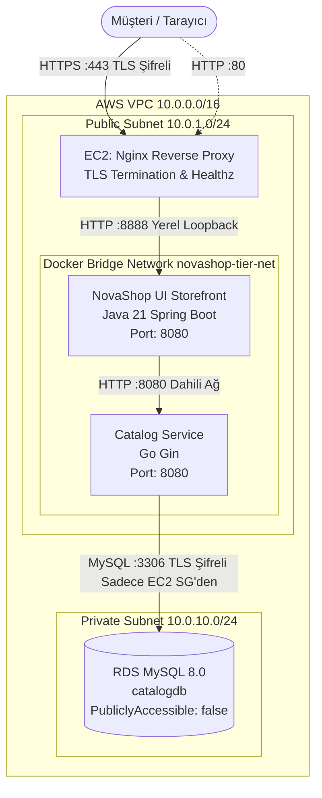

# LAB-04-AWS-3TIER — AWS 3-Tier Mimari: Docker Compose, Private RDS ve TLS Dağıtımı

---

### Amaç

AWS üzerinde izole bir VPC içerisinde; public subnet'teki EC2 üzerinde Docker Compose ile NovaShop UI ve Catalog mikroservislerini çalıştırmak, Catalog servisini private subnet'teki RDS MySQL veritabanına bağlamak ve Nginx ters vekili üzerinde TLS/HTTPS sertifikası ile güvenli, uçtan uca çalışan 3-katmanlı kurumsal bir e-ticaret altyapısı kurup rollback mekanizmasını doğrulamak.

---

### Kazanımlar

- 3-Katmanlı (Presentation, Application, Database) bulut mimarisini mikroservis konteynerleri ile hayata geçirmek.
- Konteynerize Catalog servisi (Go) ile private subnet'teki RDS MySQL veritabanını güvenli ortam değişkenleri (`.env`) ile bağlamak.
- Nginx üzerinde TLS/HTTPS (SSL) sonlandırması ve HTTP'den HTTPS'e otomatik yönlendirme yapılandırmak.
- Mikroservisler arası dahili container bridge ağı (`novashop-tier-net`) kurarak yalnızca gerekli portları dış dünyaya açmak.
- Yeni bir sürüm dağıtımında hata oluştuğunda çalışan önceki sürüme geri dönmeyi sağlayan kontrollü Rollback mekanizmasını uygulamak.

---

### Ön koşullar

- **Önceki Lablar:** [LAB-02-AWS-BASICS.md](file:///Users/hakan/novashop-workspace/novashop/docs/labs/LAB-02-AWS-BASICS.md) ve [LAB-03-DOCKER-COMPOSE.md](file:///Users/hakan/novashop-workspace/novashop/docs/labs/LAB-03-DOCKER-COMPOSE.md) tamamlanmış olmalıdır.
- **Aktif AWS Kaynakları:**
  - Çalışır durumda 1 adet VPC (10.0.0.0/16) ve Internet Gateway.
  - Public Subnet içinde 1 adet EC2 Ubuntu 22.04 LTS sunucusu (`novashop-web-sg` grubunda).
  - Private Subnet içinde 1 adet RDS MySQL veritabanı (`catalogdb` kurulu, `novashop-rds-sg` grubunda).
- **Alan Adı (Opsiyonel / Tavsiye Edilen):** Kendi alan adınız (`novashop.<DOMAIN>`) veya lab ortamı için kendinden imzalı (self-signed) test sertifikası.

---

### Mimari



---

### Kullanılan placeholder'lar

| Placeholder | Anlamı | Örnek Biçim |
|---|---|---|
| `<EC2_PUBLIC_IP>` | EC2 sunucusunun genel IP adresi | `3.120.45.67` |
| `<RDS_ENDPOINT>` | RDS MySQL bağlantı adresi | `novashop-catalog-db.cxxxx.rds.amazonaws.com` |
| `<DB_PASSWORD>` | RDS `novashop` veritabanı kullanıcısı şifresi | Belirlenen güçlü şifre |
| `<DOMAIN>` | Sunucu alan adı (yoksa IP kullanılır) | `shop.example.com` veya `<EC2_PUBLIC_IP>` |
| `<KEY_PATH>` | Yerel SSH özel anahtarının yolu | `~/.ssh/novashop-key.pem` |

---

### Adımlar

#### 1. EC2 Sunucusuna Bağlanma ve Docker/Compose Kurulumu

Yerel terminalinizden EC2 sunucusuna SSH ile bağlanın:

```bash
chmod 400 <KEY_PATH>
ssh -i <KEY_PATH> ubuntu@<EC2_PUBLIC_IP>
```

**Docker Engine ve Docker Compose Eklentisini Kurun:**
```bash
sudo apt-get update -y
sudo apt-get install -y ca-certificates curl gnupg

# Docker resmi GPG anahtarını ve reposunu ekle
sudo install -m 0755 -d /etc/apt/keyrings
curl -fsSL https://download.docker.com/linux/ubuntu/gpg | sudo gpg --dearmor -o /etc/apt/keyrings/docker.gpg
sudo chmod a+r /etc/apt/keyrings/docker.gpg

echo "deb [arch="$(dpkg --print-architecture)" signed-by=/etc/apt/keyrings/docker.gpg] https://download.docker.com/linux/ubuntu \
  "$(. /etc/os-release && echo "$VERSION_CODENAME")" stable" | sudo tee /etc/apt/sources.list.d/docker.list > /dev/null

sudo apt-get update -y
sudo apt-get install -y docker-ce docker-ce-cli containerd.io docker-buildx-plugin docker-compose-plugin

# Ubuntu kullanıcısını docker grubuna ekle
sudo usermod -aG docker ubuntu
```
*Not:* Grup yetkisinin geçerli olması için oturumu kapatıp yeniden bağlanın veya `newgrp docker` çalıştırın.

**Doğrulama:**
```bash
docker --version
docker compose version
```

---

#### 2. Güvenlik Grubunda HTTPS (Port 443) Açma

Yerel bilgisayarınızdan veya AWS CloudShell üzerinden EC2 Web Güvenlik Grubuna HTTPS izni ekleyin:

```bash
aws ec2 authorize-security-group-ingress \
  --group-id <WEB_SG_ID> \
  --protocol tcp --port 443 \
  --cidr 0.0.0.0/0 \
  --region <AWS_REGION>
```

---

#### 3. Proje Dosyalarını Hazırlama ve Gizli Bilgi (.env) Yönetimi

EC2 sunucusu üzerinde uygulama dizinini oluşturun:

```bash
mkdir -p ~/novashop-deploy && cd ~/novashop-deploy
```

**Güvenli Ortam Değişkenleri Dosyası (`.env`):**
> [!IMPORTANT]
> Veritabanı şifresi ve endpoint bilgileri doğrudan komutlarda veya Dockerfile içinde tutulmaz; sunucuya özel `.env` dosyasında saklanır ve asla Git'e commit edilmez:

```bash
read -s -p "RDS Veritabanı Parolasını Giriniz: " DB_PASS
echo ""

cat << EOF > .env
# NovaShop 3-Tier Production Environment
APP_ENV=production
UI_PORT=8888
CATALOG_PORT=8081

# RDS Veritabanı Parametreleri
DB_ENDPOINT=<RDS_ENDPOINT>:3306
DB_USER=novashop
DB_PASSWORD=$DB_PASS
DB_NAME=catalogdb
EOF

# Parolayı bellekten temizle ve .env dosyasını yalnızca sahibine okunur yap
unset DB_PASS
chmod 600 .env
```

---

#### 4. Üretim Düzeyi Docker Compose Dosyası (`docker-compose.prod.yml`)

EC2 üzerinde `docker-compose.prod.yml` dosyasını oluşturun. Bu dosya UI ve Catalog servislerini izole bir container bridge ağında birleştirir ve katı kaynak limitleri uygular (D-008):

```bash
cat << 'EOF' > docker-compose.prod.yml
version: '3.8'

networks:
  novashop-tier-net:
    driver: bridge

services:
  catalog:
    image: public.ecr.aws/aws-containers/retail-store-sample-catalog:v1.6.2
    container_name: novashop-catalog-prod
    restart: unless-stopped
    networks:
      - novashop-tier-net
    environment:
      - DB_ENDPOINT=${DB_ENDPOINT}
      - DB_USER=${DB_USER}
      - DB_PASSWORD=${DB_PASSWORD}
      - DB_NAME=${DB_NAME}
      - PORT=8080
    deploy:
      resources:
        limits:
          cpus: '0.40'
          memory: 384M
        reservations:
          memory: 128M
    healthcheck:
      test: ["CMD-SHELL", "wget -qO- http://localhost:8080/health || exit 1"]
      interval: 15s
      timeout: 5s
      retries: 3
      start_period: 10s

  ui:
    image: public.ecr.aws/aws-containers/retail-store-sample-ui:v1.6.2
    container_name: novashop-ui-prod
    restart: unless-stopped
    depends_on:
      catalog:
        condition: service_healthy
    networks:
      - novashop-tier-net
    ports:
      - "127.0.0.1:8888:8080"
    environment:
      - ENDPOINTS_CATALOG=http://catalog:8080
      - JAVA_OPTS=-Xms128m -Xmx384m
    deploy:
      resources:
        limits:
          cpus: '0.60'
          memory: 512M
        reservations:
          memory: 256M
    healthcheck:
      test: ["CMD-SHELL", "wget -qO- http://localhost:8080/actuator/health | grep -q 'UP' || exit 1"]
      interval: 15s
      timeout: 5s
      retries: 3
      start_period: 30s
EOF
```

---

#### 5. TLS Sertifikası ve Nginx HTTPS Yapılandırması

**1. TLS Sertifikası Üretimi:**
Eğer doğrulanmış bir DNS alan adınız varsa Let's Encrypt / Certbot (`sudo certbot --nginx -d <DOMAIN>`) kullanabilirsiniz. Lab veya IP tabanlı test ortamında ise yüksek güvenlikli kendinden imzalı TLS sertifikası üretin:

```bash
sudo mkdir -p /etc/ssl/novashop
sudo openssl req -x509 -nodes -days 365 -newkey rsa:2048 \
  -keyout /etc/ssl/novashop/novashop.key \
  -out /etc/ssl/novashop/novashop.crt \
  -subj "/C=TR/ST=Istanbul/L=DevOps/O=NovaShop/CN=<EC2_PUBLIC_IP>"

sudo chmod 600 /etc/ssl/novashop/novashop.key
sudo chmod 644 /etc/ssl/novashop/novashop.crt
```

**2. Nginx TLS ve Reverse Proxy Konfigürasyonu:**
`/etc/nginx/conf.d/novashop-3tier.conf` dosyasını oluşturun:

```bash
sudo tee /etc/nginx/conf.d/novashop-3tier.conf > /dev/null << 'EOF'
# HTTP -> HTTPS Yönlendirmesi
server {
    listen 80 default_server;
    listen [::]:80 default_server;
    server_name _;

    # Sağlık kontrolü HTTP üzerinden de yanıt verir (Load Balancer dostu)
    location = /healthz {
        access_log off;
        default_type application/json;
        return 200 '{"status":"UP","tier":"3-tier-edge","protocol":"http"}\n';
    }

    # Diğer tüm istekleri güvenli HTTPS portuna zorla yönlendir (301)
    location / {
        return 301 https://$host$request_uri;
    }
}

# HTTPS Güvenli Web Katmanı
server {
    listen 443 ssl http2 default_server;
    listen [::]:443 ssl http2 default_server;
    server_name _;

    # SSL / TLS Sertifikaları
    ssl_certificate /etc/ssl/novashop/novashop.crt;
    ssl_certificate_key /etc/ssl/novashop/novashop.key;

    # Güçlü TLS Protokol ve Şifreleme Ayarları
    ssl_protocols TLSv1.2 TLSv1.3;
    ssl_prefer_server_ciphers on;
    ssl_ciphers ECDHE-ECDSA-AES128-GCM-SHA256:ECDHE-RSA-AES128-GCM-SHA256:ECDHE-ECDSA-AES256-GCM-SHA384:ECDHE-RSA-AES256-GCM-SHA384;
    ssl_session_cache shared:SSL:10m;
    ssl_session_timeout 1d;

    # Güvenlik Başlıkları
    add_header Strict-Transport-Security "max-age=31536000; includeSubDomains" always;
    add_header X-Frame-Options "SAMEORIGIN" always;
    add_header X-Content-Type-Options "nosniff" always;
    add_header X-XSS-Protection "1; mode=block" always;
    server_tokens off;

    # 1. Sağlık Kontrolü
    location = /healthz {
        access_log off;
        default_type application/json;
        return 200 '{"status":"UP","tier":"3-tier-edge","protocol":"https"}\n';
    }

    # 2. UI Storefront Reverse Proxy (127.0.0.1:8888)
    location / {
        proxy_pass http://127.0.0.1:8888;
        proxy_http_version 1.1;

        proxy_set_header Connection "";
        proxy_set_header Host $host;
        proxy_set_header X-Real-IP $remote_addr;
        proxy_set_header X-Forwarded-For $proxy_add_x_forwarded_for;
        proxy_set_header X-Forwarded-Proto https;

        proxy_connect_timeout 5s;
        proxy_send_timeout 60s;
        proxy_read_timeout 60s;
    }
}
EOF
```

**Nginx Test ve Yeniden Başlatma:**
```bash
sudo rm -f /etc/nginx/conf.d/novashop.conf /etc/nginx/sites-enabled/default 2>/dev/null || true
sudo nginx -t
sudo systemctl restart nginx
```

---

#### 6. 3-Tier Uygulama Yığınını Başlatma

Konteynerleri arka planda başlatın:

```bash
cd ~/novashop-deploy
docker compose -f docker-compose.prod.yml up -d
```

**Konteynerlerin Sağlık Durumunu İzleyin:**
```bash
docker compose -f docker-compose.prod.yml ps
```
*Beklenen çıktı (yaklaşık 20-30 saniye sonra):*
```text
NAME                   IMAGE                                                  STATUS                    PORTS
novashop-catalog-prod  .../retail-store-sample-catalog:v1.6.2                 Up (healthy)              8080/tcp
novashop-ui-prod       .../retail-store-sample-ui:v1.6.2                      Up (healthy)              127.0.0.1:8888->8080/tcp
```

**Katalog Servisi Loglarını ve Veritabanı Bağlantısını Kontrol Edin:**
```bash
docker logs novashop-catalog-prod | head -n 20
```
*Beklenen çıktı:* `Using mysql database ... Running database migration ... Database migration complete`.

---

#### 7. Uçtan Uca Doğrulama ve Testler

Yerel bilgisayarınızdan veya terminalinizden testleri gerçekleştirin:

```bash
# 1. HTTP -> HTTPS 301 Yönlendirme Testi
curl -s -I http://<EC2_PUBLIC_IP>/ | grep -E "(HTTP|Location)"
```
*Beklenen çıktı:*
```text
HTTP/1.1 301 Moved Permanently
Location: https://<EC2_PUBLIC_IP>/
```

```bash
# 2. HTTPS Sağlık Kontrolü (Kendinden imzalı sertifika için -k / --insecure)
curl -s -k https://<EC2_PUBLIC_IP>/healthz
```
*Beklenen çıktı:*
```json
{"status":"UP","tier":"3-tier-edge","protocol":"https"}
```

```bash
# 3. HTTPS Üzerinden Mağaza Sayfası İçerik Kontrolü
curl -s -k https://<EC2_PUBLIC_IP>/ | grep -i "catalog"
```

```bash
# 4. Otomatik Laboratuvar Doğrulama Betiğini Çalıştırma
bash scripts/verify/verify-lab-04.sh <EC2_PUBLIC_IP> --insecure
```
*Beklenen çıktı:*
```text
=== [LAB-04] Doğrulama Başlatılıyor: <EC2_PUBLIC_IP> ===
1. HTTP (Port 80) -> HTTPS yönlendirme testi...
✅ HTTP -> HTTPS yönlendirmesi başarılı (HTTP 301).
2. HTTPS üzerinden ana sayfa ve NovaShop marka kontrolü...
✅ HTTPS erişimi ve marka başlığı ('NovaShop DevOps Store') doğrulandı.
3. HTTPS /actuator/health sağlık kontrolü...
✅ Actuator sağlık kontrolü başarılı: {"status":"UP"}
✅ HTTPS Favicon HTTP 200 OK.
=== [LAB-04] Tüm 3-Tier Doğrulamaları Başarılı! ===
```

---

#### 8. Kontrollü Sürüm Güncelleme ve Rollback Mekanizması

Gerçek üretim ortamlarında hatalı bir sürüm çıktığında sistemin anında önceki kararlı sürüme dönebilmesi gerekir.

**1. Dağıtım ve Rollback Betiği (`deploy.sh` ve `rollback.sh`):**
```bash
cat << 'EOF' > rollback.sh
#!/usr/bin/env bash
set -e

echo "=== NovaShop Acil Rollback Başlatılıyor ==="
PREV_UI_IMAGE="public.ecr.aws/aws-containers/retail-store-sample-ui:v1.6.2"

# Çalışan hatalı servisi önceki stabil imaja döndür
sed -i "s|image: .*retail-store-sample-ui:.*|image: ${PREV_UI_IMAGE}|g" docker-compose.prod.yml

docker compose -f docker-compose.prod.yml up -d ui

echo "Rollback tamamlandı. Konteyner durumu:"
docker compose -f docker-compose.prod.yml ps
EOF

chmod +x rollback.sh
```

**2. Rollback Testi:**
```bash
./rollback.sh
```
*Beklenen çıktı:* `Rollback tamamlandı. Konteyner durumu: ... Up (healthy)`.

---

### Troubleshooting

#### Senaryo 1: Catalog Servisi RDS'e Bağlanamıyor (`dial tcp ...:3306: i/o timeout`)
- **Belirti:** `docker logs novashop-catalog-prod` çıktısında `failed to connect database: dial tcp <RDS_ENDPOINT>:3306: i/o timeout` hatası.
- **Muhtemel Neden:** RDS Security Group (`novashop-rds-sg`) kuralında EC2 Security Group kimliğinin eksik olması veya yanlış yazılması.
- **Teşhis Komutu:**
  ```bash
  docker exec -it novashop-catalog-prod nc -zv <RDS_ENDPOINT> 3306
  ```
- **Güvenli Çözüm:** AWS konsolundan veya CLI ile `novashop-rds-sg` güvenlik grubunda port 3306'nın kaynağının `novashop-web-sg` olduğunu teyit edin.

#### Senaryo 2: UI Servisi Açılmıyor veya Catalog'u Göremiyor (`502 Bad Gateway`)
- **Belirti:** Tarayıcıda ürünler yüklenmiyor veya UI loglarında `Connection refused` görünüyor.
- **Muhtemel Neden:** Catalog servisi sağlıklı (`healthy`) duruma geçmeden UI'ın başlamış olması veya `novashop-tier-net` köprü ağı tanımlama hatası.
- **Teşhis Komutu:**
  ```bash
  docker inspect novashop-catalog-prod --format '{{.State.Health.Status}}'
  docker exec -it novashop-ui-prod curl -s http://catalog:8080/health
  ```
- **Güvenli Çözüm:** `docker-compose.prod.yml` içinde `depends_on.catalog.condition: service_healthy` tanımlandığından emin olun ve konteynerleri yeniden başlatın: `docker compose -f docker-compose.prod.yml restart`.

#### Senaryo 3: Nginx SSL Sertifika Hatası (`SSL_ERROR_RX_RECORD_TOO_LONG`)
- **Belirti:** Tarayıcı veya curl `SSL_ERROR_RX_RECORD_TOO_LONG` hatası veriyor.
- **Muhtemel Neden:** Port 443 bloğunda `ssl` anahtar kelimesinin unutulmuş olması (`listen 443;` yerine `listen 443 ssl;` olmalıdır).
- **Teşhis Komutu:**
  ```bash
  sudo nginx -t
  grep -rn "listen 443" /etc/nginx/
  ```
- **Güvenli Çözüm:** Konfigürasyon dosyasında `listen 443 ssl http2;` satırını doğrulayıp `sudo systemctl restart nginx` yapın.

---

### Güvenlik Notu

1. **İç Ağ İzolasyonu:**
   - Catalog servisi dış dünyaya (`0.0.0.0/0`) hiçbir port açmaz; yalnızca Docker iç ağı (`novashop-tier-net`) üzerinden UI servisiyle konuşur.
   - UI servisi yalnızca `127.0.0.1:8888` üzerinden EC2 loopback adresinde dinler; dış dünya doğrudan erişemez, yalnızca Nginx üzerinden HTTPS ile erişir.
2. **TLS Zorunluluğu:**
   - Port 80 gelen tüm istekler HTTP 301 kodu ile HTTPS port 443'e zorla yönlendirilir.
   - Güçlü HSTS (`Strict-Transport-Security`) başlığı eklenmiştir.
3. **Secret Yönetimi:**
   - `.env` dosyası `chmod 600` ile korunur ve `.gitignore` içinde yer alır.

---

### Cleanup / Rollback

Kaynakları güvenle kaldırmak için:

```bash
# 1. Konteynerleri ve iç ağı durdur
cd ~/novashop-deploy
docker compose -f docker-compose.prod.yml down -v

# 2. Üretilen TLS sertifikalarını ve deploy dizinini temizle
sudo rm -rf /etc/ssl/novashop ~/novashop-deploy

# 3. AWS Altyapısını Silme (EC2 ve RDS)
# LAB-02-AWS-BASICS.md dosyasındaki "Cleanup / Rollback" adımlarını eksiksiz uygulayınız.
```

---

### Öğrenci Görevi

1. Nginx konfigürasyonuna `/api/catalog/` yolunu ekleyerek doğrudan Catalog servisinin sağlık durumunu dönen bir alt yönlendirme (proxy path) tanımlayın.
2. `curl -k https://<EC2_PUBLIC_IP>/api/catalog/health` çağrısının `200 OK` verdiğini teyit edin.

---

### Eğitmen Kontrol Listesi

- [ ] Docker Compose üzerinde UI ve Catalog mikroservisleri `healthy` durumunda mı?
- [ ] Catalog servisi private subnet'teki RDS MySQL'e başarıyla bağlanıp migration tamamlamış mı?
- [ ] HTTP istekleri otomatik olarak HTTPS'e (port 443, HTTP 301) yönlendiriliyor mu?
- [ ] Nginx üzerinden `/healthz` endpoint'i `HTTP 200 OK` dönüyor mu?
- [ ] `rollback.sh` betiği kesintisiz ve hatasız çalışıyor mu?
