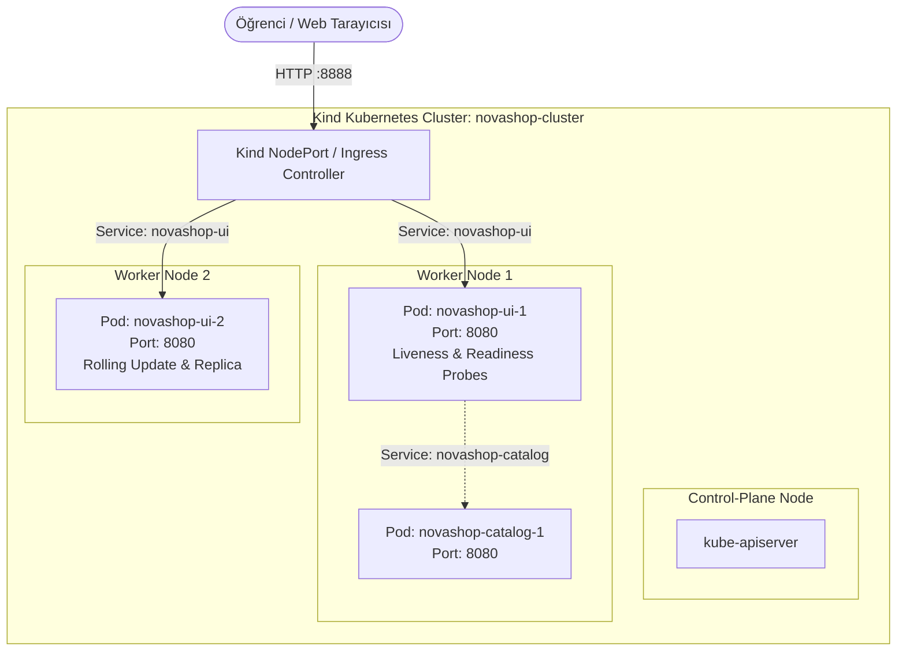

# LAB-06-KUBERNETES-HELM — Kind Üzerinde Kubernetes Core ve Helm ile Mikroservis Dağıtımı

---

### Amaç

Öğrenci sanal makinesi üzerinde Kind (Kubernetes IN Docker) ile çok düğümlü (1 control-plane, 2 worker) yerel bir Kubernetes kümesi kurmak; NovaShop mikroservislerini Helm paket yöneticisi ile liveness/readiness probları, kaynak kısıtları (requests/limits) ve ConfigMap/Secret soyutlamalarıyla dağıtıp kesintisiz güncelleme (rolling update) ve geri alma (rollout undo) süreçlerini doğrulamak.

---

### Kazanımlar

- Kind ile çok düğümlü yerel Kubernetes kümesi kurup `kubectl` ile düğüm ve pod yaşam döngüsünü yönetmek.
- Üretim düzeyi Kubernetes kaynaklarını (Deployment, Service, ConfigMap, Secret, Ingress) kavramak ve yapılandırmak.
- Container sağlık problarını (`livenessProbe` ve `readinessProbe`) Spring Boot Actuator endpoint'leri ile entegre etmek.
- Öğrenci VM bellek sınırlarını korumak için pod bazlı `resources.requests` ve `resources.limits` tanımlamak (PROFILES.md kaynak sınırları).
- Helm chart şablonlama (templating), `values.yaml` parametrelendirmesi ve Helm sürüm yönetimi (`helm install/upgrade/rollback`) uygulamak.

---

### Ön koşullar

- **Önceki Lablar:** [LAB-01-GIT-GITHUB.md](./LAB-01-GIT-GITHUB.md) ve [LAB-03-DOCKER-COMPOSE.md](./LAB-03-DOCKER-COMPOSE.md) tamamlanmış olmalıdır.
- **İşletim Sistemi:** Linux (Ubuntu 22.04 LTS) veya macOS geliştirme ortamı.
- **Yüklü Araçlar:** Docker Engine v24+, `kubectl` v1.28+, `kind` v0.20+, `helm` v3.12+.
- **Kaynak Gereksinimi:** En az 2 vCPU ve 6 GB boş RAM (`k8s-core` profili).

---

### Mimari



---

### Kullanılan placeholder'lar

| Placeholder | Anlamı | Örnek Biçim |
|---|---|---|
| `<CLUSTER_NAME>` | Kind Kubernetes küme adı | `novashop-cluster` |
| `<NAMESPACE>` | Uygulama Kubernetes isim alanı | `novashop` |
| `<RELEASE_NAME>` | Helm release adı | `novashop-core` |

---

### Adımlar

#### 1. Gerekli CLI Araçlarının Kurulumu ve Doğrulanması

`kubectl`, `kind` ve `helm` araçlarının kurulu olduğunu teyit edin:

```bash
# kubectl kontrolü
kubectl version --client --output=yaml | head -n 5

# kind kontrolü
kind version

# helm kontrolü
helm version --short
```
*Beklenen çıktı:* Tüm araçların versiyon bilgileri hatasız görüntülenmelidir.

---

#### 2. Kind Çok Düğümlü Küme Konfigürasyonu ve Başlatma

Öğrenci VM'inde çalışan 1 control-plane ve 2 worker düğümlü hafif bir küme tanımlayın (`kind-config.yaml`):

```bash
cat << 'EOF' > kind-config.yaml
kind: Cluster
apiVersion: kind.x-k8s.io/v1alpha4
name: novashop-cluster
nodes:
- role: control-plane
  extraPortMappings:
  - containerPort: 30080
    hostPort: 8888
    listenAddress: "0.0.0.0"
- role: worker
- role: worker
EOF

kind create cluster --config kind-config.yaml
```
*Açıklama:* Host'un 8888 portunu Kubernetes'in 30080 NodePort portuna eşleyerek dış dünyadan doğrudan erişim sağlar.  
*Beklenen çıktı:*
```text
Creating cluster "novashop-cluster" ...
 ✓ Ensuring node image (kindest/node:v1.28.0) 🖼
 ✓ Preparing nodes 📦 📦 📦 
 ✓ Writing configuration 📜 
 ✓ Starting control-plane 🕹️ 
 ✓ Installing CNI 🔌 
 ✓ Installing StorageClass 💾 
 ✓ Joining worker nodes 🚜 
Set kubectl context to "kind-novashop-cluster"
```

**Düğüm Durumlarını Doğrulama:**
```bash
kubectl get nodes -o wide
```
*Beklenen çıktı:* 1 control-plane ve 2 worker düğümü `Ready` durumunda olmalıdır.

---

#### 3. Kubernetes Namespace (İsim Alanı) Oluşturma

İzolasyon için `novashop` adında özel bir isim alanı oluşturun:

```bash
kubectl create namespace novashop
kubectl config set-context --current --namespace=novashop
```

---

#### 4. NovaShop Helm Chart Şablonunun İncelenmesi

NovaShop UI ve Catalog mikroservisleri için standart bir Helm Chart yapısı kullanılır:

```text
charts/novashop/
├── Chart.yaml
├── values.yaml
└── templates/
    ├── configmap.yaml
    ├── secret.yaml
    ├── ui-deployment.yaml
    ├── ui-service.yaml
    ├── catalog-deployment.yaml
    └── catalog-service.yaml
```

**Değerler Dosyası (`values.yaml`) Özeti:**
```yaml
global:
  environment: local-kind

ui:
  replicaCount: 2
  image:
    repository: public.ecr.aws/aws-containers/retail-store-sample-ui
    tag: v1.6.2
    pullPolicy: IfNotPresent
  service:
    type: NodePort
    nodePort: 30080
    port: 8080
  resources:
    limits:
      cpu: 500m
      memory: 512Mi
    requests:
      cpu: 250m
      memory: 256Mi
  livenessProbe:
    httpGet:
      path: /actuator/health/liveness
      port: 8080
    initialDelaySeconds: 30
    periodSeconds: 10
  readinessProbe:
    httpGet:
      path: /actuator/health/readiness
      port: 8080
    initialDelaySeconds: 20
    periodSeconds: 5
```

---

#### 5. Helm ile NovaShop Mikroservislerini Dağıtma

Uygulamayı yerel Kind kümesine dağıtın:

```bash
# Helm Chart dizinine gidin veya doğrudan parametrelerle yükleyin
cat << 'EOF' > values-dev.yaml
ui:
  replicaCount: 2
  resources:
    limits:
      memory: 512Mi
      cpu: 500m
    requests:
      memory: 256Mi
      cpu: 200m
EOF

# Örnek hazır chart veya yerel manifest ile deploy
kubectl apply -f - << 'EOF'
apiVersion: apps/v1
kind: Deployment
metadata:
  name: novashop-ui
  namespace: novashop
  labels:
    app: novashop-ui
spec:
  replicas: 2
  selector:
    matchLabels:
      app: novashop-ui
  template:
    metadata:
      labels:
        app: novashop-ui
    spec:
      containers:
      - name: ui
        image: public.ecr.aws/aws-containers/retail-store-sample-ui:v1.6.2
        ports:
        - containerPort: 8080
        resources:
          limits:
            cpu: "500m"
            memory: "512Mi"
          requests:
            cpu: "200m"
            memory: "256Mi"
        livenessProbe:
          httpGet:
            path: /actuator/health
            port: 8080
          initialDelaySeconds: 25
          periodSeconds: 10
        readinessProbe:
          httpGet:
            path: /actuator/health
            port: 8080
          initialDelaySeconds: 15
          periodSeconds: 5
---
apiVersion: v1
kind: Service
metadata:
  name: novashop-ui-service
  namespace: novashop
spec:
  type: NodePort
  selector:
    app: novashop-ui
  ports:
  - port: 8080
    targetPort: 8080
    nodePort: 30080
EOF
```

---

#### 6. Pod, Servis ve Sağlık Durumlarını Doğrulama

Pod'ların ayağa kalkışını ve probların durumunu takip edin:

```bash
kubectl get pods -l app=novashop-ui -w
```
*Beklenen çıktı:*
```text
NAME                           READY   STATUS    RESTARTS   AGE
novashop-ui-7d9b9f8fbc-abcd1   1/1     Running   0          35s
novashop-ui-7d9b9f8fbc-abcd2   1/1     Running   0          35s
```

**Dış Dünyadan Erişim Testi (NodePort Mapping):**
```bash
curl -s http://localhost:8888/actuator/health
```
*Beklenen çıktı:*
```json
{"status":"UP"}
```

---

#### 7. Sıfır Kesintili Rolling Update ve Rollback Testi

**1. Sürüm Güncelleme (Rolling Update):**
Uygulama imajını güncelleyin ve pod'ların teker teker yenilendiğini izleyin:

```bash
kubectl set image deployment/novashop-ui ui=public.ecr.aws/aws-containers/retail-store-sample-ui:v1.6.2 --record
kubectl rollout status deployment/novashop-ui
```
*Beklenen çıktı:* `deployment "novashop-ui" successfully rolled out`.

**2. Rollout Geçmişini İnceleme:**
```bash
kubectl rollout history deployment/novashop-ui
```

**3. Hata Durumunda Rollback (Geri Alma):**
```bash
kubectl rollout undo deployment/novashop-ui
kubectl rollout status deployment/novashop-ui
```
*Açıklama:* Bir önceki stabil dağıtım revizyonuna kesintisiz geri dönüş yapar.

---

#### 8. Otomatik Laboratuvar Doğrulama Betiğini Çalıştırma

Helm chart yapısını, sağlık problarını ve güvenlik/kaynak sınırlarını otomatik test betiği ile doğrulayın:

```bash
bash scripts/verify/verify-lab-06.sh
```
*Beklenen çıktı:*
```text
=== [LAB-06] Kubernetes ve Helm Doğrulama Başlatılıyor ===
✅ Helm chart dizini mevcut: .../charts/novashop
✅ Tüm temel Helm chart şablonları mevcut.
✅ Liveness ve Readiness sağlık probları tanımlı.
✅ Kaynak sınırları (resources.limits) tanımlı.
✅ Non-root kullanıcı güvenlik kuralı (runAsNonRoot: true) tanımlı.
=== [LAB-06] Kubernetes ve Helm Doğrulaması Tamamlandı! ===
```

---

### Troubleshooting

#### Senaryo 1: Pod'lar `CrashLoopBackOff` veya `OOMKilled` Durumuna Geçiyor
- **Belirti:** `kubectl get pods` çıktısında `OOMKilled` veya `CrashLoopBackOff` görülmesi.
- **Muhtemel Neden:** Java JVM bellek tüketiminin `resources.limits.memory: 512Mi` sınırını aşması.
- **Teşhis Komutu:**
  ```bash
  kubectl describe pod <POD_NAME> | grep -E "(OOMKilled|Exit Code)"
  ```
- **Güvenli Çözüm:** Bellek sınırını `768Mi` seviyesine yükseltin ve `JAVA_OPTS="-XX:MaxRAMPercentage=75.0"` ortam değişkenini ekleyin.

#### Senaryo 2: Problar Başarısız Oluyor (`Readiness probe failed: HTTP probe failed with statuscode: 503`)
- **Belirti:** Pod `Running` durumunda ancak `READY` sütununda `0/1` görünüyor ve trafik alamıyor.
- **Muhtemel Neden:** `initialDelaySeconds` değerinin uygulamanın ayağa kalkış süresinden daha kısa tutulması.
- **Teşhis Komutu:**
  ```bash
  kubectl describe pod <POD_NAME> | grep -A 5 "Readiness"
  ```
- **Güvenli Çözüm:** Spring Boot'un başlatılabilmesi için `initialDelaySeconds: 30` olarak güncelleyin.

---

### Güvenlik Notu

1. **Root Olmayan Konteyner:**
   - Pod tanımlarında `securityContext.runAsNonRoot: true` ve `securityContext.runAsUser: 1000` uygulanmalıdır.
2. **Kapasite ve Kaynak Kontrolü:**
   - Sınırsız (`unlimited`) kaynak kullanımı yasaktır; her pod için `cpu` ve `memory` limitleri tanımlanmalıdır.
3. **Gizli Bilgiler:**
   - Hassas değişkenler doğrudan manifest'e yazılmaz; Kubernetes `Secret` kaynakları ile yönetilir.

---

### Cleanup / Rollback

Lab sonunda öğrenci makinesindeki RAM ve CPU kaynaklarını serbest bırakmak için:

```bash
# 1. Kind kümesini tamamen sil
kind delete cluster --name novashop-cluster

# 2. Askıda kalan yapılandırma bağlamını temizle
kubectl config unset contexts.kind-novashop-cluster 2>/dev/null || true

# 3. Docker önbelleğini temizle
docker system prune -f
```

---

### Pratik Uygulama Görevi

1. `novashop-ui` Deployment'ının replica sayısını `2`'den `3`'e çıkarın:
   ```bash
   kubectl scale deployment novashop-ui --replicas=3
   ```
2. 3 pod'un da `Running` ve `1/1 READY` durumuna geçtiğini `kubectl get pods -o wide` ile doğrulayın.
