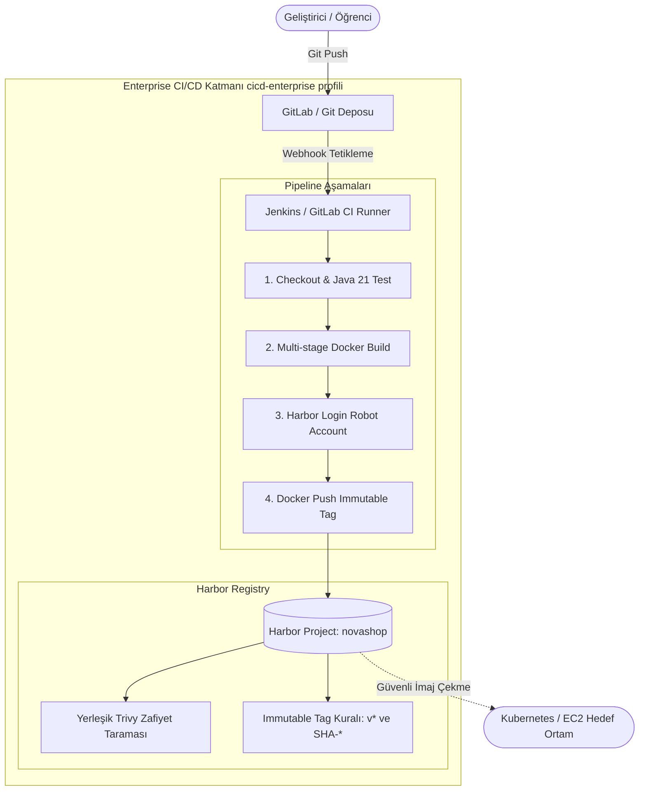

# LAB-07-ENTERPRISE-CICD — Kurumsal CI/CD: GitLab, Jenkins ve Harbor ile Güvenli Dağıtım Hattı

---

### Amaç

Kurumsal DevOps standartlarına uygun olarak; yerel veya bulut ortamında barındırılan GitLab/Jenkins otomasyon sunucusu ve Harbor özel konteyner kayıt defteri (Registry) üzerinde NovaShop mikroservisleri için otomatik derleme, birim test, değiştirilemez (immutable) etiketleme ve zafiyet taramalı uçtan uca güvenli bir CI/CD pipeline'ı kurup işletmek.

---

### Kazanımlar

- Kurumsal CI/CD mimarisinde kod deposu (GitLab), otomasyon motoru (Jenkins/GitLab CI) ve güvenli imaj kayıt defteri (Harbor) entegrasyonunu kurmak.
- Harbor üzerinde en az ayrıcalık (Least Privilege) ilkesiyle çalışan **Robot Hesapları (Robot Accounts)** ve rol tabanlı erişim kontrolü (RBAC) uygulamak.
- İmaj bütünlüğü ve denetlenebilirlik için Harbor üzerinde **Değiştirilemez Etiket (Immutable Tag)** kurallarını yapılandırmak.
- Pipeline aşamasında imajların yerleşik Trivy motoru ile otomatik zafiyet taramasından (CVE scan) geçirilmesini sağlamak.
- `Jenkinsfile` / `.gitlab-ci.yml` bildirimsel (declarative) boru hattı sözdizimi ile çok aşamalı (Multi-stage) derleme ve dağıtım akışını yönetmek.

---

### Ön koşullar

- **Önceki Lablar:** [LAB-01-GIT-GITHUB.md](./LAB-01-GIT-GITHUB.md) ve [LAB-03-DOCKER-COMPOSE.md](./LAB-03-DOCKER-COMPOSE.md) tamamlanmış olmalıdır.
- **Kaynak Gereksinimi:** Öğrenci VM'inde `cicd-enterprise` profili çalıştırılacaktır (en az 2 vCPU, 8 GB boş RAM). Diğer ağır profiller (Kind, ELK) durdurulmuş olmalıdır (PROFILES.md kaynak sınırları).
- **Yüklü Araçlar:** Docker Engine, Docker Compose, `curl`, Git.

---

### Mimari



---

### Kullanılan placeholder'lar

| Placeholder | Anlamı | Örnek Biçim |
|---|---|---|
| `<HARBOR_URL>` | Harbor Registry erişim adresi | `harbor.novashop.local` veya `localhost:8443` |
| `<ROBOT_NAME>` | Harbor robot hesap adı | `robot$novashop-cicd` |
| `<ROBOT_SECRET>` | Harbor robot hesap gizli belirteci | Token dizesi |
| `<IMAGE_TAG>` | Üretilen sürüm veya commit SHA etiketi | `v0.1.0` veya `sha-1a2b3c4` |

---

### Adımlar

#### 1. Harbor Konteyner Kayıt Defterinde Proje Yapılandırması

Harbor web arayüzüne veya REST API'sine bağlanarak NovaShop projesini oluşturun:

1. **Proje Oluşturma:**
   - Proje Adı: `novashop`
   - Erişim Türü: `Private` (Yalnızca yetkili hesaplar erişebilir).
2. **Değiştirilemez Etiket (Immutable Tag) Kuralı:**
   - **Administration > Projects > novashop > Tag Immutability** sekmesine gidin.
   - Kural: `v*` ve `sha-*` desenli etiketlerin yeniden yazılmasını engelleyin.
   - Bu kural, aynı versiyon etiketiyle farklı/zararlı bir imaj yüklenmesini (Image Poisoning / Tampering) tamamen engeller.
3. **Zafiyet Taraması (Scan on Push):**
   - **Configuration > Automatically scan images on push** seçeneğini etkinleştirin.

---

#### 2. En Az Ayrıcalıklı Robot Hesabı (Robot Account) Tanımlama

Pipeline için insan kullanıcı yerine sınırlı yetkiye sahip bir sistem robot hesabı üretin:

```bash
# Harbor arayüzünden: novashop > Robot Accounts > New Robot Account
# İsim: novashop-cicd
# İzinler: Push, Pull, Read (novashop projesiyle sınırlı)
```
Üretilen `<ROBOT_NAME>` ve `<ROBOT_SECRET>` değerlerini güvenli olarak not edin.

---

#### 3. Bildirimsel Pipeline Tanımı (`Jenkinsfile` / `.gitlab-ci.yml`)

Reponun kök dizininde kurumsal dağıtım hattını tanımlayan `Jenkinsfile` dosyasını inceleyin:

```groovy
pipeline {
    agent any

    environment {
        HARBOR_REGISTRY = 'harbor.novashop.local:8443'
        HARBOR_PROJECT  = 'novashop'
        IMAGE_NAME      = 'novashop-ui'
        HARBOR_CREDS    = credentials('harbor-robot-secret') // Jenkins Credentials Store
    }

    stages {
        stage('1. Checkout & Kaynak Doğrulama') {
            steps {
                checkout scm
                sh 'git log -n 1 --oneline'
            }
        }

        stage('2. Birim Testleri (Maven)') {
            steps {
                dir('src/ui') {
                    sh './mvnw test'
                }
            }
        }

        stage('3. Docker İmaj Derleme') {
            steps {
                script {
                    SHORT_SHA = sh(script: "git rev-parse --short HEAD", returnStdout: true).trim()
                    IMAGE_TAG = "sha-${SHORT_SHA}"
                    FULL_IMAGE_URI = "${HARBOR_REGISTRY}/${HARBOR_PROJECT}/${IMAGE_NAME}:${IMAGE_TAG}"

                    sh "docker build -t ${FULL_IMAGE_URI} src/ui"
                }
            }
        }

        stage('4. Harbor Kimlik Doğrulama & Push') {
            steps {
                script {
                    sh """
                        echo "\$HARBOR_CREDS_PSW" | docker login ${HARBOR_REGISTRY} -u "\$HARBOR_CREDS_USR" --password-stdin
                        docker push ${FULL_IMAGE_URI}
                    """
                }
            }
        }

        stage('5. Güvenlik ve Zafiyet Analizi (Quality Gate)') {
            steps {
                script {
                    echo "Harbor yerleşik Trivy taraması bekleniyor..."
                    // Zafiyet eşiği: HIGH veya CRITICAL tespit edilirse pipeline durdurulabilir
                }
            }
        }
    }

    post {
        always {
            sh "docker logout ${HARBOR_REGISTRY} || true"
            cleanWs()
        }
        success {
            echo "Pipeline başarıyla tamamlandı. İmaj Harbor'a güvenle aktarıldı."
        }
        failure {
            echo "Pipeline başarısız oldu! Güvenlik veya derleme hatası tespit edildi."
        }
    }
}
```

---

#### 4. GitLab CI Alternatifi (`.gitlab-ci.yml`)

GitLab ortamı için eşdeğer `.gitlab-ci.yml` tanımı:

```yaml
stages:
  - test
  - build-and-push

variables:
  HARBOR_URL: "harbor.novashop.local:8443"
  IMAGE_NAME: "$HARBOR_URL/novashop/novashop-ui"

unit-tests:
  stage: test
  image: eclipse-temurin:21-jdk
  script:
    - cd src/ui
    - ./mvnw test

docker-build:
  stage: build-and-push
  image: docker:24-cli
  services:
    - docker:24-dind
  script:
    - echo "$HARBOR_ROBOT_SECRET" | docker login $HARBOR_URL -u "$HARBOR_ROBOT_NAME" --password-stdin
    - SHORT_SHA=$(echo $CI_COMMIT_SHA | cut -c1-8)
    - docker build -t $IMAGE_NAME:sha-$SHORT_SHA src/ui
    - docker push $IMAGE_NAME:sha-$SHORT_SHA
```

---

#### 5. Değiştirilemez Etiket (Immutable Tag) Korumasını Test Etme

Harbor üzerinde aynı etiketle ikinci kez imaj yüklemeye çalışarak sistemin imajın üzerine yazılmasını engellediğini doğrulayın:

```bash
# İlk push başarılı olur:
docker push harbor.novashop.local:8443/novashop/novashop-ui:v0.1.0

# Aynı etiketle tekrar push denemesi:
docker push harbor.novashop.local:8443/novashop/novashop-ui:v0.1.0
```
*Beklenen çıktı:*
```text
denied: The tag is immutable and cannot be overwritten
Error: failed to push some refs to 'harbor.novashop.local:8443/novashop/novashop-ui:v0.1.0'
```
Bu hata, üretim ortamlarında versiyon karmaşasını ve kötü niyetli kod enjeksiyonunu kesin olarak önler.

---

#### 6. Harbor Zafiyet Raporunu İnceleme

1. Harbor konsolunda **novashop > Repositories > novashop-ui** sayfasına girin.
2. `sha-...` etiketli imajın yanındaki **Vulnerabilities** sütununu inceleyin.
3. Trivy tarayıcısının `Total`, `Critical`, `High`, `Medium` ve `Low` seviyeli CVE bulgularını listelediğini ve imajın güvenlik durumunu raporladığını teyit edin.

---

#### 7. Otomatik Laboratuvar Doğrulama Betiğini Çalıştırma

CI/CD pipeline dosyalarını ve Harbor Registry erişilebilirliğini otomatik test betiği ile doğrulayın:

```bash
bash scripts/verify/verify-lab-07.sh harbor.novashop.local:8443
```
*Beklenen çıktı:*
```text
=== [LAB-07] Kurumsal CI/CD ve Harbor Doğrulama Başlatılıyor ===
✅ Pipeline tanım dosyası mevcut.
2. Harbor canlı servis kontrolü yapılıyor: harbor.novashop.local:8443
✅ Harbor API ping başarılı (pong).
=== [LAB-07] Kurumsal CI/CD Doğrulama Tamamlandı ===
```

---

### Troubleshooting

#### Senaryo 1: Docker Push Sırasında `x509: certificate signed by unknown authority`
- **Belirti:** Pipeline veya terminalde `docker push` komutunun SSL sertifika hatası vermesi.
- **Muhtemel Neden:** Harbor için üretilen kendinden imzalı sertifikanın veya CA'in Docker daemon güvenilir sertifika dizinine eklenmemiş olması.
- **Teşhis Komutu:**
  ```bash
  ls /etc/docker/certs.d/harbor.novashop.local:8443/ca.crt
  ```
- **Güvenli Çözüm:** Harbor CA sertifikasını `/etc/docker/certs.d/<HARBOR_URL>/ca.crt` yoluna kopyalayın ve Docker servisini yeniden başlatın: `sudo systemctl restart docker`.

#### Senaryo 2: Pipeline Bellek Yetersizliği Nedeniyle Çöküyor (OOMKilled)
- **Belirti:** GitLab Runner veya Jenkins Agent Java derleme sırasında aniden duruyor.
- **Muhtemel Neden:** Öğrenci VM'inde GitLab CE ve Jenkins'in aynı anda çalıştırılması (sistem bellek sınırı ihlali).
- **Güvenli Çözüm:** Yalnızca bir otomasyon motorunu (tercihen hafif Jenkins veya GitLab Runner) aktif tutun; diğer konteynerleri durdurun: `docker compose down`.

---

### Güvenlik Notu

1. **İnsan Parolası Kullanmama Kuralı:**
   - Pipeline'lar asla geliştirici kullanıcı adı/şifresiyle çalıştırılmaz. Süresi sınırlandırılmış ve yalnızca ilgili projeye yetkili Robot Hesapları kullanılır.
2. **Değiştirilemezlik (Immutability):**
   - Tüm yayın sürümleri (`v*`) değiştirilemez olarak kilitlenir.
3. **Zafiyet Eşiği (Quality Gate):**
   - Kritik (Critical) seviyeli zafiyet içeren imajların dağıtım aşamasına geçmesi Harbor dağıtım engelleme kuralları ile durdurulur.

---

### Cleanup / Rollback

```bash
# 1. CI/CD konteynerlerini durdurun
docker compose --profile cicd-enterprise down -v

# 2. Yerel Docker imaj önbelleğini temizleyin
docker system prune -a -f

# 3. Harbor robot hesabı oturumunu sonlandırın
docker logout <HARBOR_URL> 2>/dev/null || true
```

---

### Pratik Uygulama Görevi

1. Harbor üzerinde `novashop` projesine bir **Tag Retention Rule (Etiket Saklama Kuralı)** tanımlayın:
   - "Son yüklenen en güncel 5 imajı sakla, 5'ten eski imajları haftalık olarak otomatik sil".
2. Kuralın simülasyonunu (Dry Run) çalıştırıp doğru imajları hedeflediğini doğrulayın.
