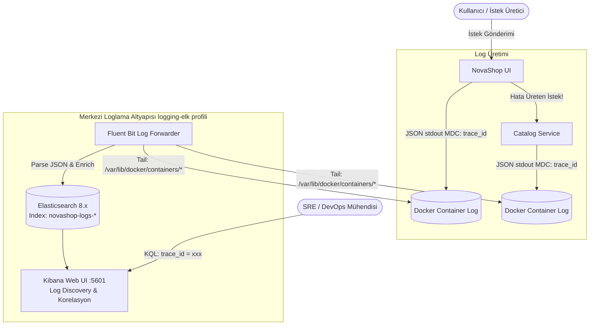

# LAB-11-CENTRALIZED-LOGGING — Merkezi Loglama: Fluent Bit, Elasticsearch, Kibana ve Trace-ID Korelasyonu

---

### Amaç

NovaShop mikroservis ekosisteminde; Fluent Bit günlük (log) toplayıcısı, Elasticsearch arama motoru ve Kibana görselleştirme arayüzü ile merkezi bir loglama mimarisi kurmak, yapılandırılmış (JSON) log akışını sağlamak ve kontrollü bir üretim hatasını `trace_id` korelasyonu ile Kibana üzerinde saniyeler içinde tespit edip doğrulamak.

---

### Kazanımlar

- Dağıtık mikroservis mimarilerinde merkezi log toplama, ayrıştırma (parsing) ve indeksleme prensiplerini uygulamak.
- Hafif ve yüksek performanslı log ileticisi **Fluent Bit** konfigürasyonunu (Input, Filter, Parser, Output) yapılandırmak.
- Java 21 / Spring Boot ve Go servislerinde standart JSON log formatı ve Logstash şablonu uygulamak.
- Dağıtık izleme (Distributed Tracing / OTel) `trace_id` ve `span_id` değerlerini log kayıtlarına enjekte ederek (MDC - Mapped Diagnostic Context) log-iz korelasyonunu sağlamak.
- Kibana üzerinde KQL (Kibana Query Language) ile arama yapmak ve operasyonel log panosu tasarlamak.

---

### Ön koşullar

- **Önceki Lablar:** [LAB-03-DOCKER-COMPOSE.md](file:///Users/hakan/novashop-workspace/novashop/docs/labs/LAB-03-DOCKER-COMPOSE.md) ve [LAB-10-OBSERVABILITY.md](file:///Users/hakan/novashop-workspace/novashop/docs/labs/LAB-10-OBSERVABILITY.md) tamamlanmış olmalıdır.
- **Kaynak Gereksinimi:** `logging-elk` profili (en az 2 vCPU, 6 GB boş RAM).
- **Yüklü Araçlar:** Docker Engine, Docker Compose, `curl`.

---

### Mimari



---

### Kullanılan placeholder'lar

| Placeholder | Anlamı | Örnek Biçim |
|---|---|---|
| `<KIBANA_URL>` | Kibana erişim adresi | `http://localhost:5601` |
| `<ES_URL>` | Elasticsearch HTTP endpoint'i | `http://localhost:9200` |
| `<TRACE_ID>` | Korelasyon için kullanılan 32 karakterlik iz kimliği | `4bf92f3577b34da6a3ce929d0e0e4736` |

---

### Adımlar

#### 1. Merkezi Loglama Profilini Başlatma

Docker Compose ile `logging-elk` profilini başlatın:

```bash
docker compose --profile logging-elk up -d
```
*Beklenen çıktı:* Elasticsearch, Kibana ve Fluent Bit konteynerlerinin `Up` duruma geçmesi.

**Elasticsearch Küme Sağlığını Doğrulama:**
```bash
curl -s http://localhost:9200/_cluster/health | grep -o '"status":"[a-z]*"'
```
*Beklenen çıktı:* `"status":"green"` veya `"status":"yellow"` (tek düğüm için sarı normaldir).

---

#### 2. Fluent Bit Yapılandırma Dosyası (`fluent-bit.conf`)

Fluent Bit'in Docker loglarını okuyup JSON ayrıştırması yaparak Elasticsearch'e ilettiği kuralları inceleyin:

```ini
[SERVICE]
    Flush        1
    Log_Level    info
    Parsers_File parsers.conf

[INPUT]
    Name             tail
    Path             /var/log/containers/*novashop*.log
    Parser           docker
    Tag              novashop.*
    Mem_Buf_Limit    50MB
    Skip_Long_Lines  On

[FILTER]
    Name         parser
    Match        novashop.*
    Key_Name     log
    Parser       json
    Reserve_Data On

[OUTPUT]
    Name            es
    Match           novashop.*
    Host            elasticsearch
    Port            9200
    Index           novashop-logs
    Type            _doc
    Logstash_Format On
    Logstash_Prefix novashop-logs
```

---

#### 3. Log Kayıtlarında Trace-ID ve Yapılandırılmış JSON Formatı

Spring Boot ve Go mikroservisleri konsola düz metin yerine yapılandırılmış JSON log basar. Örnek bir kayıt:

```json
{
  "@timestamp": "2026-09-09T12:30:45.123Z",
  "level": "ERROR",
  "service": "novashop-ui",
  "thread": "http-nio-8080-exec-3",
  "trace_id": "4bf92f3577b34da6a3ce929d0e0e4736",
  "span_id": "00f067aa0ba902b7",
  "message": "Failed to retrieve product details from catalog service",
  "exception": "java.net.ConnectException: Connection refused"
}
```
*Açıklama:* `trace_id` alanı OpenTelemetry izleyicisi tarafından otomatik olarak MDC (Mapped Diagnostic Context) üzerinden her log satırına eklenir.

---

#### 4. Kontrollü Hata Simülasyonu ve Trace-ID Yakalama

Kasıtlı olarak hata oluşturan bir istek gönderin ve dönen HTTP yanıt başlıklarından `traceparent` veya hata logunu yakalayın:

```bash
# 1. Hatalı istek gönder
curl -s -i http://localhost:8888/api/catalog/products/invalid-uuid | grep -E "(HTTP|trace)"
```

---

#### 5. Kibana Üzerinde Hata Tespiti ve Korelasyon Doğrulaması

1. Tarayıcınızda `http://localhost:5601` (Kibana) adresini açın.
2. **Management > Stack Management > Data Views (Index Patterns)** sayfasına gidin.
3. `novashop-logs-*` desenini ekleyin ve zaman alanı olarak `@timestamp` seçin.
4. **Discover** sekmesine gidin.
5. Arama çubuğuna yakalanan `trace_id` değerini yapıştırın:
   ```kql
   trace_id: "4bf92f3577b34da6a3ce929d0e0e4736"
   ```
6. **Sonuç:** Tek bir arama ile hem `novashop-ui` servisinin attığı hata logunu hem de arka plandaki `catalog` servisinin veritabanı hata kaydını kronolojik sırada yan yana görüntüleyin.

---

### Troubleshooting

#### Senaryo 1: Elasticsearch Yetersiz Bellek / Çökme (`Exit Code 137`)
- **Belirti:** Elasticsearch başladıktan hemen sonra kapanıyor.
- **Muhtemel Neden:** JVM heap alanının çok yüksek tutulması veya sistem RAM'inin tükenmesi.
- **Güvenli Çözüm:** `ES_JAVA_OPTS="-Xms512m -Xmx512m"` ile bellek kullanımını sınırlandırın.

#### Senaryo 2: Kibana'da Loglar Görünmüyor (`No results found`)
- **Belirti:** Discover sekmesinde log akışı yok.
- **Teşhis:** Elasticsearch indeksini kontrol edin: `curl -s http://localhost:9200/_cat/indices?v`.
- **Güvenli Çözüm:** Zaman filtresini (Time Filter) "Last 15 minutes" olarak ayarlayın ve Fluent Bit loglarını inceleyin: `docker logs novashop-fluent-bit`.

---

### Güvenlik Notu

1. **Hassas Veri Maskeleme (Log Sanitization):**
   - Müşteri parolaları, kredi kartı numaraları ve kimlik bilgileri loglara açık metin yazılamaz; Fluent Bit regex filtreleri veya Logback encoder ile maskelenmelidir (`***MASKED***`).
2. **Log Saklama ve Silme (Retention):**
   - Disk alanının dolmaması için Elasticsearch Index Lifecycle Management (ILM) ile 7 günden eski loglar otomatik silinir.

---

### Cleanup / Rollback

```bash
# Loglama altyapısını durdur ve birimleri temizle
docker compose --profile logging-elk down -v
```

---

### Öğrenci Görevi

1. Kibana üzerinde yalnızca `level: "ERROR"` olan logları listeleyen özel bir filtre oluşturun.
2. Bu filtrenin sonucunu "Hata Sayacı" (Error Metrics) görselleştirmesi olarak yeni bir Dashboard'a kaydedin.

---

### Eğitmen Kontrol Listesi

- [ ] Fluent Bit konteyneri Docker loglarını başarıyla okuyup Elasticsearch'e iletiyor mu?
- [ ] Loglar JSON formatında ve `trace_id` alanı içeriyor mu?
- [ ] Kibana üzerinde `novashop-logs-*` veri görünümü (data view) oluşturulmuş mu?
- [ ] Belirli bir `trace_id` sorgulandığında ilgili tüm mikroservis logları kronolojik olarak bulunabiliyor mu?
