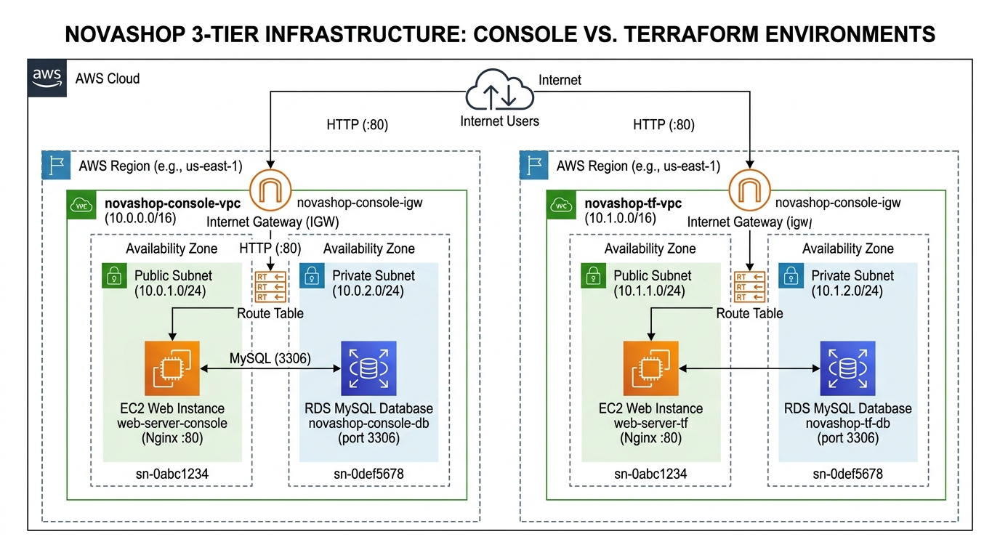

# LAB-02 — AWS Temel Altyapı ve Terraform IaC

Bu laboratuvar, NovaShop e-ticaret uygulamasının 3-katmanlı temel altyapısını AWS üzerinde hem AWS Yönetim Konsolu (Web UI) hem de **HashiCorp Terraform** ile modüler olarak kurmanızı sağlar.

---

## 🏛️ Mimari Şema

Kurulan altyapı bileşenleri:
- **VPC (10.1.0.0/16):** Konsol ortamından (`10.0.0.0/16`) izole edilmiş bağımsız sanal ağ.
- **Public Subnet (10.1.1.0/24):** İnternet Gateway (IGW) bağlantılı EC2 Web Sunucusu (`t3.medium`, Nginx).
- **Private Subnets (10.1.10.0/24 & 10.1.11.0/24):** Çoklu Erişilebilirlik Alanlı (Multi-AZ) RDS MySQL (`db.t3.small`).
- **Güvenlik Grupları (Security Groups):** Dışarıdan sadece HTTP (80) ve SSH (22) erişimi; RDS veritabanına sadece EC2 Web katmanından erişim.



---

## 📁 Dizin Yapısı

```text
lab-02/
├── README.md                      # Bu kılavuz
└── terraform-basic-infra/
    ├── provider.tf                # AWS provider ve S3 backend tanımı
    ├── variables.tf               # Genel değişkenler (Region, CIDR, Instance tipleri)
    ├── main.tf                    # Modülleri bağlayan ana dosya
    ├── outputs.tf                 # EC2 IP, DNS ve RDS çıktıları
    ├── run.sh                     # [BONUS] Tek komutla sıfır dokunuş kurulum scripti
    ├── destroy.sh                 # [BONUS] Tek komutla kaynak imha scripti
    ├── terraform.tfvars.example   # Değişken konfigürasyon şablonu
    └── modules/
        ├── vpc/                   # VPC, Subnetler, IGW ve Route Table
        ├── security/              # Web ve DB Security Groupları
        ├── ec2/                   # Nginx + Türkçe UTF-8 web katmanı
        └── rds/                   # MySQL 8.0 RDS instance ve Subnet Group
```

---

## 🚀 Standart Kurulum (Terraform CLI)

### 1. Çalışma Dizinine Geçin
```bash
cd ~/novashop/lab-02/terraform-basic-infra
```

### 2. AWS Kimlik Bilgilerini Tanımlayın
```bash
export AWS_ACCESS_KEY_ID="AKIAxxxxxxxxxxxxxxxx"
export AWS_SECRET_ACCESS_KEY="xxxxxxxxxxxxxxxxxxxxxxxxxxxxxxxxxxxxxxxx"
export AWS_DEFAULT_REGION="us-east-1"
```

### 3. Değişken Dosyasını Oluşturun
```bash
cp terraform.tfvars.example terraform.tfvars
```

### 4. Terraform Başlatın ve Altyapıyı Kurun
```bash
# Eklentileri indirin
terraform init

# Planı inceleyin
terraform plan

# Kaynakları oluşturun
terraform apply -auto-approve
```

### 5. Doğrulama
```bash
# Sağlık kontrolü
curl -i $(terraform output -raw health_check_url)

# Web mağazası
curl -s $(terraform output -raw storefront_url)
```

---

## 🎁 BONUS: Tek Komutla Sıfır Dokunuş (Zero-Touch) Otomasyonu

Eğer her adımı elle çalıştırmak yerine tam otomatik dağıtım yapmak isterseniz, bu laboratuvara özel hazırlanan **`run.sh`** scriptini kullanabilirsiniz.

### `run.sh` Scripti Ne Yapar?
1. **AWS STS Doğrulaması:** AWS kimliğinizi ve Hesap ID bilginizi otomatik çözer.
2. **S3 tfstate Backend Otomasyonu:** S3 üzerinde `novashop-tfstate-<HESAP_ID>` bucket'ının olup olmadığını denetler, yoksa otomatik oluşturup versiyonlamayı (Versioning) açar.
3. **SSH Anahtar Çifti:** AWS üzerinde `novashop-key` anahtar çifti yoksa oluşturup yerel makinenizdeki `~/.ssh/novashop-key.pem` dosyasına kaydeder.
4. **Terraform Init & Apply:** Backend konfigürasyonunu dinamik bağlayarak tüm altyapıyı tek dokunuşla ayağa kaldırır.

### Tek Komutla Çalıştırma:
```bash
cd ~/novashop/lab-02/terraform-basic-infra

# Sadece Access Key ve Secret Key tanımlamanız yeterlidir:
export AWS_ACCESS_KEY_ID="AKIAxxxxxxxxxxxxxxxx"
export AWS_SECRET_ACCESS_KEY="xxxxxxxxxxxxxxxxxxxxxxxxxxxxxxxxxxxxxxxx"

# Kurulumu başlatın:
./run.sh
```

---

## 🧹 Kaynakları Temizleme (Destroy)

Laboratuvar sonrasında AWS üzerinde maliyet oluşmasını önlemek için kaynakları silmeyi unutmayın:

* **Otomasyon Scripti ile (Önerilen):**
  ```bash
  ./destroy.sh
  ```

* **Standart Terraform CLI ile:**
  ```bash
  terraform destroy -auto-approve
  ```
