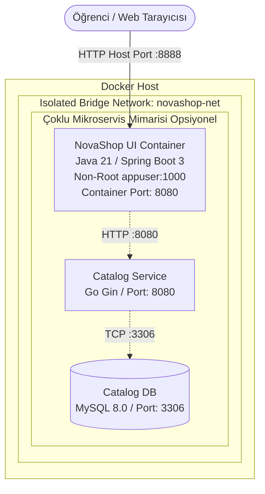

# LAB-03-DOCKER-COMPOSE — Docker ve Docker Compose ile Konteynerleştirme

---

### Amaç

NovaShop mikroservis mimarisinde yer alan servisleri; multi-stage Dockerfile yapısını satır satır inceleyerek güvenli (non-root) bir container imajı olarak derlemek, Docker Compose dosyalarını (`docker-compose.yml`) analiz etmek, yardımcı scriptlere bağımlı kalmadan **doğrudan saf `docker compose` komutlarıyla** servislerin yaşam döngüsünü, port yönlendirmelerini, ağ yapısını ve sağlık kontrollerini yönetmektir.

---

### Kazanımlar

- **Multi-Stage Build Mantığı:** Derleme araçları (Maven, JDK) ile çalışma zamanını (JRE) birbirinden ayırarak minimal, hafif ve güvenli imajlar üretmek.
- **Dockerfile Güvenlik Standartları:** Root yetkilerini bırakıp non-root (`appuser:1000`) kullanıcısı ile çalışmayı öğrenmek.
- **Docker İmaj Yaşam Döngüsü:** `docker build`, `docker images`, `docker history` komutlarıyla imajları yönetmek.
- **Docker Compose Derinlemesine Kullanımı:** `services`, `ports`, `environment`, `mem_limit`, `healthcheck`, `networks` direktiflerini kavramak.
- **Saf Docker Compose Yönetimi:** Script kullanmadan `docker compose up -d`, `docker compose ps`, `docker compose logs -f`, `docker compose stop/start/down` komutlarıyla konteynerleri denetlemek.
- **Compose Overlay (Çoklu Dosya) Mimarisi:** Temel compose dosyasına kurumsal güvenlik katmanı (`starter.secure.yml`) eklemeyi öğrenmek.
- **Mikroservis Ağı ve DNS:** Birden fazla servisin izole bridge network (`novashop-net`) üzerinden birbirleriyle servis isimleri ile nasıl haberleştiğini kavramak.

---

### Ön koşullar

- **Önceki Lab:** [LAB-01](../LAB-01/README.md) tamamlanmış olmalıdır.
- **İşletim Sistemi:** Linux (Ubuntu 22.04/24.04 LTS) veya macOS geliştirme ortamı.
- **Yüklü Araçlar:** Docker Engine v24+ (`docker --version`), Docker Compose v2.20+ (`docker compose version`).
- **Kaynak Gereksinimi:** En az 2 vCPU ve 4 GB boş RAM.

---

### Mimari ve Akış Şeması



---

### Adım Adım Laboratuvar Uygulaması

#### Adım 1: Docker ve Docker Compose Ortamını Doğrulama

Öncelikle sisteminizde Docker daemon'ının ve Compose eklentisinin sorunsuz çalıştığını kontrol edin:

```bash
docker --version
docker compose version
docker info --format 'Server Version: {{.ServerVersion}} | Storage Driver: {{.Driver}}'
```

*Beklenen çıktı:* Docker sürümü (24+ veya 26+) ve Docker Compose sürümü (v2.x) hatasız yazdırılmalıdır.

---

#### Adım 2: UI Servis Dizinine Geçiş ve Dosyaları İnceleme

NovaShop deposundaki servisler bağımsız mikroservis dizinleri altında yer alır. UI servisine geçerek mevcut dosyaları listeleyin:

```bash
cd ~/novashop/src/ui
ls -la
```

*Dizinde göreceğiniz kritik dosyalar:*
- `Dockerfile`: Çok aşamalı (multi-stage) konteyner derleme talimatları.
- `docker-compose.yml`: UI servisinin yerel çalıştırma parametreleri.
- `pom.xml`: Java / Spring Boot 3 bağımlılık tanım dosyası.
- `src/`: Java kaynak kodları ve HTML/CSS şablonları.

---

#### Adım 3: Güvenli Multi-Stage Dockerfile'ı Satır Satır İnceleme

`Dockerfile` dosyasını terminalde açarak inceleyin:

```bash
cat Dockerfile
```

Bu dosya iki temel aşamadan (`stage`) oluşur:

| Aşama | Kod Bloğu / Direktif | Görevi ve Önemi |
| :--- | :--- | :--- |
| **Aşama 1: Builder** | `FROM public.ecr.aws/amazonlinux/amazonlinux:2023 AS build-env` | Derleme ortamı hazırlanır. Maven ve JDK 21 kurulur. |
| **Önbellek Optimizasyonu** | `COPY pom.xml .` <br/> `RUN ./mvnw dependency:go-offline -B -q` | Kaynak kod değişse bile bağımlılıkların her seferinde yeniden indirilmesi önlenir (Docker Layer Cache). |
| **Paketleme** | `COPY ./src ./src` <br/> `RUN ./mvnw -DskipTests package -q` | Uygulama derlenir ve çalıştırılabilir `/app.jar` üretilir. |
| **Aşama 2: Runtime** | `FROM public.ecr.aws/amazonlinux/amazonlinux:2023` | Sıfırdan temiz bir taban imaj açılır. **Maven ve kaynak kodlar burada yer almaz.** Yalnızca JRE yüklenir. |
| **Güvenlik (Non-Root)** | `RUN useradd --uid 1000 appuser`<br/>`USER appuser` | Konteyner asla `root` yetkisiyle çalıştırılmaz; UID 1000 yetkisiz `appuser` kullanıcısına devredilir. |
| **Uygulama Transferi** | `COPY --from=build-env /app.jar .` | Yalnızca 1. aşamada üretilen derlenmiş JAR dosyası son imaja kopyalanır. İmaj boyutu yüzlerce megabayt küçülür. |
| **Giriş Noktası** | `EXPOSE 8080`<br/>`ENTRYPOINT ["sh", "-c", "java $JAVA_OPTS -jar /app/app.jar"]` | 8080 portu deklare edilir ve Spring Boot uygulaması başlatılır. |

---

#### Adım 4: Dockerfile ile İmajı Manuel Olarak Derleme

Şimdi `src/ui` dizinindeyken Docker CLI komutunu kullanarak imajınızı oluşturun:

```bash
# Bulunduğunuz dizindeki (src/ui) Dockerfile ile novashop-ui imajını derleyin
docker build -t novashop-ui:v0.1.0 .
```

*Açıklama:* `.` işareti geçerli dizini build context olarak belirler.  
*Beklenen çıktı:* `build-env` katmanları ve ardından son runtime katmanı başarıyla tamamlanarak `naming to docker.io/library/novashop-ui:v0.1.0` mesajı görülür.

**Derlenen İmajı ve Katmanlarını Doğrulayın:**
```bash
# Üretilen imajı boyutunu ve etiketini kontrol edin
docker images novashop-ui:v0.1.0

# İmajın katman geçmişini ve boyut dağılımını inceleyin
docker history novashop-ui:v0.1.0
```

---

#### Adım 5: `docker-compose.yml` Dosyasını İnceleme

Şimdi aynı dizindeki `docker-compose.yml` dosyasını terminalde görüntüleyin:

```bash
cat docker-compose.yml
```

**Dosyanın Temel Bölümleri:**
```yaml
services:
  ui:
    build:
      context: .
    ports:
      - 8888:8080                  # Host portu 8888 -> Container portu 8080
    environment:
      - JAVA_OPTS=-XX:MaxRAMPercentage=75.0 -Djava.security.egd=file:/dev/urandom
      - SERVER_TOMCAT_ACCESSLOG_ENABLED=true
      - RETAIL_UI_SEARCH_ENABLED=false
    mem_limit: 512m                # Bellek tüketim sınırı (OOM koruması)
    cap_drop:
      - ALL                        # Linux çekirdek yetkilerini tamamen düşür
    healthcheck:                   # Otomatik servis sağlığı denetimi
      test: ["CMD-SHELL", "curl -s -f http://localhost:8080/actuator/health || exit 1"]
      interval: 10s
      timeout: 10s
      retries: 3
      start_period: 15s
    restart: always
```

---

#### Adım 6: Doğrudan Saf Docker Compose ile Konteyneri Başlatma

Yardımcı bir script kullanmadan, doğrudan `docker compose` komutuyla konteyneri arka planda (detached) ayağa kaldırın:

```bash
# src/ui dizinindeyken servisi başlatın
docker compose up -d
```

*Beklenen çıktı:*
```text
[+] Running 2/2
 ✔ Network ui_default  Created
 ✔ Container ui-ui-1   Started
```

---

#### Adım 7: Konteyner Durumunu ve Sağlık Durumunu İnceleme

Konteynerin çalışıp çalışmadığını ve sağlık kontrolü sürecini native komutlarla takip edin:

```bash
# 1. Compose ile çalışan servisleri listeleyin
docker compose ps

# 2. Canlı log akışını görüntüleyin (Çıkmak için Ctrl+C tuşlayın)
docker compose logs -f ui
```

*Not:* İlk 10-15 saniyede durum `starting` olarak görünür; Spring Boot ayağa kalkıp `/actuator/health` başarılı olduğunda durum **`(healthy)`** olarak güncellenir.

```bash
# 3. Docker inspect ile detaylı sağlık durumunu sorgulayın
docker inspect $(docker compose ps -q ui) --format 'Sağlık Durumu: {{.State.Health.Status}} (Hata Sayısı: {{.State.Health.FailingStreak}})'
```

---

#### Adım 8: Uygulama Uç Noktalarını Test Etme

Web servisine terminal üzerinden HTTP istekleri göndererek çalıştığını doğrulayın:

```bash
# 1. Spring Boot Actuator Sağlık Uç Noktası (HTTP 200 döner)
curl -i http://localhost:8888/actuator/health

# 2. NovaShop Mağaza Ana Sayfa Başlığı Kontrolü
curl -s http://localhost:8888/ | grep -o "NovaShop DevOps Store"

# 3. Favicon HTTP Durum Kodu (200 OK)
curl -s -o /dev/null -w "%{http_code}\n" http://localhost:8888/favicon.ico
```

> **Tarayıcıdan İnceleme (Erişim Seçenekleri):**  
> * **Model A (Doğrudan IP):** `http://<UBUNTU_IP>:8888` (DNS veya SSL gerektirmez)  
> * **Model B (Kurumsal DNS + SSL):** `https://studentXX-novashop.devopsatolyesi.com` (Nginx Reverse Proxy yapılandırıldıysa)  
> Web tarayıcınızdan yukarıdaki adreslerden biriyle NovaShop e-ticaret arayüzünü canlı olarak görüntüleyin.

---

#### Adım 9: Docker Compose Yaşam Döngüsü Yönetimi (CLI Deneyimi)

Konteynerleri yönetmek için temel Docker Compose komutlarını uygulayın:

```bash
# Servisi geçici olarak durdurun
docker compose stop

# Durumun durdurulduğunu (Exited) görün
docker compose ps -a

# Servisi yeniden başlatın
docker compose start

# Servisin durumunu kontrol edin
docker compose ps
```

---

#### Adım 10: İleri Seviye — Çoklu Compose Dosyası ile Güvenlik Overlay Mantığı (Overlay Pattern)

Gerçek kurumsal DevOps senaryolarında temel `docker-compose.yml` dosyasına dokunulmadan, ortama özel güvenlik sertleştirmeleri (`starter.secure.yml`) ek bir overlay dosyası olarak uygulanır.

1. **Güvenlik Overlay Dosyasını İnceleyin:**
   ```bash
   cat ~/novashop/deploy/compose/starter.secure.yml
   ```
   *İçerik:* `read_only: true` (kök dosya sistemi salt-okunur), `no-new-privileges: true` (yetki yükseltme engeli), `cpus: 0.50` (CPU sınırı) ve `tmpfs /tmp` tanımlarını içerir.

2. **İki Dosyayı Birleştirerek Nihai Yapılandırmayı Çözümleyin (`config`):**
   ```bash
   cd ~/novashop
   docker compose \
     -f src/ui/docker-compose.yml \
     -f deploy/compose/starter.secure.yml \
     config
   ```
   *Açıklama:* Compose, iki YAML dosyasını birleştirir ve nihai birleşik yapılandırmayı ekrana basar.

3. **Güvenli Overlay ile Başlatın:**
   > **⚠️ Port Çakışması Uyarısı:**  
   > Adım 6'da `src/ui` dizininde başlattığınız standart `ui-ui-1` konteyneri `8888` portunu dinlemektedir. Yeni bir proje ismiyle (`-p novashop-starter`) başlatmadan önce port çakışmasını önlemek için standart konteyneri durdurun:
   ```bash
   # 1. Standart UI servisini durdurun (8888 portunu serbest bırakın)
   cd ~/novashop/src/ui && docker compose down

   # 2. Güvenlik overlay'i ile yeni sertleştirilmiş servisi başlatın
   cd ~/novashop
   docker compose -p novashop-starter \
     -f src/ui/docker-compose.yml \
     -f deploy/compose/starter.secure.yml \
     up -d
   ```

4. **Salt-Okunur Dosya Sistemi Güvenliğini Test Edin:**
   *Standart Linux izinleri (`Permission denied`) ile Docker Kernel seviyesindeki salt-okunur (`Read-only file system`) koruması arasındaki farkı test edin:*
   ```bash
   # A. Standartta 'appuser' kullanıcısının yazabildiği kendi çalışma dizinine (/app) yazmayı deneyin:
   docker exec novashop-starter-ui-1 touch /app/saldiri.sh
   # Beklenen Çıktı: touch: cannot touch '/app/saldiri.sh': Read-only file system

   # B. 'root' (UID 0) olarak kök dizine dosya yazmayı deneyin (Root bile yazamaz!):
   docker exec -u 0 novashop-starter-ui-1 touch /root_test.txt
   # Beklenen Çıktı: touch: cannot touch '/root_test.txt': Read-only file system

   # C. Yalnızca overlay içinde tmpfs olarak izin verilen /tmp dizinine yazmayı deneyin (Başarılı olur):
   docker exec novashop-starter-ui-1 touch /tmp/gecici.txt && echo "Güvenli /tmp dizinine başarıyla yazıldı!"
   ```


---

#### Adım 11: Bütünsel Mimari — Çoklu Mikroservis `docker-compose.yml` (Repo Kökü)

NovaShop'un çoklu servis mimarisinde servislerin birbirini nasıl bulduğunu görmek için ana dosyayı inceleyin:

```bash
cd ~/novashop
head -n 55 docker-compose.yml
```

**Kilit Kavramlar:**
- **Service Discovery (DNS):** `ui` servisi, `catalog` servisine IP adresiyle değil `http://catalog:8080` servis adı üzerinden erişir. Docker'ın dahili DNS motoru servis adını otomatik çözer.
- **Networks (`novashop-net`):** Tüm servisler izole bir bridge ağına (`novashop-net`) bağlıdır. Dış dünyadan yalnızca `ui` servisinin `8888` portu açılır; veritabanı portları dışarıya kapalı tutulur.

---

#### Adım 12: Otomatik Laboratuvar Doğrulama Betiğini Çalıştırma

Tüm yapılandırmanın ve çalışan canlı servisin doğruluğunu test edin:

```bash
cd ~/novashop
bash scripts/verify/verify-lab-03.sh
```

*Beklenen Çıktı:*
```text
=== [LAB-03] Doğrulama Başlatılıyor (localhost:8888 | Mod: live) ===
✅ Güvenlik overlay dosyası mevcut (deploy/compose/starter.secure.yml).
✅ Overlay güvenlik sertleştirmeleri (read-only, no-new-privileges, CPU/PID limits) doğrulandı.
✅ Dockerfile non-root kullanıcı direktifi (USER appuser) doğrulandı.
4. Canlı konteyner Actuator sağlık kontrolü test ediliyor...
✅ Sağlık kontrolü başarılı: {"status":"UP"}
5. NovaShop marka kimliği test ediliyor...
✅ Marka başlığı doğrulandı: 'NovaShop DevOps Store'
6. Favicon HTTP 200 kontrolü...
✅ Favicon HTTP 200 OK.
=== [LAB-03] Canlı Smoke ve Güvenlik Doğrulaması Başarılı (PASS) ===
```

---

#### Adım 13: Temizlik (Cleanup)

Laboratuvar çalışması bittiğinde oluşturulan konteynerleri ve kaynakları temizleyin:

```bash
# 1. Overlay ile açılan veya UI dizinindeki konteynerleri durdurup kaldırın
cd ~/novashop
docker compose -p novashop-starter \
  -f src/ui/docker-compose.yml \
  -f deploy/compose/starter.secure.yml \
  down

# Veya src/ui dizininde doğrudan:
cd ~/novashop/src/ui && docker compose down

# 2. Oluşturulan test imajını silin (disk tasarrufu için)
docker rmi novashop-ui:v0.1.0 2>/dev/null || true

# 3. Kullanılmayan derleme önbelleğini temizleyin
docker builder prune -f
```

---

### Alternatif Seçenek: Hızlı Kurulum ve Otomasyon (Yardımcı Script ile)

Laboratuvarın temel amacı Docker ve Docker Compose komutlarını manuel olarak deneyimlemektir. Ancak adımları başarıyla tamamladıktan sonra veya sonraki laboratuvarlarda hızlıca ayağa kaldırıp kapatmak istediğinizde, arka planda bu adımları yürüten hazır scripti opsiyonel bir kısayol olarak kullanabilirsiniz:

```bash
cd ~/novashop

# Hızlı Başlatma (Build + Overlay + Healthcheck)
bash scripts/compose-starter.sh up

# Hızlı Kapatma
bash scripts/compose-starter.sh down
```
*(Not: Bu bölüm öğrenme amaçlı adımların yerine geçmez, pratik bir alternatif kısayoldur.)*

---

### Troubleshooting (Sorun Giderme)

#### 1. Port Çakışması (`bind: address already in use: 8888`)
- **Neden:** 8888 portu başka bir işlem veya arka planda kalan eski bir konteyner tarafından kullanılıyor olabilir.
- **Çözüm:**
  ```bash
  # 8888 portunu dinleyen süreci tespit edin
  sudo ss -tulpn | grep 8888
  # Portu işgal eden eski konteyneri durdurun
  docker ps --filter "publish=8888" -q | xargs -r docker stop
  ```

#### 2. Konteyner Çökmesi (Exit Code 137 / OOMKilled)
- **Neden:** JVM bellek ihtiyacı Compose dosyasındaki `mem_limit: 512m` sınırını aştığında Linux OOM Killer konteyneri sonlandırır.
- **Teşhis:**
  ```bash
  docker inspect <container_id> --format 'OOMKilled: {{.State.OOMKilled}}'
  ```
- **Çözüm:** `JAVA_OPTS` içinde `-XX:MaxRAMPercentage=75.0` parametresinin verildiğinden veya compose dosyasında bellek limitinin artırıldığından emin olun.

#### 3. Salt-Okunur Dosya Sistemi Hatası (`Read-only file system`)
- **Neden:** `starter.secure.yml` overlay'i devredeyken uygulamanın `/tmp` dışındaki bir dizine dosya yazmaya çalışması.
- **Çözüm:** Yazılması gereken ek dizinler varsa (örneğin `/run` veya `/app/logs`), compose dosyasına `tmpfs:` olarak eklenmelidir.

---

### 🎁 Bonus Bölüm: İleri Seviye Dockerfile Optimizasyonu (İmaj Boyutunu %65 Küçültme)

Gerçek kurumsal projelerde 1 GB boyutundaki Java/Spring Boot imajları; ağ transfer süresini uzatır, CI/CD pipeline'larını yavaşlatır ve güvenlik taramalarında (Trivy/Clair) gereksiz işletim sistemi paketlerinden ötürü yüksek CVE riski doğurur.

#### 1. Neden Standart İmaj 1.08 GB Civarındaydı?
Standart `Dockerfile` incelendiğinde çalışma zamanı (runtime) için tam bir `amazonlinux:2023` dağıtımı üzerine `java-21-amazon-corretto-headless`, `shadow-utils` ve `curl-full` paketleri DNF ile kurulmaktadır. Asıl uygulama JAR dosyası yalnızca **~60 MB** olmasına rağmen, işletim sistemi ve paket yöneticisi kalıntılarıyla birlikte imaj boyutu **~1.08 GB**'a ulaşır.

#### 2. Çözüm: Hafifletilmiş JRE Runtime (Alpine Temurin) ile Multi-Stage Build
Derleme aşamasını (`build-env`) koruyup, çalışma aşamasında (runtime) sadece Java çalıştırma ortamını içeren hafif bir Alpine tabanı (`eclipse-temurin:21-jre-alpine`) kullanarak imajı **~129 MB indirme (registry transfer) / ~400 MB disk boyutuna** indirebilirsiniz.

**Optimize Edilmiş Dockerfile (`src/ui/Dockerfile.optimized`):**
```dockerfile
# Aşama 1: Derleme (Build Stage)
FROM public.ecr.aws/amazonlinux/amazonlinux:2023 AS build-env

RUN dnf --setopt=install_weak_deps=False install -q -y \
    maven \
    java-21-amazon-corretto-headless \
    which tar gzip \
    && dnf clean all

WORKDIR /
COPY .mvn .mvn
COPY mvnw .
COPY pom.xml .
RUN ./mvnw dependency:go-offline -B -q

COPY ./src ./src
RUN ./mvnw -DskipTests package -q && \
    mv /target/ui-0.0.1-SNAPSHOT.jar /app.jar

# Aşama 2: Hafif Üretim Aşaması (Lightweight Alpine JRE)
FROM eclipse-temurin:21-jre-alpine

# Actuator sağlık denetimi için curl ve non-root kullanıcı
RUN apk add --no-cache curl && \
    addgroup -g 1000 appuser && \
    adduser -u 1000 -G appuser -s /bin/sh -D -h /app appuser

ENV APPUSER=appuser \
    APPUID=1000 \
    APPGID=1000 \
    SPRING_PROFILES_ACTIVE=prod

WORKDIR /app
USER appuser

COPY --chown=appuser:appuser --from=build-env /app.jar .

EXPOSE 8080
ENTRYPOINT ["sh", "-c", "java $JAVA_OPTS -jar /app/app.jar"]
```

#### 3. Optimize İmajı Derleyin ve Karşılaştırın:
```bash
cd ~/novashop/src/ui

# Optimize imajı derleyin:
docker build -t novashop-ui:optimized -f Dockerfile.optimized .

# Boyut farkını kıyaslayın:
docker images | grep novashop-ui
```

*Sonuç Karşılaştırması:*
| İmaj Adı | Disk Boyutu | İndirme / İçerik Boyutu (Registry Transfer) | Tasarruf |
| :--- | :--- | :--- | :--- |
| `novashop-ui:v0.1.0` (Orijinal) | **1.08 GB** | ~382 MB | Referans |
| `novashop-ui:optimized` (Alpine JRE) | **~400 MB** | **~129 MB** | **~%66 Daha Hızlı & Küçük** 🚀 |

#### 4. Optimize İmajı Test Edin:
```bash
docker run -d --rm --name test-optimized -p 8889:8080 novashop-ui:optimized
sleep 15
curl -i http://localhost:8889/actuator/health
docker stop test-optimized
```

