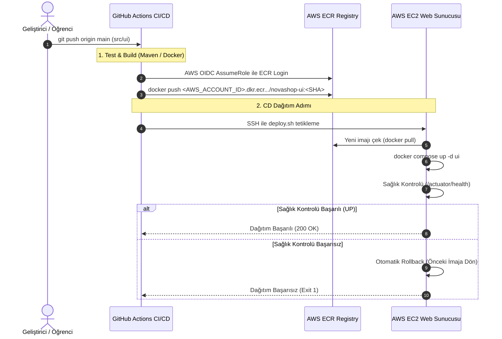

# LAB-05-GITHUB-ACTIONS — GitHub Actions ile Otomatik CI/CD, ECR ve EC2 Dağıtımı

| Seviye | Tahmini Süre | Profil / Araçlar | Açık Portlar |
|---|---|---|---|
| Orta | 45 Dakika | GitHub Actions, AWS ECR, AWS IAM OIDC, Docker Compose, Nginx | 80 (HTTP), 443 (HTTPS), 8888 (UI Local) |

---

### Amaç

NovaShop UI mikroservisini; GitHub Actions iş akışı kullanarak otomatik olarak derlemek, Docker imajı olarak etiketleyip AWS ECR (Elastic Container Registry) özel kayıt defterine göndermek, EC2 sunucusuna güvenli OIDC/SSH üzerinden otomatik dağıtmak ve sağlık kontrolü başarısız olduğunda otomatik rollback mekanizmasını doğrulamak.

---

### Kazanımlar

- Modern CI/CD yaşam döngüsünü (Continuous Integration & Continuous Deployment) uçtan uca kurmak.
- Kalıcı AWS anahtarları (Access Key / Secret Key) yerine **GitHub OIDC (OpenID Connect)** ve geçici IAM Rolü (`AssumeRoleWithWebIdentity`) ile en yüksek güvenlik standardını uygulamak.
- AWS ECR üzerinde özel container kayıt defteri oluşturup imajları semantik versiyon ve Git commit SHA ile etiketlemek (`immutable tag`).
- EC2 sunucusunda çalışan Docker Compose yığınını yeni imaj ile kesintisiz güncellemek.
- Dağıtım sonrası otomatik sağlık kontrolü (`smoke test`) koşmak ve hata durumunda otomatik geri alma (rollback) tetiklemek.
- Ortam değişkenlerini (`.env`) merkezi yöneterek komut satırında hard-coded değer girmeden doğrudan kopyala-yapıştır ile operasyon yürütmek.

---

### Ön koşullar

- **Önceki Lablar:** [LAB-01](../LAB-01/README.md) ve [LAB-04](../LAB-04/README.md) tamamlanmış olmalıdır.
- **GitHub Reposu:** Öğrencinin kendi GitHub hesabı altındaki `novashop` reposu (Admin yetkili).
- **AWS Hesabı:** ECR ve IAM rolü oluşturma yetkisine sahip AWS kullanıcısı (veya CloudShell).
- **Çalışan EC2 Sunucusu:** LAB-04'ten kalan Docker Compose ve Nginx kurulu EC2 instance'ı.
- **SSH Anahtarı:** EC2 sunucusuna bağlanan `.pem` özel anahtarı (`~/.ssh/novashop-key.pem`).

---

### Mimari ve Çalışma Modeli



---

### ⚙️ Ortam Değişkenleri ve Konfigürasyon Dosyası (.env)

Bu laboratuvardaki tüm komutların kopyala-yapıştır ile doğrudan çalışabilmesi için parametreler `.env` dosyasında tanımlanır.

#### 1. Yerel Terminalde Değişkenleri Tanımlama

Yerel bilgisayarınızda veya CloudShell'de lab klasörüne geçin ve `.env` dosyanızı oluşturun:

```bash
cd labs/LAB-05
cp .env.example .env
```

`.env` dosyasını kendi AWS, GitHub ve EC2 değerlerinizle güncelleyin (`nano .env`):

```bash
# --- AWS ve Hesap Bilgileri ---
AWS_REGION="eu-central-1"
AWS_ACCOUNT_ID="123456789012"

# --- GitHub Bilgileri ---
GITHUB_ORG_OR_USER="devops-ogrenci"
GITHUB_REPO_NAME="novashop"

# --- EC2 Sunucu Bilgileri ---
EC2_PUBLIC_IP="3.120.45.67"
EC2_USER="ubuntu"
KEY_PATH="~/.ssh/novashop-key.pem"
```

Değişkenleri terminal oturumunuza aktarın:

```bash
set -a && source .env && set +a
```

> [!TIP]
> `set -a && source .env && set +a` komutu `.env` içindeki tüm değişkenleri `export` eder. Böylece aşağıdaki tüm komutları parametre değiştirmeden doğrudan kopyalayıp çalıştırabilirsiniz.

---

### Adım Adım Uygulama Rehberi

#### 1. AWS Kaynaklarını Oluşturma (ECR ve GitHub OIDC IAM Rolü)

AWS tarafında ECR reposunu, GitHub OIDC identity provider'ı ve `novashop-github-actions-role` IAM rolünü tek komutla hazırlamak için hazır kurulum betiğini çalıştırın:

```bash
./setup-aws.sh
```

Bu betik otomatik olarak:
1. `novashop-ui` ECR özel reposunu `IMMUTABLE` ve `scanOnPush=true` kurallarıyla oluşturur.
2. AWS IAM üzerinde GitHub OIDC sağlayıcısını (`token.actions.githubusercontent.com`) kontrol eder / ekler.
3. Reponuza özel güven ilkesi (`repo:${GITHUB_ORG_OR_USER}/${GITHUB_REPO_NAME}:*`) ile IAM rolü oluşturur.
4. ECR yetkilendirmesi (`AmazonEC2ContainerRegistryPowerUser`) politikasını role bağlar.
5. GitHub'a girmeniz gereken tüm Secrets ve Variables değerlerini ekrana yazdırır.

---

#### 2. GitHub Secrets ve Variables Tanımlama

GitHub'da deponuza gidin: **Settings > Secrets and variables > Actions**

**1. Repository Secrets (Gizli Değerler):**
- **İsim:** `EC2_SSH_KEY`
- **Değer:** EC2 anahtarınızın tam metin içeriği:
  ```bash
  cat "$KEY_PATH"
  ```

**2. Repository Variables (Genel Değişkenler):**
Aşağıdaki 5 değişkeni `New repository variable` butonu ile ekleyin:
- `AWS_ROLE_TO_ASSUME`: `arn:aws:iam::<AWS_ACCOUNT_ID>:role/novashop-github-actions-role`
- `AWS_REGION`: `$AWS_REGION` (örn: `eu-central-1`)
- `ECR_REPOSITORY`: `<AWS_ACCOUNT_ID>.dkr.ecr.<AWS_REGION>.amazonaws.com/novashop-ui`
- `EC2_HOST`: `$EC2_PUBLIC_IP`
- `EC2_USER`: `ubuntu`

---

#### 3. EC2 Sunucusunda Dağıtım Dizinini ve Betikleri Hazırlama

EC2 sunucunuza bağlanın:

```bash
chmod 400 "$KEY_PATH"
ssh -i "$KEY_PATH" ubuntu@"$EC2_PUBLIC_IP"
```

Sunucu üzerinde repo klasörüne geçin (veya repoyu çekin):

```bash
git clone https://gitlab.com/devops-practitioner-labs/novashop.git ~/novashop || (cd ~/novashop && git pull)
cd ~/novashop/labs/LAB-05
cp .env.example .env
nano .env   # RDS_ENDPOINT ve DB_PASSWORD girip kaydedin
set -a && source .env && set +a
```

Klasör içeriğinde hazır bulunan dosyalar:
- `deploy.sh`: ECR'dan yeni imajı çeker, `docker-compose.prod.yml`'ı günceller, UI servisini yeniden başlatır, 15 denemede sağlık kontrolü yapar; başarısız olursa otomatik rollback yapar.
- `rollback.sh`: İstenen kararlı sürüme anında döner.
- `docker-compose.prod.yml`: 3-Tier mimariyi çalıştıran üretim Compose dosyası.

---

#### 4. GitHub Actions CI/CD Pipeline'ını İnceleme ve Devreye Alma

Deponuzda `.github/workflows/deploy.yml` dosyası hazır olarak tanımlanmıştır:

```bash
cat .github/workflows/deploy.yml
```

İş akışı iki aşamadan oluşur:
1. **build-and-push:**
   - Java 21 ortamında `./mvnw test` ile birim testleri çalıştırır.
   - AWS OIDC ile geçici token alır.
   - Git Commit SHA ile Docker imajını derler ve ECR'a gönderir (`novashop-ui:<SHORT_SHA>`).
2. **deploy-to-ec2:**
   - OIDC üzerinden ECR login token alır.
   - Appleboy SSH Action ile EC2'ye bağlanır.
   - `./deploy.sh "<IMAGE_URI>"` çalıştırarak konteyneri günceller.
   - Dışarıdan `https://${EC2_HOST}/healthz` ile duman testi (smoke test) koşar.

---

#### 5. Pipeline'ı Tetikleme ve Otomatik Dağıtımı İzleme

CI/CD hattını tetiklemek için UI kodunda ufak bir değişiklik yapıp repoya gönderin:

```bash
# Yerel bilgisayarınızda
git add .
git commit -m "feat(ui): update banner title and trigger CI/CD pipeline"
git push origin main
```

**İzleme:**
1. GitHub reponuzda **Actions** sekmesine gidin.
2. `NovaShop CI/CD Pipeline` çalışmasını canlı izleyin.
3. `build-and-push` ve `deploy-to-ec2` adımlarının yeşile döndüğünü (`Success`) doğrulayın.

---

### Doğal Doğrulama ve Beklenen Sonuç

Dağıtım tamamlandıktan sonra yerel terminalinizden canlı doğrulama yapın:

```bash
# 1. Nginx Edge Sağlık Kontrolü
curl -s -k "https://${EC2_PUBLIC_IP}/healthz"
```
*Beklenen çıktı:*
```json
{"status":"UP","tier":"3-tier-edge","protocol":"https"}
```

```bash
# 2. UI Mikroservisi Doğrudan Actuator Kontrolü
curl -s -k "https://${EC2_PUBLIC_IP}/actuator/health"
```
*Beklenen çıktı:*
```json
{"status":"UP"}
```

```bash
# 3. Otomatik Laboratuvar Doğrulama Betiğini Çalıştırma
bash scripts/verify/verify-lab-05.sh
```
*Beklenen çıktı:*
```text
=== [LAB-05] GitHub Actions Doğrulama Başlatılıyor ===
✅ Workflows dizini mevcut.
✅ Bulunan iş akışı sayısı: 10
✅ OIDC / AWS kimlik sağlayıcı tanımı tespit edildi: deploy.yml
✅ Hardcoded AWS gizli anahtarı bulunmadı (Güvenli).
✅ İmaj etiketleme kuralları temiz (SHA veya semantik versiyon kullanılıyor).
=== [LAB-05] GitHub Actions Doğrulaması Tamamlandı! ===
```

---

### Kontrollü Sürüm Güncelleme ve Otomatik Rollback

Sistemin dağıtım hatasında otomatik olarak önceki stabil sürüme döndüğünü test etmek için kasıtlı olarak hatalı bir imaj ile dağıtımı simüle edin:

```bash
# EC2 sunucusunda test edin:
cd ~/novashop/labs/LAB-05

# Kasıtlı olarak /actuator/health yanıtı vermeyen bir imajı dağıtmayı deneyin:
./deploy.sh "alpine:latest"
```

*Beklenen çıktı:*
```text
=== 1. Mevcut Çalışan İmajı Yedekleme ===
Mevcut çalışan stabil imaj: .../novashop-ui:1.6.2
...
=== 5. Sağlık Kontrolü Doğrulaması (Smoke Test) ===
   Servis bekleniyor (1/15)...
   ...
❌ HATA: Sağlık kontrolü başarısız oldu! Otomatik Rollback başlatılıyor...
Geri dönülüyor: .../novashop-ui:1.6.2
✅ Rollback tamamlandı: Stabil imaj yeniden devrede.
```

Sistemin ayakta kaldığını doğrulayın:
```bash
curl -s http://127.0.0.1:8888/actuator/health
```
*Beklenen çıktı:* `{"status":"UP"}`

---

### Troubleshooting

#### Senaryo 1: GitHub Actions `Not authorized to perform sts:AssumeRoleWithWebIdentity`
- **Belirti:** Pipeline "AWS OIDC Kimlik Doğrulaması" adımında yetki hatası alıyor.
- **Muhtemel Neden:** IAM rolünün Güven İlkesinde (`Trust Policy`) repo adı (`repo:<ORG>/<REPO>:*`) yanlış yazılmış veya `Condition` bloğunda `aud` eşleşmiyor.
- **Teşhis Komutu:**
  ```bash
  aws iam get-role --role-name novashop-github-actions-role --query 'Role.AssumeRolePolicyDocument'
  ```
- **Güvenli Çözüm:** `setup-aws.sh` betiğini `.env` içindeki doğru `GITHUB_ORG_OR_USER` ve `GITHUB_REPO_NAME` bilgileriyle yeniden çalıştırın.

#### Senaryo 2: ECR Push Sırasında `denied: Your authorization token has expired`
- **Belirti:** Docker push adımında `unauthorized` veya token süresi doldu hatası.
- **Muhtemel Neden:** ECR login işleminin yapılmaması veya IAM rolünde `ecr:GetAuthorizationToken` izninin eksik olması.
- **Güvenli Çözüm:** IAM rolüne `AmazonEC2ContainerRegistryPowerUser` politikasının bağlı olduğunu doğrulayın.

#### Senaryo 3: EC2 SSH Adımında `Host Key Verification Failed` veya Zaman Aşımı
- **Belirti:** GitHub Actions `appleboy/ssh-action` adımında takılı kalıyor ve timeout veriyor.
- **Muhtemel Neden:** EC2 Güvenlik Grubunda (SG) port 22'nin açık olmaması veya `EC2_SSH_KEY` secret'ının eksik/hatalı kopyalanması.
- **Güvenli Çözüm:** `cat ~/.ssh/novashop-key.pem` çıktısının tamamını (başlangıç ve bitiş çizgileri dahil) `EC2_SSH_KEY` secret'ına ekleyin.

---

### Güvenlik Notu

1. **Sıfır Kalıcı Secret (Zero Static Keys):**
   - Repoda hiçbir AWS Access Key veya Secret Key saklanmaz. GitHub OIDC ile dakikalık geçici oturum anahtarları üretilir.
2. **Değiştirilemez İmaj Etiketleri (Immutable Tags):**
   - ECR üzerinde `IMMUTABLE` özelliği açık tutularak aynı etiketle mevcut imajın üzerine yazılması engellenir.
3. **Otomatik Güvenlik Taraması (ECR Scan on Push):**
   - Her imaj AWS tarafında bilinen güvenlik açıkları (CVE) için taranır.

---

### Cleanup

Laboratuvarı tamamladıktan sonra AWS kaynaklarını temizlemek için:

```bash
# 1. AWS ECR Kayıt Defterini Silin
aws ecr delete-repository --repository-name "$ECR_REPO_NAME" --force --region "$AWS_REGION"

# 2. IAM Rolünü Silin
aws iam detach-role-policy --role-name "$ROLE_NAME" --policy-arn arn:aws:iam::aws:policy/AmazonEC2ContainerRegistryPowerUser
aws iam delete-role --role-name "$ROLE_NAME"
```
