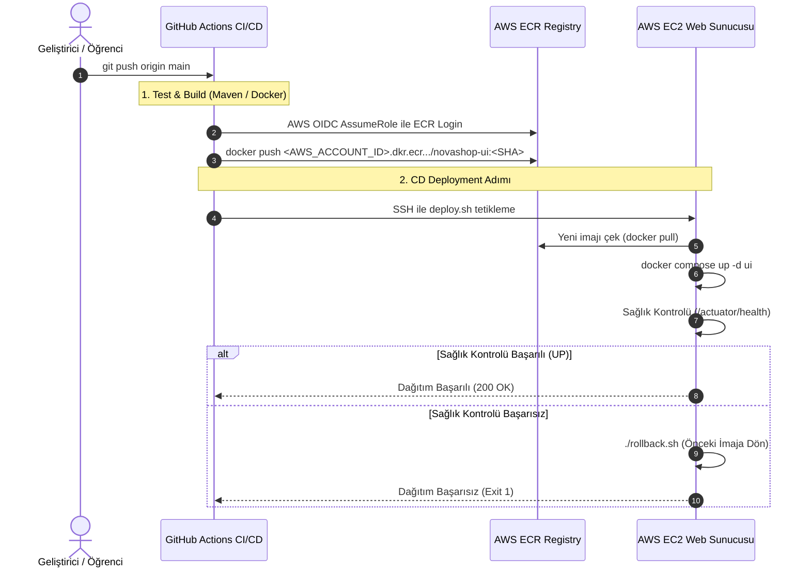

# LAB-05-GITHUB-ACTIONS — GitHub Actions ile Otomatik CI/CD, ECR ve EC2 Dağıtımı

---

### Amaç

NovaShop UI mikroservisini; GitHub Actions iş akışı (workflow) kullanarak otomatik olarak derlemek, Docker imajı olarak etiketleyip AWS ECR (Elastic Container Registry) özel kayıt defterine göndermek, EC2 sunucusuna güvenli OIDC/SSH üzerinden otomatik dağıtmak ve sağlık kontrolü başarısız olduğunda otomatik rollback mekanizmasını doğrulamak.

---

### Kazanımlar

- Modern CI/CD yaşam döngüsünü (Continuous Integration & Continuous Deployment) uçtan uca kurmak.
- Kalıcı AWS anahtarları (Access Key / Secret Key) yerine **GitHub OIDC (OpenID Connect)** ve geçici IAM Rolü (`AssumeRoleWithWebIdentity`) ile en yüksek güvenlik standardını uygulamak.
- AWS ECR üzerinde özel container kayıt defteri oluşturup imajları semantik versiyon ve Git commit SHA ile etiketlemek (`immutable tag`).
- EC2 sunucusunda çalışan Docker Compose yığınını yeni imaj ile sıfır kesintiye yakın güncellemek.
- Dağıtım sonrası otomatik sağlık kontrolü (`health check`) testi koşmak ve hata durumunda otomatik geri alma (rollback) tetiklemek.

---

### Ön koşullar

- **Önceki Lablar:** [LAB-01](../LAB-01/README.md) ve [LAB-04](../LAB-04/README.md) tamamlanmış olmalıdır.
- **GitHub Reposu:** Öğrencinin kendi GitHub hesabı altındaki `novashop` reposu (Admin yetkili).
- **AWS Hesabı:** ECR ve IAM rolü oluşturma yetkisine sahip AWS kullanıcısı.
- **Çalışan EC2 Sunucusu:** Docker ve Docker Compose kurulu, public subnet'teki EC2 instance'ı.

---

### Mimari



---

### Kullanılan placeholder'lar

| Placeholder | Anlamı | Örnek Biçim |
|---|---|---|
| `<AWS_ACCOUNT_ID>` | 12 haneli AWS hesap numarası | `123456789012` |
| `<AWS_REGION>` | Çalışılan AWS bölgesi | `eu-central-1` |
| `<GITHUB_ORG_OR_USER>` | GitHub kullanıcı adı veya organizasyonu | `devops-ogrenci` |
| `<EC2_PUBLIC_IP>` | EC2 sunucusunun genel IP adresi | `3.120.45.67` |
| `<ECR_REPO_NAME>` | ECR kayıt defteri adı | `novashop-ui` |

---

### Adımlar

#### 1. AWS ECR Kayıt Defterini (Repository) Oluşturma

Yerel terminalinizden veya AWS CloudShell üzerinden NovaShop UI için özel ECR reposu oluşturun:

```bash
aws ecr create-repository \
  --repository-name novashop-ui \
  --image-tag-mutability IMMUTABLE \
  --image-scanning-configuration scanOnPush=true \
  --region <AWS_REGION>
```
*Açıklama:*
- `--image-tag-mutability IMMUTABLE`: Aynı etiketle (tag) var olan bir imajın üzerine yazılmasını engelleyerek sürüm güvenliğini sağlar.
- `scanOnPush=true`: İmaj her yüklendiğinde otomatik güvenlik açığı taraması başlatır.

**ECR URI Bilgisini Alma:**
```bash
aws ecr describe-repositories --repository-names novashop-ui --region <AWS_REGION> \
  --query 'repositories[0].repositoryUri' --output text
```
*Beklenen çıktı:* `<AWS_ACCOUNT_ID>.dkr.ecr.<AWS_REGION>.amazonaws.com/novashop-ui`

---

#### 2. Güvenli GitHub OIDC (OpenID Connect) IAM Rolü Oluşturma

> [!IMPORTANT]
> GitHub Actions içine asla kalıcı AWS Access Key / Secret Key yazılmaz. AWS STS AssumeRoleWithWebIdentity ile geçici 1 saatlik token alınır:

**1. OIDC Identity Provider Varlığını Kontrol Etme:**
```bash
aws iam list-open-id-connect-providers | grep -q "token.actions.githubusercontent.com" || \
aws iam create-open-id-connect-provider \
  --url https://token.actions.githubusercontent.com \
  --client-id-list sts.amazonaws.com \
  --thumbprint-list 6938fd4d98bab03faadb97b34396831e3780aea1 1c5860f5b04e3ca1a81f3cb0e6e1b4b0e8b5770e
```

**2. GitHub Reponuza Özel Güven İlkesi (Trust Policy) Oluşturma:**
```bash
cat << EOF > github-oidc-trust.json
{
  "Version": "2012-10-17",
  "Statement": [
    {
      "Effect": "Allow",
      "Principal": {
        "Federated": "arn:aws:iam::<AWS_ACCOUNT_ID>:oidc-provider/token.actions.githubusercontent.com"
      },
      "Action": "sts:AssumeRoleWithWebIdentity",
      "Condition": {
        "StringEquals": {
          "token.actions.githubusercontent.com:aud": "sts.amazonaws.com"
        },
        "StringLike": {
          "token.actions.githubusercontent.com:sub": "repo:<GITHUB_ORG_OR_USER>/novashop:*"
        }
      }
    }
  ]
}
EOF

aws iam create-role \
  --role-name novashop-github-actions-role \
  --assume-role-policy-document file://github-oidc-trust.json

# ECR Push ve Login Yetki Politikasını Ekle
aws iam attach-role-policy \
  --role-name novashop-github-actions-role \
  --policy-arn arn:aws:iam::aws:policy/AmazonEC2ContainerRegistryPowerUser

rm -f github-oidc-trust.json
```
Rol ARN adresini not ediniz: `arn:aws:iam::<AWS_ACCOUNT_ID>:role/novashop-github-actions-role`.

---

#### 3. GitHub Secrets ve Değişkenlerini (Variables) Tanımlama

GitHub reponuzun **Settings > Secrets and variables > Actions** sayfasına giderek aşağıdaki değerleri ekleyin:

**Repository Secrets:**
- `EC2_SSH_KEY`: EC2 sunucunuza bağlanan `.pem` anahtarınızın tam metin içeriği (`cat ~/.ssh/novashop-key.pem`).

**Repository Variables:**
- `AWS_ROLE_TO_ASSUME`: `arn:aws:iam::<AWS_ACCOUNT_ID>:role/novashop-github-actions-role`
- `AWS_REGION`: `<AWS_REGION>`
- `ECR_REPOSITORY`: `<AWS_ACCOUNT_ID>.dkr.ecr.<AWS_REGION>.amazonaws.com/novashop-ui`
- `EC2_HOST`: `<EC2_PUBLIC_IP>`
- `EC2_USER`: `ubuntu`

---

#### 4. EC2 Sunucusunda Otomatik Dağıtım Betiğini Hazırlama

EC2 sunucunuza SSH ile bağlanıp dağıtım ve doğrulama betiğini oluşturun:

```bash
cat << 'EOF' > ~/novashop-deploy/deploy.sh
#!/usr/bin/env bash
set -e

NEW_IMAGE="$1"
if [ -z "$NEW_IMAGE" ]; then
    echo "Hata: İmaj parametresi eksik! Kullanım: ./deploy.sh <IMAGE_URI>"
    exit 1
fi

echo "=== 1. Mevcut Stabil İmajı Yedekleme ==="
CURRENT_IMAGE=$(grep -o "image: .*/novashop-ui:.*" docker-compose.prod.yml | awk '{print $2}' || true)
echo "Mevcut çalışan imaj: $CURRENT_IMAGE"

echo "=== 2. Yeni İmajı ECR'dan Çekme ==="
# AWS CLI ile ECR oturum aç
aws ecr get-login-password --region eu-central-1 | docker login --username AWS --password-stdin $(echo "$NEW_IMAGE" | cut -d/ -f1)
docker pull "$NEW_IMAGE"

echo "=== 3. docker-compose.prod.yml Güncelleme ==="
sed -i "s|image: .*/novashop-ui:.*|image: ${NEW_IMAGE}|g" docker-compose.prod.yml

echo "=== 4. Konteyneri Güncelleme ==="
docker compose -f docker-compose.prod.yml up -d ui

echo "=== 5. Sağlık Kontrolü Doğrulaması (Smoke Test) ==="
SUCCESS=0
for i in {1..12}; do
    STATUS=$(curl -s http://127.0.0.1:8888/actuator/health | grep -o '"status":"UP"' || true)
    if [ "$STATUS" = '"status":"UP"' ]; then
        echo "Sağlık kontrolü BAŞARILI: $STATUS"
        SUCCESS=1
        break
    fi
    echo "Servis bekleniyor ($i/12)..."
    sleep 5
done

if [ "$SUCCESS" -ne 1 ]; then
    echo "HATA: Sağlık kontrolü başarısız oldu! Otomatik Rollback başlatılıyor..."
    if [ -n "$CURRENT_IMAGE" ]; then
        sed -i "s|image: .*/novashop-ui:.*|image: ${CURRENT_IMAGE}|g" docker-compose.prod.yml
        docker compose -f docker-compose.prod.yml up -d ui
        echo "Rollback tamamlandı: $CURRENT_IMAGE aktif edildi."
    fi
    exit 1
fi

echo "=== Dağıtım Başarıyla Tamamlandı ==="
EOF

chmod +x ~/novashop-deploy/deploy.sh
```

---

#### 5. GitHub Actions Workflow Dosyasını Oluşturma

Yerel çalışma kopyanızda `.github/workflows/deploy.yml` dosyasını oluşturun:

```bash
mkdir -p .github/workflows
cat << 'EOF' > .github/workflows/deploy.yml
name: NovaShop CI/CD Pipeline

on:
  push:
    branches: [ main ]
    paths:
      - 'src/ui/**'
      - '.github/workflows/deploy.yml'
  workflow_dispatch:

permissions:
  id-token: write
  contents: read

jobs:
  build-and-push:
    name: Build, Test & Push to ECR
    runs-on: ubuntu-latest
    outputs:
      image_tag: ${{ steps.meta.outputs.tag }}
      image_uri: ${{ steps.build-image.outputs.image_uri }}

    steps:
      - name: Repoyu Klonla
        uses: actions/checkout@v4

      - name: Java 21 Kurulumu
        uses: actions/setup-java@v4
        with:
          distribution: 'temurin'
          java-version: '21'
          cache: 'maven'

      - name: Birim Testleri Çalıştır
        run: |
          cd src/ui
          ./mvnw test

      - name: AWS OIDC Kimlik Doğrulaması
        uses: aws-actions/configure-aws-credentials@v4
        with:
          role-to-assume: ${{ vars.AWS_ROLE_TO_ASSUME }}
          aws-region: ${{ vars.AWS_REGION }}

      - name: AWS ECR Girişi Yap
        id: login-ecr
        uses: aws-actions/amazon-ecr-login@v2

      - name: İmaj Etiketi Belirleme
        id: meta
        run: |
          SHORT_SHA=$(git rev-parse --short HEAD)
          echo "tag=${SHORT_SHA}" >> $GITHUB_OUTPUT

      - name: Docker İmajını Derle ve ECR'a Gönder
        id: build-image
        env:
          ECR_REGISTRY: ${{ steps.login-ecr.outputs.registry }}
          ECR_REPOSITORY: novashop-ui
          IMAGE_TAG: ${{ steps.meta.outputs.tag }}
        run: |
          IMAGE_URI="${ECR_REGISTRY}/${ECR_REPOSITORY}:${IMAGE_TAG}"
          docker build -t "$IMAGE_URI" src/ui
          docker push "$IMAGE_URI"
          echo "image_uri=${IMAGE_URI}" >> $GITHUB_OUTPUT

  deploy-to-ec2:
    name: Deploy to EC2 & Verify
    needs: build-and-push
    runs-on: ubuntu-latest

    steps:
      - name: SSH ile EC2'ye Dağıtım Yap
        uses: appleboy/ssh-action@v1.0.3
        with:
          host: ${{ vars.EC2_HOST }}
          username: ${{ vars.EC2_USER }}
          key: ${{ secrets.EC2_SSH_KEY }}
          script: |
            cd ~/novashop-deploy
            ./deploy.sh "${{ needs.build-and-push.outputs.image_uri }}"

      - name: Dış Uçtan Uca Sağlık Kontrolü (Smoke Test)
        run: |
          curl -s -k -f https://${{ vars.EC2_HOST }}/healthz || exit 1
          echo "Canlı sistem doğrulandı."
EOF
```

---

#### 6. Pipeline'ı Tetikleme ve Otomatik Dağıtımı İzleme

Yapılan değişikliği commit edin ve GitHub'a gönderin:

```bash
git add .github/workflows/deploy.yml
git commit -m "ci: add automated CI/CD pipeline with AWS ECR and EC2 deployment"
git push origin main
```

**GitHub Arayüzünden Takip:**
1. GitHub reponuzda **Actions** sekmesine gidin.
2. `NovaShop CI/CD Pipeline` iş akışının yeşile döndüğünü (`Success`) doğrulayın.
3. AWS ECR konsolunda yeni commit SHA etiketiyle imajın yüklendiğini teyit edin.

---

#### 7. Otomatik Rollback Senaryosunu Test Etme

Sistemin başarısız bir dağıtımda önceki stabil sürüme döndüğünü test etmek için kasıtlı olarak hatalı bir imaj dağıtımını simüle edin:

```bash
# EC2 sunucusunda test edin:
ssh -i <KEY_PATH> ubuntu@<EC2_PUBLIC_IP>
cd ~/novashop-deploy

# Bilerek sağlık kontrolü vermeyen bir imajı dağıtmaya çalışın
./deploy.sh "alpine:latest"
```
*Beklenen çıktı:*
```text
Servis bekleniyor (1/12)...
...
HATA: Sağlık kontrolü başarısız oldu! Otomatik Rollback başlatılıyor...
Rollback tamamlandı: <PREV_IMAGE> aktif edildi.
```
Sistemin çökmediğini ve önceki çalışan imajın devrede kaldığını teyit edin:
```bash
curl -s http://127.0.0.1:8888/actuator/health
# {"status":"UP"}
```

---

#### 8. Otomatik Laboratuvar Doğrulama Betiğini Çalıştırma

İş akışlarınızı, OIDC tanımlarınızı ve secret sızıntı denetimini otomatik test betiği ile denetleyin:

```bash
bash scripts/verify/verify-lab-05.sh
```
*Beklenen çıktı:*
```text
=== [LAB-05] GitHub Actions Doğrulama Başlatılıyor ===
✅ Workflows dizini mevcut.
✅ Bulunan iş akışı sayısı: ...
✅ OIDC / AWS kimlik sağlayıcı tanımı tespit edildi: ...
✅ Hardcoded AWS gizli anahtarı bulunmadı (Güvenli).
✅ İmaj etiketleme kuralları temiz (SHA veya semantik versiyon kullanılıyor).
=== [LAB-05] GitHub Actions Doğrulaması Tamamlandı! ===
```

---

### Troubleshooting

#### Senaryo 1: GitHub Actions `Not authorized to perform sts:AssumeRoleWithWebIdentity`
- **Belirti:** Pipeline'ın "AWS OIDC Kimlik Doğrulaması" adımında yetki hatası alması.
- **Muhtemel Neden:** IAM rolünün Güven İlkesinde (`Trust Policy`) repo adı (`repo:<ORG>/<REPO>:*`) yazım hatası veya `token.actions.githubusercontent.com:aud` şartının uyuşmaması.
- **Teşhis Komutu:**
  ```bash
  aws iam get-role --role-name novashop-github-actions-role --query 'Role.AssumeRolePolicyDocument'
  ```
- **Güvenli Çözüm:** `Condition` altındaki `sub` dizesini GitHub reponuzun tam yoluyla (`repo:kullanici/novashop:*`) eşleştirin.

#### Senaryo 2: ECR Push Sırasında `denied: Your authorization token has expired`
- **Belirti:** Docker push adımında `unauthorized` veya token süresi doldu hatası.
- **Muhtemel Neden:** ECR login işleminin yapılmaması veya IAM rolünde `ecr:GetAuthorizationToken` izninin eksik olması.
- **Güvenli Çözüm:** IAM rolüne `AmazonEC2ContainerRegistryPowerUser` politikasının eklendiğini teyit edin.

#### Senaryo 3: EC2 SSH Adımında `Host Key Verification Failed` veya Zaman Aşımı
- **Belirti:** GitHub Actions `appleboy/ssh-action` adımında takılı kalıyor ve zaman aşımına uğruyor.
- **Muhtemel Neden:** EC2 Web Güvenlik Grubunda SSH portunun (22) GitHub Actions runner IP'lerine kapalı olması veya SSH anahtarının yanlış formatta eklenmesi.
- **Güvenli Çözüm:** Lab ortamında SSH anahtarının doğru eklendiğini ve güvenlik grubunda port 22'nin erişilebilir olduğunu kontrol edin.

---

### Güvenlik Notu

1. **Sıfır Kalıcı Secret (Zero Static Keys):**
   - Repoda hiçbir AWS Access Key veya Secret Key saklanmaz. GitHub OIDC ile dakikalık geçici oturum anahtarları üretilir.
2. **Değiştirilemez İmaj Etiketleri (Immutable Tags):**
   - ECR üzerinde `IMMUTABLE` özelliği açılarak aynı etiketle zararlı veya hatalı kod yüklenmesi engellenir.
3. **Otomatik Güvenlik Taraması (ECR Scan on Push):**
   - Her imaj AWS tarafında bilinen güvenlik açıkları (CVE) için taranır.

---

### Cleanup / Rollback

```bash
# 1. AWS ECR Kayıt Defterini Silin
aws ecr delete-repository --repository-name novashop-ui --force --region <AWS_REGION>

# 2. IAM Rolünü Silin
aws iam detach-role-policy --role-name novashop-github-actions-role --policy-arn arn:aws:iam::aws:policy/AmazonEC2ContainerRegistryPowerUser
aws iam delete-role --role-name novashop-github-actions-role

# 3. EC2 Sunucusunu Durdurma/Silme
# LAB-02-AWS-BASICS.md cleanup adımlarını uygulayınız.
```

---

### Pratik Uygulama Görevi

1. `.github/workflows/deploy.yml` dosyasına derleme öncesinde `src/ui/src/main/resources/lang/messages.properties` dosyasında syntax kontrolü yapan bir shell adımı ekleyin.
2. Hatalı bir sözdizimi ile commit atıp pipeline'ın derlemeyi durdurduğunu (Quality Gate) Actions sekmesinde gözlemleyin.
