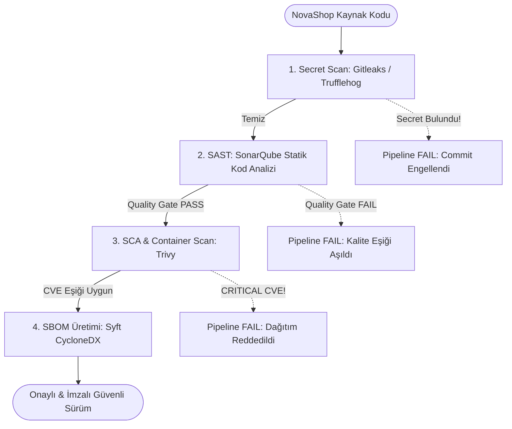

# LAB-08-SECURITY-GATES — DevSecOps: SonarQube, Trivy, Secret Scanning ve SBOM ile Güvenlik Kapıları

---

### Amaç

NovaShop kod tabanında statik kod analizi (SonarQube/SAST), bağımlılık ve konteyner zafiyet taraması (Trivy/SCA), parola/anahtar sızıntı denetimi (Secret Scanning) ve yazılım malzeme listesi (SBOM) üretimini otomatikleştirerek geçişi engelleyen veya onaylayan kurumsal Kalite Kapılarını (Quality Gates) doğrulamak.

---

### Kazanımlar

- CI/CD boru hattına "Shift-Left Security" (Güvenliği Sola Çekme) prensibiyle otomatik güvenlik denetimleri eklemek.
- SonarQube ile kod kokuları (Code Smells), potansiyel hatalar (Bugs) ve güvenlik açıkları için eşik değerler (Quality Gate) belirlemek.
- Trivy ile hem dosya sistemi (Filesystem) hem de Docker imajları üzerinde CVE taraması yapmak ve kritik zafiyet durumunda derlemeyi durdurmak (`--exit-code 1`).
- Repoya yanlışlıkla secret (parola, API token, özel anahtar) commit edilmesini engellemek için yerel ve CI tabanlı gizli bilgi tarayıcıları çalıştırmak.
- Syft / ORT araçları ile CycloneDX/SPDX formatında standart Yazılım Malzeme Listesi (SBOM - Software Bill of Materials) üretmek.

---

### Ön koşullar

- **Önceki Lablar:** [LAB-01](../LAB-01/README.md) ve [LAB-05](../LAB-05/README.md) tamamlanmış olmalıdır.
- **Yüklü Araçlar:** Docker Engine, `trivy` CLI, Java 21 JDK, Git.
- **Kaynak Gereksinimi:** `security-gates` profili (en az 2 vCPU, 4 GB boş RAM).

---

### Mimari



---

### Kullanılan placeholder'lar

| Placeholder | Anlamı | Örnek Biçim |
|---|---|---|
| `<SONAR_HOST_URL>` | SonarQube sunucu adresi | `http://localhost:9000` |
| `<SONAR_TOKEN>` | SonarQube proje kimlik belirteci | `sqp_1a2b3c4d5e...` |
| `<IMAGE_NAME>` | Taranacak Docker imajı | `novashop-ui:v0.1.0` |

---

### Adımlar

#### 1. Gizli Bilgi Taraması (Secret Scanning)

Repoda unutulmuş API anahtarları, şifreler veya sertifikaları tespit etmek için yerel tarayıcıyı çalıştırın:

```bash
# Docker üzerinden izole Trivy ile secret taraması
docker run --rm -v $(pwd):/src aquasec/trivy:latest fs --security-checks secret /src
```
*Açıklama:* Çalışma dizinindeki dosyaları desen ve entropi kurallarıyla tarayarak açıkta kalan kimlik bilgilerini raporlar.  
*Beklenen çıktı:* `Secrets: 0` (Hiçbir secret bulunmamalıdır).

---

#### 2. SonarQube Statik Kod Analizi (SAST)

SonarQube analizcisini Maven eklentisi ile çalıştırın:

```bash
cd src/ui
./mvnw clean verify sonar:sonar \
  -Dsonar.projectKey=novashop-ui \
  -Dsonar.projectName='NovaShop UI' \
  -Dsonar.host.url=<SONAR_HOST_URL> \
  -Dsonar.token=<SONAR_TOKEN> \
  -Dsonar.qualitygate.wait=true
```
*Açıklama:*
- `-Dsonar.qualitygate.wait=true`: SonarQube sunucusundaki analiz bitene kadar bekler; eğer Kalite Kapısı koşulları (ör. 0 Güvenlik Açığı, %80 Kod Kapsamı) sağlanmazsa derlemeyi derhal başarısız (`BUILD FAILURE`) kılar.

---

#### 3. Trivy ile Konteyner İmaj Zafiyet Taraması (SCA)

Derlenen `novashop-ui:v0.1.0` imajını işletim sistemi paketleri ve uygulama bağımlılıkları açısından tarayın:

```bash
# Bilgilendirici tam rapor
trivy image novashop-ui:v0.1.0

# Kalite Kapısı Modu: CRITICAL seviyeli açık varsa çıkış kodu 1 dönerek pipeline'ı durdur
trivy image --severity HIGH,CRITICAL --exit-code 1 novashop-ui:v0.1.0
```
*Açıklama:* Eğer imajda düzeltilmemiş kritik seviyeli bir CVE açığı varsa komut `1` koduyla sonlanır ve dağıtım engellenir.

---

#### 4. Yazılım Malzeme Listesi (SBOM) Üretimi

Uygulamanın içerdiği tüm açık kaynak kütüphaneleri, sürümleri ve lisansları içeren standart CycloneDX formatında SBOM oluşturun:

```bash
# Syft aracı ile JSON ve XML formatında SBOM üretimi
docker run --rm -v /var/run/docker.sock:/var/run/docker.sock -v $(pwd):/out \
  anchore/syft:latest novashop-ui:v0.1.0 -o cyclonedx-json=/out/sbom.json

head -n 25 sbom.json
```
*Açıklama:* Üretilen `sbom.json` dosyası denetim, uyumluluk (compliance) ve tedarik zinciri güvenliği (Supply Chain Security) kanıtı olarak saklanır.

---

#### 5. Başarılı ve Başarısız Kalite Kapısı Simülasyonu

**1. Başarısız Kapı Senaryosu (Fail Gate):**
Kasıtlı olarak zafiyetli eski bir kütüphaneyi veya test anahtarını repoya ekleyip tarayıcıyı çalıştırın:
```bash
echo "AWS_SECRET_ACCESS_KEY=AKIAIOSFODNN7EXAMPLE123456" > test_secret.env
docker run --rm -v $(pwd):/src aquasec/trivy:latest fs --security-checks secret --exit-code 1 /src
```
*Beklenen çıktı:* `Exit code 1 - CRITICAL: Secret found!` (Pipeline'ın kırmızıya dönerek dağıtımı engellediğini kanıtlar).

**2. Temizleme ve Başarılı Kapı Senaryosu (Pass Gate):**
```bash
rm -f test_secret.env
docker run --rm -v $(pwd):/src aquasec/trivy:latest fs --security-checks secret --exit-code 1 /src
```
*Beklenen çıktı:* `Exit code 0` (Kalite kapısı geçildi).

---

#### 6. Otomatik Laboratuvar Doğrulama Betiğini Çalıştırma

Kod tabanınızdaki gizli anahtarları, lisans uyumluluğunu ve Dockerfile non-root kontrollerini otomatik betik ile test edin:

```bash
bash scripts/verify/verify-lab-08.sh
```
*Beklenen çıktı:*
```text
=== [LAB-08] DevSecOps Güvenlik Kapıları Doğrulama Başlatılıyor ===
1. Hassas bilgi ve özel anahtar sızıntı taraması yapılıyor...
✅ Secret taraması temiz: Kod tabanında sızıntı tespit edilmedi.
2. Açık kaynak lisans ve atıf (Attribution) kontrolü...
✅ Ana depo LICENSE dosyası mevcut.
3. Dockerfile güvenlik sertleştirmesi (Non-root) denetleniyor...
✅ Non-root kullanıcı kuralları doğrulandı.
=== [LAB-08] DevSecOps Güvenlik Kapıları Doğrulaması Başarılı! ===
```

---

### Troubleshooting

#### Senaryo 1: Trivy Veritabanı İndirme Hatası (`download error: rate limit exceeded`)
- **Belirti:** `trivy image` çalıştırıldığında DB güncellemesinde zaman aşımı veya rate limit hatası alınması.
- **Güvenli Çözüm:** Yerel veritabanı önbelleğini kullanın veya GitHub token ortam değişkenini tanımlayın: `export GITHUB_TOKEN=<TOKEN>`.

#### Senaryo 2: SonarQube `Quality Gate failed: Coverage on New Code < 80%`
- **Belirti:** Kod güvenli olmasına rağmen test kapsamı eşiği aşılamadığı için analiz başarısız oluyor.
- **Teşhis:** SonarQube panelinde "Measures > Coverage" sekmesini inceleyin.
- **Güvenli Çözüm:** Yeni eklenen sınıflar veya metodlar için `src/test/java` altında birim test yazarak kapsamı artırın.

---

### Güvenlik Notu

1. **Shift-Left İlkesi:**
   - Güvenlik kontrolleri canlı ortam yerine geliştirici bilgisayarında (pre-commit hook) ve CI derleme aşamasında işletilir.
2. **Kritik Zafiyet İntoleransı:**
   - Bilinen `CRITICAL` seviyeli CVE açığına sahip hiçbir imaj üretim ortamına çıkamaz (`--exit-code 1`).

---

### Cleanup / Rollback

```bash
# Üretilen SBOM ve geçici tarama dosyalarını silin
rm -f sbom.json test_secret.env

# SonarQube konteynerini durdurun
docker compose --profile security-gates down -v 2>/dev/null || true
```

---

### Pratik Uygulama Görevi

1. Reponun `.gitignore` dosyasına `*.env`, `*.pem` ve `sbom.json` kurallarının eklendiğini teyit edin.
2. Git hooks (`.git/hooks/pre-commit`) içerisine `trivy fs --security-checks secret` çalıştıran bir komut ekleyerek secret içeren commit'leri yerelde engelleyin.
