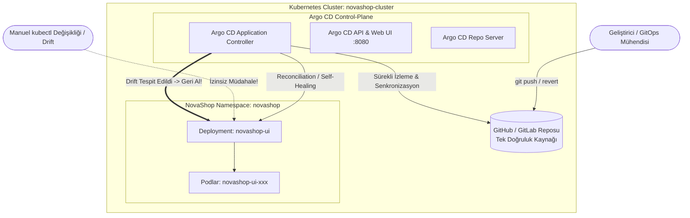

# LAB-09-ARGOCD-GITOPS — Argo CD ile GitOps Sürekli Dağıtımı, Drift Düzeltme ve Geri Alma

---

### Amaç

Kubernetes kümesi üzerinde Argo CD GitOps operatörünü kurarak; Git reposunu "Tek Doğruluk Kaynağı" (Single Source of Truth) olarak tanımlamak, bildirimsel (declarative) NovaShop uygulamalarını otomatik senkronizasyonla dağıtmak, canlı kümedeki manuel sapmaları (Drift) otomatik düzeltmek (Self-Healing) ve Git geçmişi üzerinden güvenli geri alma (Rollback) sürecini doğrulamak.

---

### Kazanımlar

- GitOps felsefesini (Git tabanlı bildirimsel altyapı ve uygulama yönetimi) uygulamalı olarak kavramak.
- Kubernetes kümesi içerisine Argo CD sunucusunu ve CRD (Custom Resource Definition) bileşenlerini kurmak.
- Argo CD `Application` kaynağı tanımlayarak Git deposundaki Helm/Kustomize manifestolarını canlı kümeye bağlamak.
- Küme üzerinde yapılan izinsiz manuel değişiklikleri (Configuration Drift) tespit edip otomatik olarak Git kaynağına senkronize eden Self-Healing mekanizmasını test etmek.
- GitOps yaklaşımında rollback işleminin doğrudan Git commit'i geri alarak (`git revert`) nasıl işletildiğini kanıtlamak.

---

### Ön koşullar

- **Önceki Lablar:** [LAB-01](../LAB-01/README.md) ve [LAB-06](../LAB-06/README.md) tamamlanmış olmalıdır.
- **Çalışan Kubernetes Kümesi:** Kind veya bulut üzerinde Kubernetes kümesi (`kubectl get nodes` erişilebilir olmalıdır).
- **Yüklü Araçlar:** `kubectl`, `argocd` CLI veya `curl`, Git.
- **Kaynak Gereksinimi:** `gitops-argo` profili (en az 2 vCPU, 6.5 GB boş RAM).

---

### Mimari



---

### ⚙️ Ortam Değişkenleri ve Parametreler

| Parametre | Açıklama | Örnek Değer |
|---|---|---|
| `<ARGOCD_PASSWORD>` | Argo CD admin arayüzü şifresi | Güvenli parola |
| `<REPO_URL>` | GitOps manifestolarını barındıran repo adresi | `https://github.com/.../novashop.git` |
| `<TARGET_NAMESPACE>` | Uygulama hedef isim alanı | `novashop` |

---

### Adımlar

#### 1. Argo CD'yi Kubernetes Kümesine Kurma

**Seçenek 1 (Önerilen — Otomatik Tek Komutla Kurulum):**
Tüm kurulumu, olası NodePort 30080 çakışma temizliğini ve GitOps Application dağıtımını tek seferde çalıştırmak için:
```bash
bash scripts/deploy-argocd.sh
```

**Seçenek 2 (Adım Adım Manuel Kurulum):**
Argo CD için özel isim alanı oluşturun ve resmi kurulum manifestolarını uygulayın:

```bash
kubectl create namespace argocd --dry-run=client -o yaml | kubectl apply -f -
# Not: Argo CD CRD'lerinin 256KB limitini aşmaması ve çakışmaları ezmesi için --server-side ve --force-conflicts kullanılır:
kubectl apply --server-side --force-conflicts -n argocd -f https://raw.githubusercontent.com/argoproj/argo-cd/stable/manifests/install.yaml

# Pod'ların hazır duruma gelmesini bekleyin (yaklaşık 1-2 dakika)
kubectl wait --for=condition=available --timeout=300s deployment/argocd-server -n argocd
```
*Beklenen çıktı:* `deployment.apps/argocd-server condition met`.

---

#### 2. Başlangıç Yönetici Parolasını Alma ve Erişim Seçenekleri

Argo CD web paneline erişmek için başlangıç admin şifresini çekin:

```bash
# Otomatik üretilen başlangıç parolasını çöz
ARGOCD_PASS=$(kubectl -n argocd get secret argocd-initial-admin-secret -o jsonpath="{.data.password}" | base64 -d)
echo "Argo CD Admin Parolası: $ARGOCD_PASS"
```

##### Model A: Doğrudan Port-Forward (Lokal IP)
```bash
# Sunucunun tüm arayüzlerinde dinlemek için --address 0.0.0.0 ile port yönlendirme:
kubectl port-forward svc/argocd-server -n argocd 8080:443 --address 0.0.0.0 > /dev/null 2>&1 &
```
Tarayıcınızdan `https://<UBUNTU_IP>:8080` veya `https://localhost:8080` adresine giderek kullanıcı adı `admin` ve yukarıdaki parola ile giriş yapın.

##### Model B: Kurumsal DNS ve SSL ile Erişim
Eğer eğitmen tarafından alan adınız tanımlandıysa:
`https://studentXX-argocd.devopsatolyesi.com` üzerinden güvenli HTTPS ile erişebilirsiniz.

---

#### 3. Argo CD Application Kaynağını Tanımlama ve Çakışmaları Temizleme

LAB-06'da yapılan manuel Helm kurulumunun NodePort `30080` portunu kilitlemesini önlemek için önce eski manuel servisi temizleyin:

```bash
# LAB-06 manuel Helm kurulumundan kalan çakışan servisi temizle (NodePort 30080'i serbest bırakır):
helm uninstall novashop -n novashop 2>/dev/null || true
kubectl delete svc novashop-ui -n novashop --ignore-not-found 2>/dev/null || true
```

Ardından hazır GitOps manifestosunu uygulayın:

```bash
kubectl apply -f deploy/gitops/application.yaml
```
```
*Açıklama:*
- `automated.selfHeal: true`: Canlı kümedeki manuel değişiklikleri otomatik olarak tespit edip Git deposundaki durumla ezer.
- `automated.prune: true`: Git'ten silinen bir kaynağı canlı kümeden de otomatik siler.

---

#### 4. Senkronizasyon Durumunu Doğrulama

Argo CD uygulamasının senkronize (`Synced`) ve sağlıklı (`Healthy`) duruma geçtiğini kontrol edin:

```bash
kubectl get application novashop-ui-gitops -n argocd -o wide
```
*Beklenen çıktı:*
```text
NAME                  SYNC STATUS   HEALTH STATUS   REVISION
novashop-ui-gitops    Synced        Healthy         ...
```

---

#### 5. Configuration Drift ve Self-Healing Testi

Canlı kümede izinsiz bir manuel müdahale simüle edin (örneğin bir geliştirici `kubectl` ile replica sayısını değiştirsin):

```bash
# 1. Manuel olarak replica sayısını 5'e çıkarın (Git'te 2 olarak tanımlıydı):
kubectl scale deployment novashop-ui -n novashop --replicas=5

# 2. Canlı durumu anlık izleyin:
kubectl get deployment novashop-ui -n novashop
```
*Beklenen çıktı (birkaç saniye içinde):*
```text
NAME          READY   UP-TO-DATE   AVAILABLE   AGE
novashop-ui   2/2     2            2           3m
```
*Açıklama:* Argo CD kümedeki sapmayı (Drift) derhal fark etmiş ve `selfHeal: true` kuralı gereğince replica sayısını zorla Git'te tanımlı olan `2` değerine geri döndürmüştür!

---

#### 6. GitOps Yöntemiyle Rollback (Geri Alma)

Geleneksel `kubectl rollout undo` yerine GitOps standardında geri alma **Git geçmişi üzerinden** yapılır:

```bash
# 1. Yapılan hatalı commit'i geri al (revert)
git revert HEAD --no-edit

# 2. Değişikliği repoya push et
git push origin main

# 3. Argo CD'nin yeni durumu canlı kümeye otomatik yansıtmasını izle
kubectl rollout status deployment/novashop-ui -n novashop
```
*Açıklama:* Bu sayede kimin, ne zaman ve hangi sebeple geri alma yaptığı Git denetim izinde (Audit Log) kalıcı ve şeffaf olarak saklanır.

---

#### 7. Otomatik Laboratuvar Doğrulama Betiğini Çalıştırma

ArgoCD Application yapılandırmasını (selfHeal, prune, namespace) otomatik test betiği ile doğrulayın:

```bash
bash scripts/verify/verify-lab-09.sh
```
*Beklenen çıktı:*
```text
=== [LAB-09] ArgoCD GitOps Doğrulama Başlatılıyor ===
✅ ArgoCD Application manifesti bulundu.
✅ Otomatik drift düzeltme (selfHeal: true) aktif.
✅ Yetim kaynak temizleme (prune: true) aktif.
✅ Hedef kubernetes namespace: novashop.
=== [LAB-09] ArgoCD GitOps Doğrulama Tamamlandı ===
```

---

### Troubleshooting

#### Senaryo 1: Argo CD `ComparisonError: repository not found`
- **Belirti:** Application durumu `Unknown` veya `ComparisonError` veriyor.
- **Muhtemel Neden:** Git repo URL'sinin yanlış yazılması veya private repo için SSH anahtarı/token tanımlanmamış olması.
- **Güvenli Çözüm:** Reponun public olduğunu teyit edin veya private repo için `argocd repo add` ile erişim belirteci ekleyin.

#### Senaryo 2: Application `OutOfSync` Durumunda Takılı Kalıyor
- **Belirti:** Durum sarı renkte `OutOfSync` olarak görünüyor ve otomatik senkronize olmuyor.
- **Teşhis:** `kubectl describe application novashop-ui-gitops -n argocd`.
- **Güvenli Çözüm:** Senkronizasyon hatasına neden olan geçersiz manifesto parametresini düzeltip manuel senkronizasyon tetikleyin: `argocd app sync novashop-ui-gitops`.

---

### Güvenlik Notu

1. **Küme Erişiminin Kısıtlanması:**
   - GitOps devreye girdikten sonra geliştiricilere doğrudan kümeye erişim (`cluster-admin`) yetkisi verilmez; tüm değişiklikler Pull Request üzerinden Git onaylarıyla yürütülür.
2. **Kendi Kendini Onarma (Self-Healing):**
   - Kümede manuel olarak açılan arka kapılar veya yetkisiz müdahaleler Argo CD tarafından anında ezilir.

---

### Cleanup / Rollback

```bash
# 1. Argo CD uygulamasını ve oluşturduğu kaynakları silin
kubectl delete application novashop-ui-gitops -n argocd

# 2. Argo CD isim alanını temizleyin
kubectl delete namespace argocd novashop
```

---

### Pratik Uygulama Görevi

1. Git deposundaki `values.yaml` dosyasında `ui.replicaCount` değerini `2`'den `3`'e çıkarıp commit edin.
2. Argo CD arayüzünde uygulamanın otomatik senkronize oluşunu ve pod sayısının 3'e yükseldiğini gözlemleyin.
