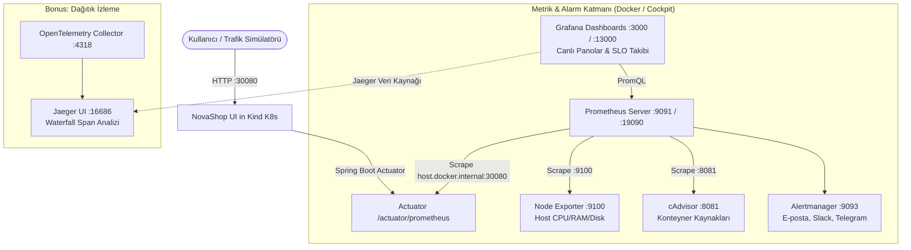
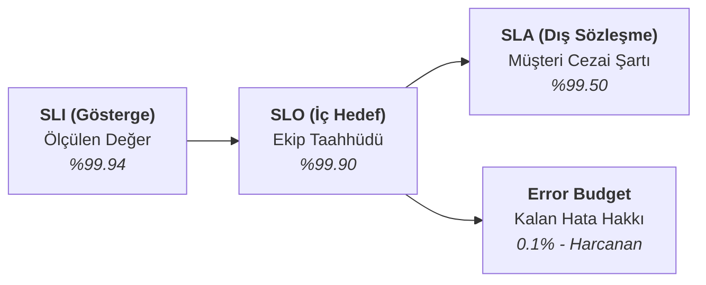

# LAB-10-OBSERVABILITY — İleri Gözlemlenebilirlik: Prometheus, Grafana, Alertmanager ve SRE (SLI/SLA/SLO) Yönetimi

---

### Amaç

NovaShop mikroservis ekosisteminde; **Prometheus** ile zaman serisi metrik toplama (RED ve USE metotları), **Grafana** ile operasyonel izleme panoları kurma, **Alertmanager** ile çok kanallı alarm yönlendirme (E-posta, Slack, Telegram) ve kontrollü yük oluşturarak **SRE Hizmet Seviyesi Hedefleri (SLO)** ile **Hata Bütçesi (Error Budget)** yönetimini uçtan uca doğrulamaktır.

Laboratuvarın sonunda yer alan **Bonus Bölüm** ile modern mikroservis mimarilerinde isteklerin uçtan uca yolculuğunu izleyen **OpenTelemetry (OTel) Collector & Jaeger Distributed Tracing** altyapısı incelenir.

---

### Kazanımlar

- **Metrik Toplama Mimarisi (Pull Modeli):** Prometheus'un `/actuator/prometheus` ve cAdvisor/Node-Exporter uç noktalarından metrik toplama dinamiklerini kavramak.
- **PromQL ile Derinlemesine Analiz:** Table (anlık snapshot) ve Graph (zaman serisi trend) modlarında RED (Rate, Errors, Duration) ve USE (Utilization, Saturation, Errors) sorguları yazmak.
- **Grafana Panel & Dashboard Tasarımı:** Time series, Stat, Gauge, Bar chart, Table ve Alert List panellerini hem UI üzerinden hem de kodla (JSON/Provisioning) oluşturmak.
- **Alarm Yönetimi ve Çok Kanallı Bildirim:** Kritik sistem durumlarında Alertmanager üzerinden E-posta (Gmail SMTP), Slack ve Telegram kanallarına bildirim iletmek.
- **SRE Metodolojisi:** SLI, SLA, SLO, Error Budget ve Burn Rate kavramlarını PromQL formülleriyle hesaplayıp Grafana'da canlı takip etmek.
- **Bonus Tracing (OpenTelemetry & Jaeger):** Mikroservisler arasındaki HTTP çağrılarının şelale (Waterfall) gecikmelerini analiz etmek.

---

### Ön Koşullar ve Hızlı Hazırlık

1. **NovaShop'un Kind Üzerinde Başlatılması:**
   NovaShop uygulamasının Kind Kubernetes kümesinde ayakta olması gerekir. Eğer önceki lablar yapılmadıysa veya küme kapalıysa, tek komutla her şeyi hazır hale getirin:
   ```bash
   bash scripts/setup-kind-cluster.sh
   ```
   *Doğrulama:* `kubectl get pods -n novashop` (Podların `Running` olduğu görülür).  
   *Mağaza Erişimi (Kind NodePort):* `http://localhost:30080` (veya Cockpit üzerinden App Slot).

2. **Gerekli Araçlar:** Docker v24+, `curl`, `jq`.

---

### Mimari



---

### 🧭 Erişim Modelleri ve Kimlik Bilgileri (Credentials)

| Servis | Model B: Kurumsal DNS + SSL (1. Seçenek) | Model A: Doğrudan IP:Port (2. Seçenek) | Kullanıcı Adı | Varsayılan Parola |
| :--- | :--- | :--- | :---: | :---: |
| **Grafana Panosu** | `https://studentXX-grafana.devopsatolyesi.com` | `http://<UBUNTU_IP>:3000` veya `:13000` | `admin` | `.env` içindeki `GRAFANA_ADMIN_PASSWORD` (`DevOps2026!`) |
| **Prometheus Web UI** | `https://studentXX-prometheus.devopsatolyesi.com` | `http://<UBUNTU_IP>:9091` veya `:19090` | - | Kimlik doğrulaması yok (*Cockpit 9090 kullandığı için 9091/19090 ayrılmıştır*) |
| **Alertmanager** | - | `http://<UBUNTU_IP>:9093` | - | Kimlik doğrulaması yok |
| **NovaShop Storefront (Kind)** | `https://studentXX-app1.devopsatolyesi.com` | `http://<UBUNTU_IP>:30080` | - | E-ticaret vitrini |
| **Jaeger UI (Tracing - Bonus)** | `https://studentXX-jaeger.devopsatolyesi.com` | `http://<UBUNTU_IP>:16686` | - | Kimlik doğrulaması yok |

---

## 🛠️ Adım Adım Uygulama Rehberi (CLI & UI)

---

### ADIM 1: Gözlemlenebilirlik Profilini Başlatma

#### Yöntem A: Terminalden (CLI)
Yerel parolanızı tanımlayın ve servisleri Docker Compose ile başlatın:

```bash
cd ~/novashop
test -f .env || cp config/project.env.example .env
sed -i 's/<SET_A_LOCAL_SECRET>/DevOps2026!/g' .env
chmod 600 .env

# Stack'i başlatın
docker compose --env-file .env -p novashop-observability -f deploy/observability/docker-compose.observability.yml up -d
```

**Konteyner Durumlarını Doğrulama:**
```bash
docker compose -p novashop-observability -f deploy/observability/docker-compose.observability.yml ps
```
*Beklenen konteynerler:* `novashop-prometheus`, `novashop-grafana`, `novashop-alertmanager`, `novashop-node-exporter`, `novashop-cadvisor`.

#### Yöntem B: Web Tarayıcısından (UI)
1. Tarayıcınızda `https://studentXX-grafana.devopsatolyesi.com` veya `http://<SUNUCU_IP>:3000` adresine gidin.
2. `admin` / `DevOps2026!` ile giriş yapın.

---

### ADIM 2: Prometheus Hedeflerini (Targets) ve PromQL Sorgularını İnceleme

Prometheus'un sistemdeki bileşenleri başarıyla dinlediğini doğrulayın:

#### Yöntem A: Terminalden (CLI / curl)
```bash
curl -s http://localhost:9091/api/v1/targets | jq -r '.data.activeTargets[] | "\(.labels.job): \(.health)"'
```
*Beklenen çıktı:*
```text
prometheus: up
node-exporter: up
cadvisor: up
novashop-ui: up
```

#### Yöntem B: Prometheus Web Arayüzünden (UI)
1. `https://studentXX-prometheus.devopsatolyesi.com/targets` veya `http://<SUNUCU_IP>:9091/targets` adresine gidin.
2. Tüm hedeflerin mavi renkli **UP** durumunda olduğunu teyit edin.
3. Üst menüden **Graph** sekmesine geçin.

---

### ADIM 3: PromQL Sorgu Kütüphanesi (Table ve Graph Modları)

Prometheus arayüzünde veya Grafana **Explore** sekmesinde iki mod bulunur:
- **Table Modu:** Anlık en güncel snapshot değerlerini gösterir (Örn: `up == 1`).
- **Graph Modu:** Zaman içindeki eğilimleri, persentilleri ve türevleri çizer (`rate`, `histogram_quantile`).

#### Pratik PromQL Formülleri:

| Metot / Alan | Amaç | PromQL Sorgusu |
| :--- | :--- | :--- |
| **RED - Rate** | İstek Hızı (RPS) | `sum by (job) (rate(http_server_requests_seconds_count[1m]))` |
| **RED - Errors** | HTTP 5xx Hata Oranı (%) | `(sum(rate(http_server_requests_seconds_count{status=~"5.."}[1m])) / sum(rate(http_server_requests_seconds_count[1m]))) * 100` |
| **RED - Duration** | p95 Yanıt Gecikmesi (saniye) | `histogram_quantile(0.95, sum by (le) (rate(http_server_requests_seconds_bucket[5m])))` |
| **USE - Utilization** | Host CPU Doluluğu (%) | `100 - (avg by (instance) (rate(node_cpu_seconds_total{mode="idle"}[2m])) * 100)` |
| **USE - Memory** | Host Kullanılabilir RAM (%) | `(node_memory_MemAvailable_bytes / node_memory_MemTotal_bytes) * 100` |
| **Konteyner** | Konteyner Başına CPU (%) | `sum by (name) (rate(container_cpu_usage_seconds_total{name=~".+"}[1m])) * 100` |

---

### ADIM 4: Grafana Panoları ve Panel Mimarisi

Grafana hiyerarşisi:
$$\text{Data Source (Prometheus)} \longrightarrow \text{Query (PromQL)} \longrightarrow \text{Panel (Widget)} \longrightarrow \text{Dashboard (Pano)}$$

#### 1. Panel Tipleri ve Görevleri:
* **Time Series:** Zamanla değişen CPU, bellek ve RPS değerlerini iniş-çıkışlı çizgi grafik olarak gösterir.
* **Stat (Sayaç):** "Toplam 142 Sipariş" gibi özet bir sayıyı devasa rakamla ve eşik rengiyle gösterir.
* **Gauge (Kadran):** Araba hız göstergesi gibi % doluluk oranlarını (%85 üzeri kırmızı) gösterir.
* **Alert List:** Sistemde tanımlı alarmların o anki sağlık durumunu (Normal/Firing) pano üstünde listeler.

#### 2. Hazır Panolar:
* **NovaShop Services Overview:** RED ve e-ticaret iş metrikleri. En tepesinde canlı **Alert List** paneli yer alır.
* **NovaShop Docker & Host Overview:** Konteyner ve sunucu altyapı tüketimi.
* **NovaShop Alerting & Health Center:** Canlı alarmların, CPU/RAM kadranlarının ve servis sağlık durumlarının toplandığı merkez.

---

### ADIM 5: Alarm Yönetimi ve Kontrollü Hata Tetikleme

#### 1. Grafana UI Üzerinden Yeni Alarm Kuralı Oluşturma:
1. Sol menüden **Alerting ➔ Alert rules** sayfasına gidin ve **+ New alert rule** butonuna basın.
2. **Rule name:** `NovaShop-UI-HighErrorRate`
3. **Query (A):**
   ```promql
   sum(rate(http_server_requests_seconds_count{status=~"5.."}[1m])) / sum(rate(http_server_requests_seconds_count[1m])) * 100
   ```
4. **Condition (C):** `Input: A`, `IS ABOVE: 2` (%2 hata eşiği).
5. **Folder:** `NovaShop Alerts` seçin.
6. **Save and exit** diyerek kaydedin.

#### 2. Yapay Hata Yükü Üretme ve Alarm Testi (CLI):
```bash
# Bilerek 404/500 hataları üretecek test trafiği gönderin:
for i in {1..40}; do curl -s http://localhost:30080/api/invalid-endpoint > /dev/null & done

# veya hazır simülasyon betiği ile:
bash scripts/simulate-traffic.sh --error-burst
```
*Doğrulama:*
- `http://localhost:9091/alerts` (veya `:19090/alerts`) sayfasında alarmın `Pending` -> `Firing` olduğunu görün.
- Grafana `NovaShop Alerts` panosunda kutunun kırmızı yandığını teyit edin.

---

## 🌟 SRE BÖLÜMÜ: SLI, SLA, SLO ve Hata Bütçesi (Prometheus & Grafana)

Modern Site Reliability Engineering (SRE) yaklaşımında sistem başarısı bu 4 kavramla yönetilir:



### 1. Formüller:
* **SLI (Service Level Indicator):**
  $$\text{SLI} = \frac{\text{Başarılı İstek Sayısı (HTTP 2xx, 3xx, 4xx)}}{\text{Toplam İstek Sayısı}} \times 100$$
* **SLO (Service Level Objective):** Mühendislik hedefi: `%99.9` başarı.
* **SLA (Service Level Agreement):** Müşteri sözleşmesi: `%99.5` altı fatura iadesi.
* **Error Budget:** Ayda izin verilen maksimum kesinti süresi:
  $$100\% - 99.9\% = 0.1\% \approx \text{Ayda en fazla 43 dakika kesinti payı}$$

### 2. Grafana'da SLO Paneli Tanımlama (PromQL):
Grafana'da yeni bir **Gauge** paneli açıp aşağıdaki formülü ekleyin:

```promql
(sum(rate(http_server_requests_seconds_count{status!~"5.."}[30d])) 
/ 
sum(rate(http_server_requests_seconds_count[30d]))) * 100
```
* **Threshold Ayarları:**
  * 0 - 99.0: Kırmızı (SLA İhlali)
  * 99.0 - 99.9: Sarı (SLO Riski / Hata Bütçesi Eriyor)
  * 99.9 - 100: Yeşil (SLO Sağlandı)

---

## 🌟 BONUS / İLERİ SEVİYE SRE MODÜLÜ: OpenTelemetry & Jaeger ile Dağıtık İzleme

> **💡 Müfredat Notu:**
> Bu bölüm, klasik sistem izlemenin ötesine geçip mikroservislerdeki gecikmeleri uçtan uca analiz etmek isteyen mühendisler için **opsiyonel bir ileri seviye modüldür**.

### 1. Dağıtık İzleme (Tracing) Nedir?
Kullanıcı tek bir "Satın Al" butonuna bastığında, arkada çalışan 5 farklı servisin (UI, Sepet, Ödeme, Sipariş, Veritabanı) birbirini kaçar milisaniyede çağırdığını gösteren şelale (Waterfall) diyagramıdır.

### 2. Gerçekçi Örnek Trace Üretme (CLI):
Uygulama trafiğini simüle eden hazırladığımız betiği çalıştırın:

```bash
python3 scripts/generate-sample-traces.py
```
*Bu betik; başarılı sipariş akışlarını, ürün arama işlemlerini ve 502 Gateway Timeout hata senaryolarını OpenTelemetry üzerinden Jaeger'a basar.*

### 3. Jaeger UI'da İnceleme:
1. `https://studentXX-jaeger.devopsatolyesi.com` adresini açın.
2. **Service:** `novashop-checkout` seçin ve **Find Traces** deyin.
3. Gelen izlere tıklayarak sürenin ne kadarının HTTP çağrısında, ne kadarının veritabanı `INSERT INTO orders` SQL sorgusunda geçtiğini inceleyin.

---

### Doğrulama ve Cleanup

**Otomatik Doğrulama:**
```bash
bash scripts/verify/verify-lab-10.sh 30080 localhost
```

**Temizlik / Rollback:**
```bash
docker compose -p novashop-observability -f deploy/observability/docker-compose.observability.yml down -v
```
