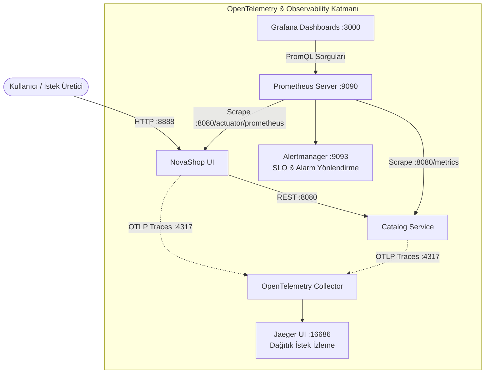

# LAB-10-OBSERVABILITY — İleri Gözlemlenebilirlik: Prometheus, Grafana, OpenTelemetry, Jaeger ve SLO Yönetimi

---

### Amaç

NovaShop mikroservis ekosisteminde; OpenTelemetry (OTel) Collector ile dağıtık izleme (Distributed Tracing / Jaeger), Prometheus ile zaman serisi metrik toplama (RED/USE), Grafana ile görsel izleme panoları kurmak ve kontrollü bir alarm üreterek Hizmet Seviyesi Hedefleri (SLO - Service Level Objective) ve Hata Bütçesi (Error Budget) yönetimini doğrulamak.

---

### Kazanımlar

- Gözlemlenebilirliğin (Observability) üç temel direğini (Metrikler, İzler/Traces, Alarmlar) uygulamak.
- OpenTelemetry (OTel) standartları ile mikroservisler arasında uçtan uca istek akışını (Trace ID / Span) Jaeger üzerinde izlemek.
- Spring Boot Actuator ve Go Gin servislerinden `/actuator/prometheus` üzerinden RED (Rate, Errors, Duration) metriklerini toplamak.
- Grafana üzerinde NovaShop operasyonel panosu (Dashboard) tasarlamak.
- Alertmanager ile yapay bir hata yükü oluşturarak kontrollü alarm tetiklemek ve bildirim akışını teyit etmek.

---

### Ön koşullar

- **Önceki Lablar:** [LAB-03](../LAB-03/README.md) veya [LAB-06](../LAB-06/README.md) tamamlanmış olmalıdır.
- **Kaynak Gereksinimi:** `observability` profili (en az 2 vCPU, 4 GB boş RAM).
- **Yüklü Araçlar:** Docker Engine, Docker Compose, `curl`.

---

### Mimari



---

### 🧭 Erişim Modelleri ve Kimlik Bilgileri (Credentials)

| Servis | Model B: Kurumsal DNS + SSL (1. Seçenek) | Model A: Doğrudan IP:Port (2. Seçenek) | Kullanıcı Adı | Varsayılan Parola |
| :--- | :--- | :--- | :---: | :---: |
| **Grafana Panosu** | `https://studentXX-grafana.devopsatolyesi.com` | `http://<UBUNTU_IP>:3000` | `admin` | `.env` içindeki `GRAFANA_ADMIN_PASSWORD` (`DevOps2026!`) |
| **Prometheus** | `https://studentXX-prometheus.devopsatolyesi.com` | `http://<UBUNTU_IP>:9091` | - | Kimlik doğrulaması yok (*Cockpit 9090 portunu kullandığı için 9091 ayrılmıştır*) |
| **Jaeger UI (Tracing)** | `https://studentXX-jaeger.devopsatolyesi.com` | `http://<UBUNTU_IP>:16686` | - | Kimlik doğrulaması yok |
| **Alertmanager** | - | `http://<UBUNTU_IP>:9093` | - | Kimlik doğrulaması yok |

---

### Adımlar

#### 1. Gözlemlenebilirlik Profilini Başlatma

İzleme altyapısını (`observability` profili) saf `docker compose` komutlarıyla ayağa kaldırın:

1. Yerel `.env` dosyasını oluşturun ve Grafana parolanızı belirleyin:
   ```bash
   test -f .env || cp config/project.env.example .env
   sed -i 's/<SET_A_LOCAL_SECRET>/DevOps2026!/g' .env
   chmod 600 .env
   ```

2. Saf `docker compose` komutuyla servisleri arka planda başlatın:
   ```bash
   docker compose --env-file .env -p novashop-observability -f deploy/observability/docker-compose.observability.yml up -d
   ```
   *(İsteğe bağlı helper betik: `bash scripts/compose-observability.sh up`)*

*Açıklama:* Bu stack, LAB-03'te oluşturulan `novashop-starter_default` ağına bağlanır; bu nedenle LAB-03 UI servisi önce çalışıyor olmalıdır.

3. **Servislerin Sağlık Durumunu Doğrulama:**
   ```bash
   docker compose -p novashop-observability -f deploy/observability/docker-compose.observability.yml ps
   ```

---

#### 2. Prometheus Metrik Toplama (Scraping) Kontrolü

Prometheus arayüzüne bağlanarak (`http://localhost:9090/targets`) NovaShop UI hedefinin aktif (`UP`) olduğunu doğrulayın:

```bash
curl -s http://localhost:9090/api/v1/targets | grep -o '"health":"up"'
```
*Beklenen çıktı:* En az 1 adet `"health":"up"` çıktısı (UI).

**Örnek PromQL Metrik Sorguları:**
- Toplam HTTP istek hızı (RPS):
  ```promql
  sum(rate(http_server_requests_seconds_count[1m]))
  ```
- Servis hata oranı (%):
  ```promql
  sum(rate(http_server_requests_seconds_count{status=~"5.."}[1m])) / sum(rate(http_server_requests_seconds_count[1m])) * 100
  ```

---

#### 3. Jaeger Üzerinde Dağıtık İstek İzleme (Distributed Tracing)

Tarayıcıdan UI ana sayfasına birkaç istek gönderin veya curl ile trafik oluşturun:

```bash
for i in {1..10}; do curl -s http://localhost:8888/ > /dev/null; sleep 0.5; done
```

1. Tarayıcınızda `http://localhost:16686` (Jaeger UI) adresini açın.
2. **Service** açılır menüsünden `novashop-ui` servisini seçin ve **Find Traces** butonuna tıklayın.
3. Bir izi (Trace) açarak isteğin `UI` -> `Catalog` mikroservisleri arasındaki alt adımlarını (Spans), gecikme sürelerini (Latency) ve veritabanı bekleme sürelerini uçtan uca inceleyin.

---

#### 4. Grafana Üzerinde RED Metrik Panosu

Tarayıcınızda `http://localhost:3000` adresine gidin ve kullanıcı adı olarak `admin`, parola olarak da yerel `.env` dosyasında belirlediğiniz `GRAFANA_ADMIN_PASSWORD` değerini kullanın:

1. **Connections > Data Sources > Prometheus** bağlantısının aktif olduğunu doğrulayın (`URL: http://prometheus:9090`).
2. Hazır **NovaShop Service Overview** panosunu açın:
   - **Rate:** Saniyedeki istek sayısı.
   - **Errors:** 4xx ve 5xx hata yüzdeleri.
   - **Duration:** 95. ve 99. yüzdelik dilim gecikme süreleri (p95, p99 Latency).

---

#### 5. Kontrollü Alarm ve SLO Hata Bütçesi İhlali Simülasyonu

Uygulamanın Hizmet Seviyesi Hedefi (SLO):
- *Hedef:* 5 dakikalık dilimde HTTP 5xx hataları %2'nin altında kalmalıdır.

**Yapay Hata Yükü Oluşturma:**
```bash
# Bilerek var olmayan veya geçersiz endpoint'lere yoğun istek gönder
for i in {1..50}; do curl -s http://localhost:8888/api/invalid-endpoint > /dev/null & done
```

**Alarm Durumunu İnceleme:**
1. `http://localhost:9090/alerts` sayfasına gidin.
2. `HighHttpErrorRate` alarm kuralının `Pending` durumundan `Firing` durumuna geçtiğini gözlemleyin.
3. Alertmanager panelinde (`http://localhost:9093`) alarm bildiriminin üretildiğini teyit edin.

---

#### 6. Otomatik Laboratuvar Doğrulama Betiğini Çalıştırma

Prometheus metrik endpoint'lerini, JVM metriklerini ve dağıtık izleme yeteneklerini otomatik test betiği ile doğrulayın:

```bash
bash scripts/verify/verify-lab-10.sh 8888 localhost
```
*Beklenen çıktı:*
```text
=== [LAB-10] Gözlemlenebilirlik Doğrulama Başlatılıyor ===
1. Actuator Prometheus metrik endpoint'i test ediliyor...
✅ /actuator/prometheus üzerinden JVM metrikleri başarıyla alınıyor.
✅ HTTP istek gecikme ve sayaç metrikleri (http_server_requests_seconds) mevcut.
✅ Dağıtık izleme (Trace) metrikleri etkin.
=== [LAB-10] Gözlemlenebilirlik Doğrulama Tamamlandı ===
```

---

### Troubleshooting

#### Senaryo 1: Jaeger'da İzler (Traces) Görünmüyor
- **Belirti:** Jaeger UI'da `novashop-ui` servisi listelenmiyor.
- **Muhtemel Neden:** Uygulamanın `MANAGEMENT_TRACING_SAMPLING_PROBABILITY=1.0` ayarının yapılmamış olması veya OTel Collector portunun (4317/4318) erişilemez olması.
- **Güvenli Çözüm:** Spring Boot ortam değişkenini kontrol edin: `docker exec -it novashop-ui printenv | grep TRACING`.

#### Senaryo 2: Grafana Prometheus'a Bağlanamıyor (`HTTP Error 502 / Connection refused`)
- **Belirti:** Grafana dashboard'larında `No data` görünmesi.
- **Teşhis:** Grafana iç ağdan `http://prometheus:9090` adresini çözebiliyor mu kontrol edin.
- **Güvenli Çözüm:** Docker Compose ağında `novashop-observability-net` köprüsünün tanımlı olduğunu teyit edin.

---

### Güvenlik Notu

1. **Metrik Uç Noktalarının İzolasyonu:**
   - `/actuator/prometheus` ve `/metrics` verileri hassas sistem mimarisi bilgisi içerebilir; dış internete (`0.0.0.0/0`) açılmamalı, yalnızca izleme sunucusunun IP'sine izin verilmelidir.
2. **Kişisel Veri (PII) Temizliği:**
   - Dağıtık izleme (Trace) verilerine kullanıcı şifreleri, kredi kartı numaraları veya gizli token'lar span attribute olarak eklenemez.

---

### Cleanup / Rollback

```bash
# Observability altyapısını durdur ve birimleri temizle
bash scripts/compose-observability.sh down -v
```

---

### Pratik Uygulama Görevi

1. Prometheus kural dosyasına (`alert.rules.yml`) p99 gecikmesi 500ms'yi aşarsa tetiklenecek `HighResponseLatency` alarmı ekleyin.
2. Konfigürasyonu yeniden yükleyin (`curl -X POST http://localhost:9090/-/reload`) ve kuralın panelde listelendiğini doğrulayın.
