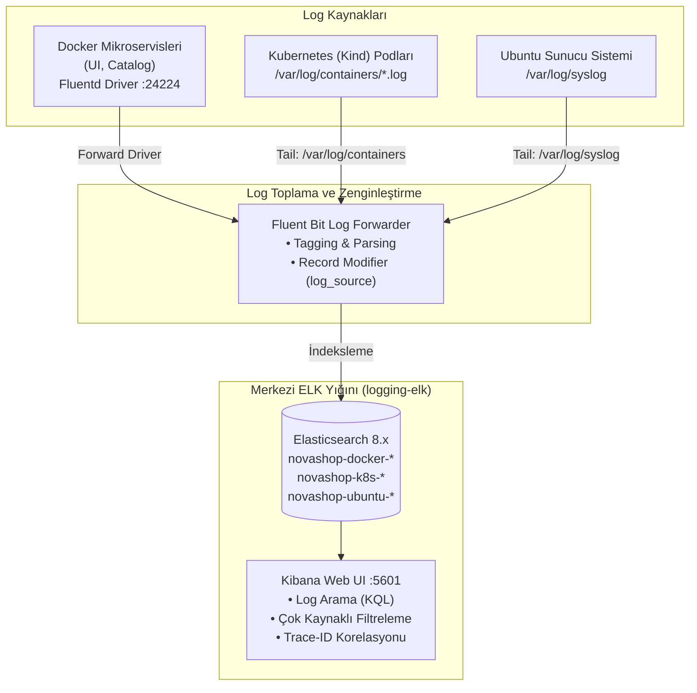

# LAB-11-CENTRALIZED-LOGGING — Merkezi Loglama (ELK Stack): Docker, Kubernetes ve Ubuntu Günlüklerinin Toplanması

---

### Amaç

NovaShop ekosisteminde; **Fluent Bit** log toplayıcısı, **Elasticsearch** arama ve indeksleme motoru ile **Kibana** görselleştirme arayüzünden oluşan tam teşekküllü bir **ELK Loglama Yığını** kurmaktır.

Bu laboratuvarda 3 farklı kaynaktan gelen loglar merkezi olarak toplanıp Kibana'da analiz edilir:
1. **Docker Mikroservis Logları:** UI, Catalog ve diğer servislerin JSON logları ve `trace_id` korelasyonu.
2. **Kubernetes (Kind) Küme Logları:** Pod ve konteyner seviyesindeki operasyonel loglar (`/var/log/containers/*.log`).
3. **Ubuntu Sunucu Sistem Logları:** Host işletim sistemi seviyesindeki syslog ve servis günlükleri (`/var/log/syslog`).

---

### Kazanımlar

- **ELK & Fluent Bit Mimarisi:** Dağıtık sistemlerde hafif iletici (Fluent Bit), depolama/indeksleme (Elasticsearch) ve görselleştirme (Kibana) akışını uçtan uca kurmak.
- **Çok Kaynaklı Log Toplama:** Docker konteynerleri, Kubernetes podları ve Ubuntu Linux sistem loglarını tek bir hatta birleştirmek.
- **Log Parsing ve Zenginleştirme:** Gelen ham logları JSON ve Syslog ayrıştırıcıları ile parse edip `log_source` etiketleri eklemek.
- **Dağıtık İzleme (Trace Correlation):** Mikroservislerdeki `trace_id` değerini yakalayarak bir hatayı tüm servisler arasında izlemek.
- **Kibana ile Görselleştirme:** Kibana üzerinde Data View (Index Pattern) oluşturup KQL ile Docker, Kubernetes ve Ubuntu loglarını filtrelemek.

---

### Ön koşullar

- **Önceki Lablar:** [LAB-03](../LAB-03/README.md) ve [LAB-06](../LAB-06/README.md) tamamlanmış olmalıdır.
- **Kaynak Gereksinimi:** `logging-elk` profili (en az 2 vCPU, 4 GB boş RAM).
- **Yüklü Araçlar:** Docker Engine, Docker Compose, `curl`.

---

### Mimari



---

### Kullanılan Değerler

| Değer / Parametre | Açıklama | Varsayılan |
|---|---|---|
| Kibana Web UI | Görsel analiz arayüzü | `http://localhost:5601` |
| Elasticsearch API | Log sorgu ve sağlık uç noktası | `http://localhost:9200` |
| Fluent Bit Forward | Docker konteyner log alım portu | `24224/TCP` |
| Docker Log İndeksi | Uygulama logları | `novashop-docker-*` |
| Kubernetes Log İndeksi | Pod logları | `novashop-k8s-*` |
| Ubuntu Sistem İndeksi | Host syslog kayıtları | `novashop-ubuntu-*` |

---

### Adımlar

#### 1. Merkezi Loglama Profilini Başlatma

Docker Compose ile `logging-elk` profilini başlatın:

```bash
docker compose --profile logging-elk up -d
```
*Beklenen çıktı:* Elasticsearch, Kibana ve Fluent Bit konteynerlerinin `Up` duruma geçmesi.

**Elasticsearch Küme Sağlığını Doğrulama:**
```bash
curl -s http://localhost:9200/_cluster/health | grep -o '"status":"[a-z]*"'
```
*Beklenen çıktı:* `"status":"green"` veya `"status":"yellow"` (tek düğüm için sarı normaldir).

---

#### 2. Fluent Bit Çok Kaynaklı Yapılandırması (`fluent-bit.conf`)

Fluent Bit; Docker mikroservis loglarını forward portundan (24224), Kubernetes pod loglarını `/var/log/containers/` yolundan ve Ubuntu sistem günlüklerini `/var/log/syslog` dosyasından toplayarak Elasticsearch'e aktarır:

```ini
# 1. GİRİŞLER: Docker, Kubernetes ve Ubuntu
[INPUT]
    Name             forward
    Listen           0.0.0.0
    Port             24224
    Tag              docker.novashop.*

[INPUT]
    Name             tail
    Path             /var/log/containers/*.log
    Tag              k8s.*
    Parser           docker

[INPUT]
    Name             tail
    Path             /var/log/syslog
    Tag              ubuntu.syslog

# 2. ÇIKIŞLAR: Elasticsearch İndeksleri
[OUTPUT]
    Name             es
    Match            docker.*
    Host             elasticsearch
    Port             9200
    Index            novashop-docker
    Logstash_Format  On
    Logstash_Prefix  novashop-docker

[OUTPUT]
    Name             es
    Match            k8s.*
    Host             elasticsearch
    Port             9200
    Index            novashop-k8s
    Logstash_Format  On
    Logstash_Prefix  novashop-k8s

[OUTPUT]
    Name             es
    Match            ubuntu.*
    Host             elasticsearch
    Port             9200
    Index            novashop-ubuntu
    Logstash_Format  On
    Logstash_Prefix  novashop-ubuntu
```

*Not:* Docker mikroservis loglarını Fluent Bit'e aktarmak için overlay dosyasıyla servisleri başlatın:
```bash
docker compose -f src/app/docker-compose.yml -f deploy/logging/docker-compose.logging-driver.yml up -d
```

---

#### 3. Log Kayıtlarında Trace-ID ve Yapılandırılmış JSON Formatı

Spring Boot ve Go mikroservisleri konsola standart JSON formatında log üretir. OpenTelemetry MDC üzerinden eklenen `trace_id` ile dağıtık izleme sağlanır:

```json
{
  "@timestamp": "2026-09-09T12:30:45.123Z",
  "level": "ERROR",
  "service": "novashop-ui",
  "trace_id": "4bf92f3577b34da6a3ce929d0e0e4736",
  "span_id": "00f067aa0ba902b7",
  "message": "Failed to retrieve product details from catalog service"
}
```

---

#### 4. Elasticsearch İndekslerini Kontrol Etme

Her 3 kaynaktan da logların Elasticsearch'e ulaştığını doğrulayın:

```bash
curl -s http://localhost:9200/_cat/indices?v
```

*Beklenen çıktı:* `novashop-docker-*`, `novashop-k8s-*` ve `novashop-ubuntu-*` indekslerinin listede belirmesi.

---

#### 5. Kibana Üzerinde Çok Kaynaklı Log Analizi ve Korelasyon

1. Tarayıcınızda `http://localhost:5601` (Kibana) adresine gidin.
2. **Management > Stack Management > Data Views (Index Patterns)** bölümüne gidin.
3. `novashop-*` desenini ekleyin (bu desen Docker, K8s ve Ubuntu indekslerinin tamamını kapsar) ve zaman alanı olarak `@timestamp` seçin.
4. **Discover** sayfasına geçin.
5. **KQL ile Kaynak Filtreleme:**
   - Sadece Kubernetes loglarını görmek için:
     ```kql
     log_source: "kubernetes_pod"
     ```
   - Sadece Ubuntu host loglarını görmek için:
     ```kql
     log_source: "ubuntu_system"
     ```
   - Mikroservis hatasını `trace_id` ile uçtan uca izlemek için:
     ```kql
     trace_id: "4bf92f3577b34da6a3ce929d0e0e4736"
     ```
6. **Sonuç:** Tek bir Kibana arayüzünden hem altyapı (Ubuntu), hem orkestrasyon (Kubernetes) hem de uygulama (Docker) logları merkezi olarak analiz edilir.

---

#### 6. Otomatik Laboratuvar Doğrulama Betiğini Çalıştırma

Log korelasyon kalıplarını ve Elasticsearch küme durumunu otomatik test betiği ile doğrulayın:

```bash
bash scripts/verify/verify-lab-11.sh localhost:9200
```
*Beklenen çıktı:*
```text
=== [LAB-11] Merkezi Günlükleme Doğrulama Başlatılıyor ===
1. Uygulama loglarında Trace-ID / Span-ID korelasyon kontrolü...
✅ Kaynak kodda dağıtık log korelasyonu (traceId / spanId) kalıbı mevcut.
2. Elasticsearch canlı cluster durumu test ediliyor...
=== [LAB-11] Merkezi Günlükleme Doğrulama Tamamlandı ===
```

---

### Troubleshooting

#### Senaryo 1: Elasticsearch Yetersiz Bellek / Çökme (`Exit Code 137`)
- **Belirti:** Elasticsearch başladıktan hemen sonra kapanıyor.
- **Muhtemel Neden:** JVM heap alanının çok yüksek tutulması veya sistem RAM'inin tükenmesi.
- **Güvenli Çözüm:** `ES_JAVA_OPTS="-Xms512m -Xmx512m"` ile bellek kullanımını sınırlandırın.

#### Senaryo 2: Kibana'da Loglar Görünmüyor (`No results found`)
- **Belirti:** Discover sekmesinde log akışı yok.
- **Teşhis:** Elasticsearch indeksini kontrol edin: `curl -s http://localhost:9200/_cat/indices?v`.
- **Güvenli Çözüm:** Zaman filtresini (Time Filter) "Last 15 minutes" olarak ayarlayın ve Fluent Bit loglarını inceleyin: `docker logs novashop-fluent-bit`.

---

### Güvenlik Notu

1. **Hassas Veri Maskeleme (Log Sanitization):**
   - Müşteri parolaları, kredi kartı numaraları ve kimlik bilgileri loglara açık metin yazılamaz; Fluent Bit regex filtreleri veya Logback encoder ile maskelenmelidir (`***MASKED***`).
2. **Log Saklama ve Silme (Retention):**
   - Disk alanının dolmaması için Elasticsearch Index Lifecycle Management (ILM) ile 7 günden eski loglar otomatik silinir.

---

### Cleanup / Rollback

```bash
# Loglama altyapısını durdur ve birimleri temizle
docker compose --profile logging-elk down -v
```

---

### Pratik Uygulama Görevi

1. Kibana üzerinde yalnızca `level: "ERROR"` olan logları listeleyen özel bir filtre oluşturun.
2. Bu filtrenin sonucunu "Hata Sayacı" (Error Metrics) görselleştirmesi olarak yeni bir Dashboard'a kaydedin.
