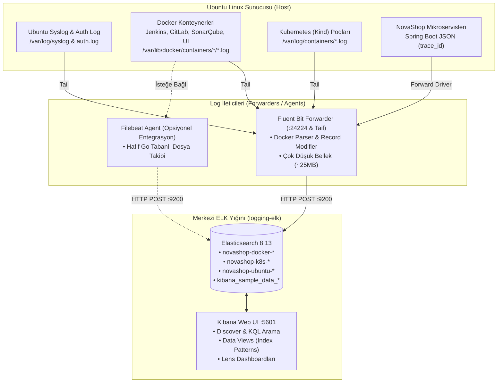
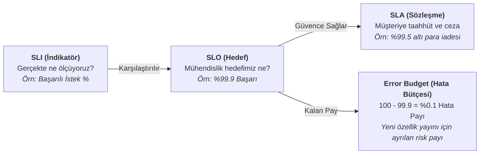

# LAB-11-CENTRALIZED-LOGGING — Kapsamlı Merkezi Loglama (ELK Stack): Docker, Kubernetes, Ubuntu, Jenkins ve GitLab Günlükleri

---

### Amaç

NovaShop ekosisteminde; **Elasticsearch 8.x** arama/indeksleme motoru, **Kibana 8.x** analiz ve görselleştirme platformu ile **Fluent Bit** ve **Filebeat** log ileticilerinden oluşan kurumsal seviyede bir **Merkezi Günlükleme (ELK Stack)** altyapısı kurmaktır.

Bu laboratuvarda "hiçbir şey gizli veya sihirli kalmadan", öğrencinin **hem terminal komutlarıyla (CLI/curl/bash) hem de web kullanıcı arayüzünden (Kibana UI)** adım adım:
1. Altyapıyı sıfırdan başlatması,
2. Ubuntu sunucusundaki tüm kaynaklardan (Docker konteynerleri, Spring Boot mikroservisleri, Kubernetes podları, Ubuntu host ve Jenkins/GitLab) log toplaması,
3. Elasticsearch API ile doğrudan veri basıp index/mapping mekanizmasını kavraması,
4. Hazır örnek e-ticaret veri setlerini yüklemesi,
5. Kibana Data View (Index Pattern) oluşturması,
6. KQL (Kibana Query Language) ile arama ve `trace_id` korelasyonu yapması,
7. Kibana Lens ile sıfırdan panolar çizip komutla içe aktarması,
8. **SRE Bonus Bölümü** ile SLI, SLA, SLO ve Error Budget kavramlarını hem Grafana hem de ELK üzerinde canlı hesaplaması hedeflenir.

---

### Kazanımlar

- **ELK Mimarisi ve Veri Akışı:** Ham logun dosyadan çıkıp Elasticsearch indeksine ve Kibana panosuna uzanan yolculuğunu kavramak.
- **Log Toplayıcı Ajanlar (Filebeat vs. Fluent Bit vs. Logstash):** Hangi log toplayıcının ne zaman, neden seçileceğini mimari ve kaynak tüketimi açısından bilmek.
- **Çok Katmanlı Log Toplama:**
  - Ubuntu Linux sistem logları (`/var/log/syslog`, `/var/log/auth.log`),
  - Docker üzerinde koşan tüm araçlar (Jenkins, GitLab, SonarQube, NovaShop UI),
  - Kubernetes (Kind) kümesindeki pod logları (`/var/log/containers/*.log`),
  - Spring Boot Logback JSON formatındaki mikroservis uygulama logları.
- **Elasticsearch API & Mapping Deneyimi:** Dev Tools ve `curl` ile doküman ekleme (`_doc`), indeks şablonları ve `keyword` vs `text` farkı.
- **Kibana ile Veri Analitiği:** Discover, KQL filtreleri, hazır örnek veri (Sample Data) ve Lens ile görsel dashboard üretimi.
- **SRE & Hata Bütçesi:** SLI/SLA/SLO metriklerinin log ve zaman serisi üzerinden formüle edilmesi.

---

### Mimari



---

### 🧭 Erişim Modelleri ve Kimlik Bilgileri (Credentials)

| Servis | Model B: Kurumsal DNS + SSL (1. Seçenek) | Model A: Doğrudan IP:Port (2. Seçenek) | Kullanıcı Adı | Varsayılan Parola |
| :--- | :--- | :--- | :---: | :---: |
| **Kibana Web UI** | `https://studentXX-kibana.devopsatolyesi.com`<br/>*(veya CDN Alias: `studentXX-app1.devopsatolyesi.com`)* | `http://<UBUNTU_IP>:5601` | - | Kimlik doğrulaması yok (Eğitim Modu) |
| **Elasticsearch REST API** | `https://studentXX-elastic.devopsatolyesi.com`<br/>*(veya CDN Alias: `studentXX-k8s-app1.devopsatolyesi.com`)* | `http://<UBUNTU_IP>:9200` | - | Kimlik doğrulaması yok (`xpack.security=false`) |
| **Fluent Bit Forwarder** | - | `http://<UBUNTU_IP>:24224` | - | Fluentd TCP/UDP Forward Portu |

> **💡 Yerel DNS Otomasyonu:**
> Bilgisayarınızdan alan adlarıyla kesintisiz çalışmak için terminalinizde şu betiği çalıştırabilirsiniz:
> ```bash
> sudo bash scripts/setup-local-dns.sh <SUNUCU_IP> student100
> ```

---

### 📚 Log Toplayıcı Ajanlar: Filebeat vs. Logstash vs. Fluent Bit

Bir DevOps mühendisinin merkezi loglama kurarken vermesi gereken ilk mimari karar, doğru toplayıcıyı seçmektir:

| Özellik | Filebeat (Elastic) | Fluent Bit (CNCF) | Logstash (Elastic) |
| :--- | :--- | :--- | :--- |
| **Geliştirildiği Dil** | Go | C | Java / JRuby |
| **Bellek Tüketimi** | ~15 - 30 MB (Çok Düşük) | ~10 - 25 MB (Ultra Düşük) | ~500 MB - 1.5 GB (Ağır) |
| **Kullanım Amacı** | Uç noktalardan (Node/Sunucu) dosya okuyup doğrudan ES'e aktarmak. | Bulut yerlisi (K8s/Docker) ortamlarda yüksek hızlı, hafif yönlendirme. | Ağır metin manipülasyonu, karmaşık Grok parsing ve zenginleştirme. |
| **Konteyner Uyumu** | Mükemmel (Docker/K8s metadata modülü var). | Mükemmel (K8s standart de-facto ajanıdır). | Ağır kaldığı için her node'a agent olarak konulmaz, merkeze konur. |
| **Bizim Tercihimiz** | LAB-11'de entegrasyon örneği olarak kullanıyoruz. | Ana omurgada sistem kaynağını yormamak için varsayılan toplayıcıdır. | Ağır bellek gerektirdiği için 4GB RAM'li eğitim profilinde tercih edilmemiştir. |

---

## 🛠️ Adım Adım Uygulama Rehberi (CLI & UI)

---

### ADIM 1: Merkezi Loglama Altyapısını (ELK) Sıfırdan Başlatma

#### Yöntem A: Terminalden (CLI)
Sunucuda ELK yığınını saf Docker Compose komutuyla ayağa kaldırın:

```bash
cd ~/novashop
docker compose -p novashop-logging -f deploy/logging/docker-compose.logging.yml up -d
```

**Konteyner Durumlarını Denetleme:**
```bash
docker compose -p novashop-logging -f deploy/logging/docker-compose.logging.yml ps
```
*Beklenen çıktı:* `novashop-elasticsearch`, `novashop-kibana` ve `novashop-fluent-bit` servislerinin `running (Up)` olması.

**Elasticsearch Küme Sağlığını API ile Sorgulama:**
```bash
curl -s http://localhost:9200/_cluster/health | jq .
```
*Beklenen çıktı:*
```json
{
  "cluster_name": "docker-cluster",
  "status": "green",
  "number_of_nodes": 1,
  "active_primary_shards": 5
}
```

#### Yöntem B: Web Tarayıcısından (UI)
1. Tarayıcınızda `https://studentXX-elastic.devopsatolyesi.com` veya `http://<SUNUCU_IP>:9200` adresine gidin.
   * Ekranda Elasticsearch sürümünü (`"number": "8.13.0"`) ve `"tagline": "You Know, for Search"` ifadesini görmelisiniz.
2. `https://studentXX-kibana.devopsatolyesi.com` veya `http://<SUNUCU_IP>:5601` adresine gidin.
   * Kibana karşılama ekranı yüklenecektir.

---

### ADIM 2: Log Toplama Katmanları (Ubuntu'daki Her Şey)

NovaShop Fluent Bit yapılandırması ([deploy/logging/fluent-bit.conf](file:///Users/hakan/devops-workspace/student-novashop/deploy/logging/fluent-bit.conf)) Ubuntu sunucusundaki 5 farklı kaynağı aynı anda dinler:

1. **Ubuntu Host Logları:** `/var/log/syslog` ve `/var/log/auth.log` (SSH denemeleri, kernel mesajları).
2. **Docker Konteyner Logları:** `/var/lib/docker/containers/*/*-json.log` yolu üzerinden makinedeki tüm Docker konteynerleri (Jenkins, GitLab, SonarQube, Harbor, NovaShop UI).
3. **Uygulama JSON Logları:** Spring Boot ve Go servislerinin stdout'a bastığı yapılandırılmış JSON logları (`trace_id`, `span_id`, `level`, `service`).
4. **Kubernetes Pod Logları:** Kind kümesinin pod logları (`/var/log/pods/` ve `/var/log/containers/`).
5. **Fluentd Log Driver (:24224):** Docker servislerinin doğrudan TCP forward portu üzerinden gönderdiği loglar.

**Elasticsearch'te İndekslerin Oluştuğunu Kontrol Etme (CLI):**
```bash
curl -s http://localhost:9200/_cat/indices?v
```
*Örnek Çıktı:*
```text
health status index                        docs.count store.size
green  open   novashop-docker-2026.09.14          512    240kb
green  open   novashop-k8s-2026.09.14           48102    9.5mb
green  open   novashop-ubuntu-2026.09.14        16240    2.9mb
```

---

### ADIM 3: Elasticsearch Hands-On: Elle Veri Basma, Arama ve Mapping

Elasticsearch'ün arkasındaki mantığı tam kavramak için önce bir log dökümanını elle ekleyip arayalım.

#### Yöntem A: Terminalden (`curl` ile)
Yeni bir e-ticaret sipariş hatası simülasyonu ekleyin:

```bash
curl -s -X POST http://localhost:9200/novashop-demo/_doc \
  -H "Content-Type: application/json" \
  -d '{
    "@timestamp": "2026-09-14T10:00:00Z",
    "service": "novashop-checkout",
    "level": "ERROR",
    "http_status": 502,
    "user_id": "usr-9941",
    "trace_id": "a1b2c3d4e5f60718",
    "message": "Payment provider timeout after 5000ms"
  }' | jq .
```
*Çıktı:* `"_id": "...", "result": "created"` dönecektir.

**Eklenen Veriyi Arama:**
```bash
curl -s "http://localhost:9200/novashop-demo/_search?q=level:ERROR" | jq '.hits.hits[0]._source'
```

#### Yöntem B: Kibana UI (Dev Tools / Console)
Kibana içinde en güçlü yönetim aracı **Dev Tools** konsoludur:
1. Kibana sol menüsünde en alta inin ve **Management ➔ Dev Tools**'a tıklayın.
2. Konsol editörüne şu komutu yazıp yanındaki yeşil çalıştır üçgenine basın:

```http
POST novashop-demo/_doc
{
  "@timestamp": "2026-09-14T10:05:00Z",
  "service": "novashop-cart",
  "level": "WARN",
  "message": "Stock is low for product ID 408"
}
```
3. İndeksin otomatik oluşan şemasını (Mapping) görmek için:
```http
GET novashop-demo/_mapping
```
> **Önemli Kavram: `keyword` vs `text`:**
> - `keyword`: Tam eşleşme (Exact match), filtreleme, gruplama (Aggregation) için kullanılır (`service.keyword: "novashop-cart"`).
> - `text`: Doğal dil metin araması (Full-text search), kelime kelime ayrıştırma (Inverted Index) için kullanılır (`message: "stock"`).

---

### ADIM 4: Kibana Hazır Örnek Veri (Sample Data) Entegrasyonu

Öğrencinin sistemi kurduğu ilk dakikada binlerce gerçekçi log ve hazır grafiklerle çalışabilmesi için Kibana resmi örnek e-ticaret veri setini sağlar.

#### Yöntem A: Terminalden Tek Komutla (CLI)
Hazırladığımız otomasyon betiğini çalıştırın:
```bash
bash scripts/load-kibana-sample-data.sh
```
*Bu komut; 4.600+ sipariş işlemi, vergi, gelir, kategori kırılımları ve hazır gelir panosunu anında yükler.*

#### Yöntem B: Kibana Arayüzünden (UI)
1. Kibana ana sayfasına (`http://localhost:5601`) gidin.
2. Sayfanın en altındaki **"Add sample data"** butonuna tıklayın.
3. **Sample eCommerce orders** kartında **"Add data"** butonuna tıklayın.
4. Yükleme tamamlandığında **"View data"** butonuna basarak hazır `[eCommerce] Revenue Dashboard` panosunu açın.

---

### ADIM 5: Kibana Data Views (Index Patterns) Oluşturma

Elasticsearch'teki indekslerin Kibana **Discover** ve **Dashboard** ekranlarında görünmesi için bir **Data View** tanımlanmalıdır.

#### Yöntem A: Terminalden Otomatik Oluşturma (CLI)
```bash
bash scripts/setup-kibana-dataviews.sh
```
Bu betik şu veri görünümlerini saniyeler içinde API üzerinden kaydeder:
* `novashop-*` (Tüm sistem, docker, k8s ve ubuntu loglarını kapsayan çatı görünüm)
* `novashop-docker-*` (Yalnızca konteynerler ve mikroservisler)
* `novashop-k8s-*` (Yalnızca Kubernetes podları)
* `novashop-ubuntu-*` (Yalnızca host işletim sistemi)

#### Yöntem B: Kibana Arayüzünden (UI)
1. Sol menüden **Management ➔ Stack Management**'a girin.
2. Soldaki menüden **Kibana ➔ Data Views** seçeneğine tıklayın.
3. Sağ üstteki **Create data view** mavi butonuna basın:
   * **Name:** `NovaShop Tüm Loglar`
   * **Index pattern:** `novashop-*`
   * **Timestamp field:** `@timestamp`
4. **Save data view to Kibana** butonuna basarak kaydedin.

---

### ADIM 6: Filebeat ile İleri Entegrasyon (Opsiyonel Ajan Yapılandırması)

Fluent Bit'e ek olarak kurumsal projelerde çok yaygın kullanılan Elastic Filebeat ajanını incelemek için hazırladığımız yapılandırmayı kullanabilirsiniz:

Dosya: [deploy/logging/filebeat/filebeat.yml](file:///Users/hakan/devops-workspace/student-novashop/deploy/logging/filebeat/filebeat.yml)

**Filebeat'i Docker ile Başlatma Örneği:**
```bash
docker run -d \
  --name novashop-filebeat \
  --user root \
  --network novashop-logging-net \
  -v $(pwd)/deploy/logging/filebeat/filebeat.yml:/usr/share/filebeat/filebeat.yml:ro \
  -v /var/lib/docker/containers:/var/lib/docker/containers:ro \
  -v /var/log:/var/log:ro \
  docker.elastic.co/beats/filebeat:8.13.0
```
*Filebeat, `/var/lib/docker/containers` altındaki JSON logları otomatik okuyup `novashop-filebeat-*` indeksine basar.*

---

### ADIM 7: Kibana ile Arama ve KQL (Kibana Query Language) Kılavuzu

Kibana **Discover** ekranına (`http://localhost:5601/app/discover`) gidin ve sol üstten `novashop-*` veri görünümünü seçin.

#### Pratik KQL Sorgu Kütüphanesi:

| Amaç | KQL Sorgu Sözdizimi |
| :--- | :--- |
| **Yalnızca Hata Logları:** | `level: "ERROR"` |
| **Spesifik Mikroservis Hatası:** | `service: "novashop-checkout" and level: "ERROR"` |
| **HTTP 5xx Sunucu Hataları:** | `http.status_code >= 500` |
| **Kubernetes Pod Loglarını Filtreleme:** | `log_source: "kubernetes_pod"` |
| **Ubuntu Sistem Loglarını Filtreleme:** | `log_source: "ubuntu_system"` |
| **Metin Araması (Wildcard):** | `message: *timeout* or message: *database*` |
| **Dağıtık Trace-ID Takibi:** | `trace_id: "a1b2c3d4e5f60718"` |

> **🚀 Trace-ID Korelasyon Deneyi:**
> Bir kullanıcı ödeme yaparken hata aldıysa, logdaki `trace_id` değerini kopyalayıp KQL arama çubuğuna yapıştırın. `novashop-ui`, `novashop-checkout` ve `novashop-orders-db` servislerinin bu istek sırasında ürettiği tüm satırlar kronolojik sırayla önünüze dizilecektir!

---

### ADIM 8: Kibana Dashboard Tasarımı ve Komutla Yükleme

#### Yöntem A: Terminalden Otomatik İçe Aktarma (CLI)
Kibana Saved Objects API üzerinden doğrudan eksiksiz, Lens panelleri (Toplam Log, Hata Sayacı, Donut Kaynak Dağılımı) içeren panomuzu tek komutla yükleyin:

```bash
bash scripts/import-kibana-dashboard.sh
```
*Bu betik, `deploy/logging/kibana/novashop-central-logging-dashboard.json` şablon dosyasını kullanarak `novashop-central-logging` panosunu eksiksiz tanımlar.*

Tarayıcıdan doğrudan açın:
`http://localhost:5601/app/dashboards#/view/novashop-central-logging`
*(veya SSL üzerinden: `https://studentXX-kibana.devopsatolyesi.com/app/dashboards#/view/novashop-central-logging`)*

> **⚠️ Kritik Kibana Hata Teşhisi: `Cannot read properties of undefined (reading 'searchSourceJSON')`:**
> - **Neden Olur?** Kibana 8.x dashboard mimarisinde, panonun arama bağlamını yöneten `kibanaSavedObjectMeta.searchSourceJSON`, `optionsJSON` veya `panelsJSON` alanları eksik bırakıldığında ya da hatalı tırnak kaçışları (escaping) olduğunda Kibana dashboard render motoru çöker.
> - **Kalıcı Çözüm:** `deploy/logging/kibana/novashop-central-logging-dashboard.json` dosyasında tüm `kibanaSavedObjectMeta` ve `optionsJSON` alanları şablon olarak doğrulanmıştır. `bash scripts/import-kibana-dashboard.sh` çalıştırıldığında bu şablon hatasız olarak Kibana'ya yazılır.

#### Panoları Canlı Verilerle Doldurma:
Dashboard'un metriklerini ve grafiklerini hemen canlı sayılarla görmek için trafik ve log jeneratörümüzü çalıştırın:
```bash
bash scripts/simulate-traffic.sh --burst 30
```

#### Yöntem B: Kibana Lens ile Sıfırdan Grafik Tasarlama (UI)
1. Sol menüden **Analytics ➔ Dashboard** sekmesine gidin.
2. **Create dashboard** butonuna tıklayın.
3. **Create visualization** butonuna basın (Kibana Lens açılır):
   * **Grafik 1: Log Kaynağı Dağılımı (Bar Chart):**
     * Sağdaki alan listesinden `log_source.keyword` alanını ortaya sürükleyip bırakın.
     * Otomatik olarak `kubernetes_pod`, `ubuntu_system`, `docker_container` log sayılarını gösteren sütun grafik oluşacaktır.
   * **Grafik 2: Hata Sayacı (Metric):**
     * Sol üstteki filtre çubuğuna `level: "ERROR"` yazın.
     * Orta alana `Records` alanını sürükleyin. Dev bir kırmızı hata sayacı elde edersiniz.
4. Sağ üstteki **Save and return** butonuna basarak dashboard'unuza kaydedin.

---

## 🌟 SRE BONUS BÖLÜMÜ: SLI, SLA ve SLO Nedir? (Grafana & ELK Uygulamaları)

Site Reliability Engineering (SRE) disiplininin kalbinde yer alan üç kritik kavram:



### 1. Temel Kavramlar ve Formüller:
* **SLI (Service Level Indicator - Hizmet Seviyesi Göstergesi):** Sistemin anlık sağlık durumunu ölçen sayısal orandır.
  $$\text{SLI} = \frac{\text{İyi Olayların Sayısı (Good Events)}}{\text{Toplam Olay Sayısı (Total Events)}} \times 100$$
* **SLO (Service Level Objective - Hizmet Seviyesi Hedefi):** Mühendislik ve DevOps ekibinin sistem için koyduğu iç hedeftir (Örn: Ay boyunca $\%99.9$ başarı oranı).
* **SLA (Service Level Agreement - Hizmet Seviyesi Sözleşmesi):** Müşteri veya iş birimiyle imzalanan yasal/sözleşmesel taahhüttür. Genellikle SLO'dan daha gevşektir (Örn: $\%99.5$). Sistemin $\%99.5$ altına inmesi durumunda şirkete cezai yaptırım doğar.
* **Error Budget (Hata Bütçesi):** Sistemimizin izin verilen arıza payıdır:
  $$\text{Hata Bütçesi} = 100\% - \text{SLO} = 100\% - 99.9\% = 0.1\%$$
  *Eğer ay içinde hata bütçesi (%0.1) tükenirse, tüm yeni özellik dağıtımları durdurulur ve ekip yalnızca güvenilirlik/bug çözümlerine odaklanır.*
* **Burn Rate (Tükenme Hızı):** Hata bütçenizin ne kadar hızlı eridiğini gösterir. Normal hız 1x'tir; eğer 14x hızında yanıyorsa birkaç saat içinde aylık bütçeniz bitecektir.

---

### 2. Grafana'da SLO & SLI Nasıl Hesaplanır? (PromQL)

Grafana üzerinde bir **SLO / SLI Paneli** oluşturmak için PromQL formülleri:

1. **Kullanılabilirlik SLI (Availability %):**
   ```promql
   (sum(rate(http_server_requests_seconds_count{status!~"5.."}[30d])) 
   / 
   sum(rate(http_server_requests_seconds_count[30d]))) * 100
   ```
   *Ekrana Stat veya Gauge paneli olarak konur; yeşil eşik 99.9, sarı 99.5, kırmızı 99.0 yapılır.*

2. **Gecikme (Latency) SLI (%95 İstek < 200ms):**
   ```promql
   (sum(rate(http_server_requests_seconds_bucket{le="0.2"}[30d])) 
   / 
   sum(rate(http_server_requests_seconds_count[30d]))) * 100
   ```

3. **Kalan Hata Bütçesi (Remaining Error Budget %):**
   ```promql
   100 - ((100 - (sum(rate(http_server_requests_seconds_count{status!~"5.."}[30d])) / sum(rate(http_server_requests_seconds_count[30d])) * 100)) / 0.1 * 100)
   ```

---

### 3. ELK / Kibana'da Log Tabanlı SLO & SLI Nasıl Hesaplanır?

Prometheus metriklere bakarken, Elasticsearch doğrudan log kayıtları üzerinden SLA doğrulaması yapar:

1. **Log Tabanlı Hata Oranı SLI:**
   * Kibana Lens arayüzünde **Formula** alanına şu ifade yazılır:
   ```text
   (count() - count(kql='level: "ERROR"')) / count() * 100
   ```
   * Bu formül, gelen tüm uygulama logları içerisindeki hatasız log oranını verir.
2. **Kibana SLA İhlal Filtresi:**
   * KQL ile son 24 saatteki ihlalleri listeleme:
   ```kql
   response_time_ms > 200 or http.status_code >= 500
   ```

---

### Doğrulama ve Cleanup

**Otomatik Doğrulama:**
```bash
bash scripts/verify/verify-lab-11.sh localhost:9200
```

**Temizlik / Rollback:**
```bash
docker compose -p novashop-logging -f deploy/logging/docker-compose.logging.yml down -v
```
